# Technical Design Document: Accessible Citizen Service Assistant

**Version:** 1.0  
**Date:** November 19, 2025  
**Project:** G7 GovAI Grand Challenge - Statement 4 (Accessible Government Communication)  
**Status:** Draft - Challenge Submission

## 1. Architecture Overview

### 1.1 High-Level System Architecture

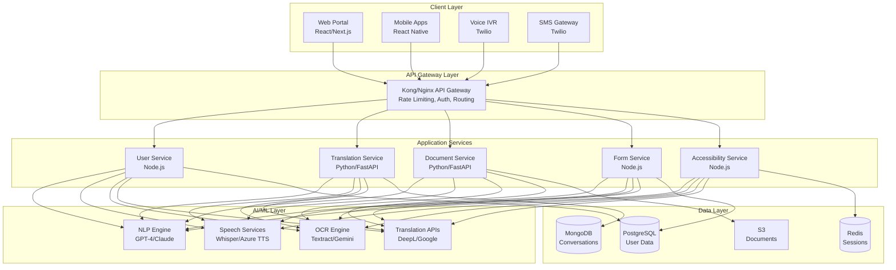

### 1.2 2-Week MVP Architecture Decisions

**Simplified Stack for Rapid Development:**
- **Frontend:** Single React web app (Next.js) with responsive design
- **Backend:** FastAPI (Python) monolith with modular structure
- **AI Services:** Direct API calls to managed services (no custom models)
- **Database:** PostgreSQL for simplicity (single DB for all data)
- **File Storage:** Local filesystem (migrate to S3 post-challenge)
- **Deployment:** Docker containers on single cloud instance

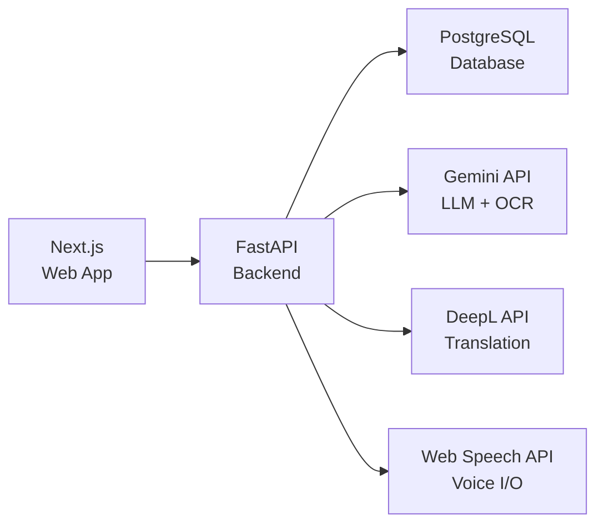

## 2. Component Design

### 2.1 Frontend Components

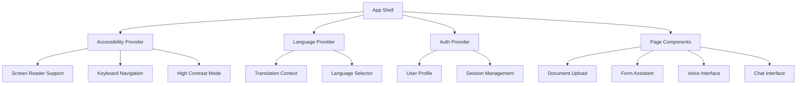

**Key React Components:**

1. **AccessibilityProvider**
   - Purpose: Global accessibility settings management
   - Features: Theme switching, text sizing, screen reader announcements
   - Props: `defaultSettings`, `onSettingsChange`

2. **DocumentUploader**
   - Purpose: Multi-format document upload with preview
   - Features: Drag-drop, camera capture, OCR preview
   - Props: `acceptedFormats`, `onExtract`, `maxSize`

3. **FormAssistant**
   - Purpose: Guided form completion with auto-fill
   - Features: Field-by-field help, validation, progress tracking
   - Props: `formSchema`, `prefillData`, `onSubmit`

4. **VoiceInterface**
   - Purpose: Voice input/output for form interaction
   - Features: Speech-to-text, text-to-speech, wake word
   - Props: `language`, `onCommand`, `isMuted`

### 2.2 Backend Services Architecture

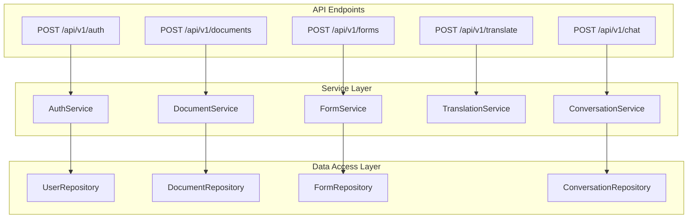

**Service Responsibilities:**

1. **DocumentService**
   - Document upload and validation
   - OCR processing via Gemini API
   - Information extraction and verification
   - Document storage and retrieval

2. **FormService**
   - Form schema management
   - Auto-fill logic from extracted data
   - Validation and error handling
   - Submission to government systems

3. **TranslationService**
   - Real-time translation via DeepL
   - Language detection
   - Cultural context adaptation
   - Translation caching

4. **ConversationService**
   - Natural language understanding
   - Intent recognition
   - Context management
   - Response generation via Gemini

## 3. Data Model

### 3.1 Entity-Relationship Diagram

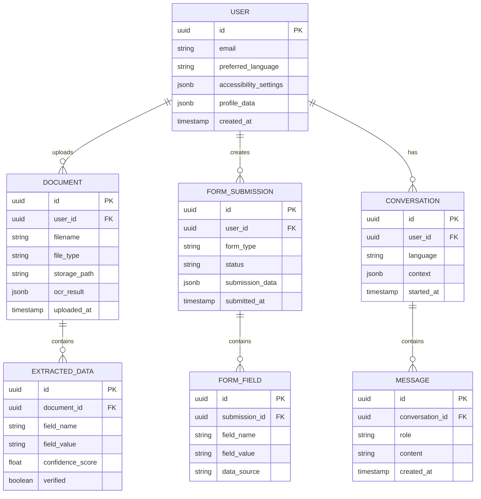

### 3.2 Database Schema

**PostgreSQL Tables:**

```sql
-- Users table
CREATE TABLE users (
    id UUID PRIMARY KEY DEFAULT gen_random_uuid(),
    email VARCHAR(255) UNIQUE NOT NULL,
    preferred_language VARCHAR(10) DEFAULT 'en',
    accessibility_settings JSONB DEFAULT '{}',
    profile_data JSONB DEFAULT '{}',
    created_at TIMESTAMP DEFAULT CURRENT_TIMESTAMP,
    updated_at TIMESTAMP DEFAULT CURRENT_TIMESTAMP
);

-- Documents table
CREATE TABLE documents (
    id UUID PRIMARY KEY DEFAULT gen_random_uuid(),
    user_id UUID REFERENCES users(id) ON DELETE CASCADE,
    filename VARCHAR(255) NOT NULL,
    file_type VARCHAR(50) NOT NULL,
    storage_path TEXT NOT NULL,
    ocr_result JSONB,
    uploaded_at TIMESTAMP DEFAULT CURRENT_TIMESTAMP,
    INDEX idx_user_documents (user_id, uploaded_at DESC)
);

-- Extracted data table
CREATE TABLE extracted_data (
    id UUID PRIMARY KEY DEFAULT gen_random_uuid(),
    document_id UUID REFERENCES documents(id) ON DELETE CASCADE,
    field_name VARCHAR(100) NOT NULL,
    field_value TEXT,
    confidence_score FLOAT,
    verified BOOLEAN DEFAULT false,
    verified_at TIMESTAMP,
    INDEX idx_document_data (document_id)
);

-- Form submissions table
CREATE TABLE form_submissions (
    id UUID PRIMARY KEY DEFAULT gen_random_uuid(),
    user_id UUID REFERENCES users(id) ON DELETE CASCADE,
    form_type VARCHAR(100) NOT NULL,
    status VARCHAR(50) DEFAULT 'draft',
    submission_data JSONB NOT NULL,
    submitted_at TIMESTAMP DEFAULT CURRENT_TIMESTAMP,
    INDEX idx_user_forms (user_id, submitted_at DESC)
);

-- Conversations table
CREATE TABLE conversations (
    id UUID PRIMARY KEY DEFAULT gen_random_uuid(),
    user_id UUID REFERENCES users(id) ON DELETE CASCADE,
    language VARCHAR(10) DEFAULT 'en',
    context JSONB DEFAULT '{}',
    started_at TIMESTAMP DEFAULT CURRENT_TIMESTAMP,
    last_activity_at TIMESTAMP DEFAULT CURRENT_TIMESTAMP
);

-- Messages table
CREATE TABLE messages (
    id UUID PRIMARY KEY DEFAULT gen_random_uuid(),
    conversation_id UUID REFERENCES conversations(id) ON DELETE CASCADE,
    role VARCHAR(20) NOT NULL CHECK (role IN ('user', 'assistant', 'system')),
    content TEXT NOT NULL,
    created_at TIMESTAMP DEFAULT CURRENT_TIMESTAMP,
    INDEX idx_conversation_messages (conversation_id, created_at ASC)
);
```

## 4. API Design

### 4.1 RESTful API Endpoints

**Authentication Endpoints:**
```
POST   /api/v1/auth/register          - Register new user
POST   /api/v1/auth/login             - User login
POST   /api/v1/auth/logout            - User logout
GET    /api/v1/auth/profile           - Get user profile
PATCH  /api/v1/auth/profile           - Update user profile
```

**Document Endpoints:**
```
POST   /api/v1/documents              - Upload document
GET    /api/v1/documents/{id}         - Get document details
GET    /api/v1/documents/{id}/extract - Get extracted data
POST   /api/v1/documents/{id}/verify  - Verify extracted field
DELETE /api/v1/documents/{id}         - Delete document
```

**Form Endpoints:**
```
GET    /api/v1/forms/types            - List available forms
GET    /api/v1/forms/{type}/schema    - Get form schema
POST   /api/v1/forms/submissions      - Create submission
GET    /api/v1/forms/submissions/{id} - Get submission
PATCH  /api/v1/forms/submissions/{id} - Update submission
POST   /api/v1/forms/submissions/{id}/submit - Final submit
```

**Translation Endpoints:**
```
POST   /api/v1/translate              - Translate text
GET    /api/v1/languages              - List supported languages
```

**Conversation Endpoints:**
```
POST   /api/v1/chat/conversations     - Start new conversation
POST   /api/v1/chat/messages          - Send message
GET    /api/v1/chat/conversations/{id} - Get conversation history
```

### 4.2 API Request/Response Examples

**Document Upload & Extraction:**

```json
POST /api/v1/documents
Content-Type: multipart/form-data

{
  "file": <binary>,
  "file_type": "passport",
  "language": "en"
}

Response (200):
{
  "document_id": "uuid",
  "filename": "passport.jpg",
  "status": "processing",
  "message": "Document uploaded successfully"
}

GET /api/v1/documents/{id}/extract
Response (200):
{
  "document_id": "uuid",
  "extracted_fields": [
    {
      "field_name": "full_name",
      "field_value": "John Smith",
      "confidence": 0.98,
      "verified": false
    },
    {
      "field_name": "passport_number",
      "field_value": "A12345678",
      "confidence": 0.95,
      "verified": false
    }
  ]
}
```

## 5. AI/ML Integration

### 5.1 Gemini API Integration Architecture

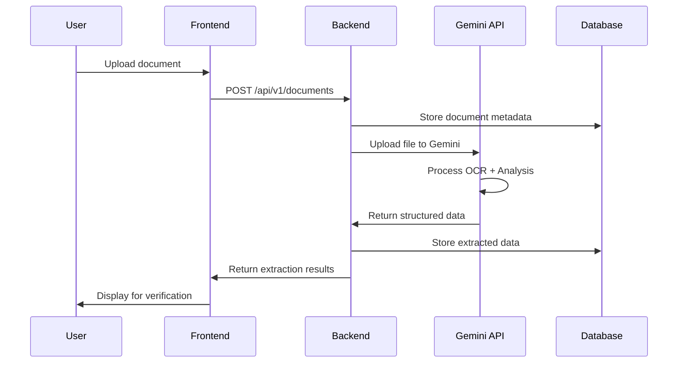

**Gemini API File Search for RAG:**
- Upload government form templates and documentation
- Semantic search for relevant examples and guidelines
- Context-aware form assistance
- Q&A about requirements and eligibility

### 5.2 Translation Pipeline

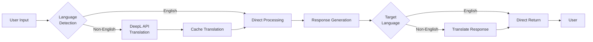

## 6. Accessibility Implementation

### 6.1 WCAG Compliance Strategy

**Level AA (MVP Target):**
- Keyboard navigation for all interactive elements
- Color contrast ratio ≥4.5:1 for normal text, ≥3:1 for large text
- Text resize up to 200% without loss of functionality
- ARIA labels and landmarks for screen readers
- Focus indicators visible on all focusable elements

**Testing Approach:**
- Automated: axe-core, Lighthouse accessibility audit
- Manual: NVDA/JAWS screen reader testing
- User testing: 2-3 participants with disabilities

### 6.2 Accessibility Features Implementation

```javascript
// AccessibilityProvider React Component
const AccessibilityContext = createContext();

export const AccessibilityProvider = ({ children }) => {
  const [settings, setSettings] = useState({
    highContrast: false,
    textSize: 'medium',
    reducedMotion: false,
    screenReaderMode: false
  });
  
  useEffect(() => {
    // Apply settings to document root
    document.documentElement.classList.toggle('high-contrast', settings.highContrast);
    document.documentElement.style.fontSize = textSizeMap[settings.textSize];
    document.documentElement.classList.toggle('reduced-motion', settings.reducedMotion);
  }, [settings]);
  
  return (
    <AccessibilityContext.Provider value={{ settings, setSettings }}>
      {children}
    </AccessibilityContext.Provider>
  );
};
```

## 7. Security & Privacy

### 7.1 Security Architecture

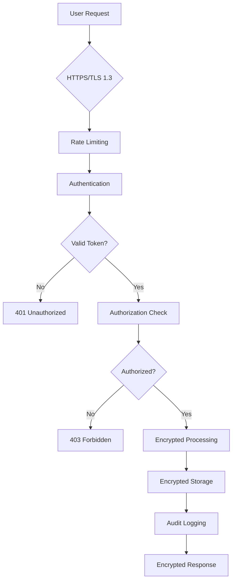

**Security Measures:**
- JWT authentication with refresh tokens
- Rate limiting (100 requests/minute per user)
- Input validation and sanitization
- SQL injection prevention (parameterized queries)
- XSS protection (Content Security Policy)
- CSRF tokens for state-changing operations

**Privacy Measures:**
- End-to-end encryption for personal data
- PII detection and redaction
- Data minimization (collect only necessary)
- Right to deletion (GDPR/PIPEDA compliant)
- Consent management for data sharing
- Anonymous analytics

## 8. Performance Optimization

### 8.1 Caching Strategy

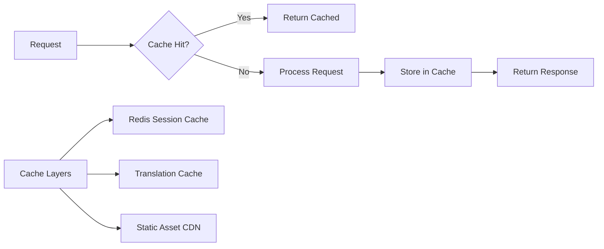

**Performance Targets (MVP):**
- Page load time: <3 seconds
- API response time: <500ms (p95)
- Document OCR: <15 seconds
- Translation: <3 seconds
- Concurrent users: 100+

## 9. Deployment & DevOps

### 9.1 MVP Deployment Architecture

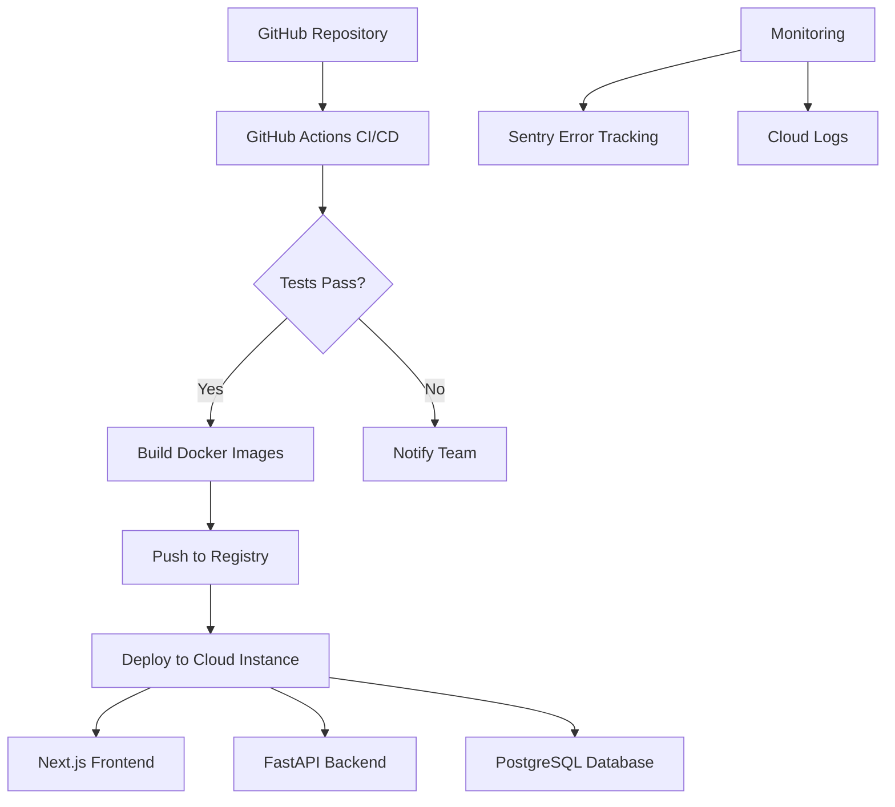

**Deployment Stack:**
- **Hosting:** Single cloud instance (AWS EC2/GCP Compute/Azure VM)
- **Containers:** Docker Compose for multi-container orchestration
- **CI/CD:** GitHub Actions for automated testing and deployment
- **Monitoring:** Sentry for error tracking, cloud provider logs
- **Backups:** Daily PostgreSQL snapshots

## 10. Testing Strategy

### 10.1 Test Pyramid

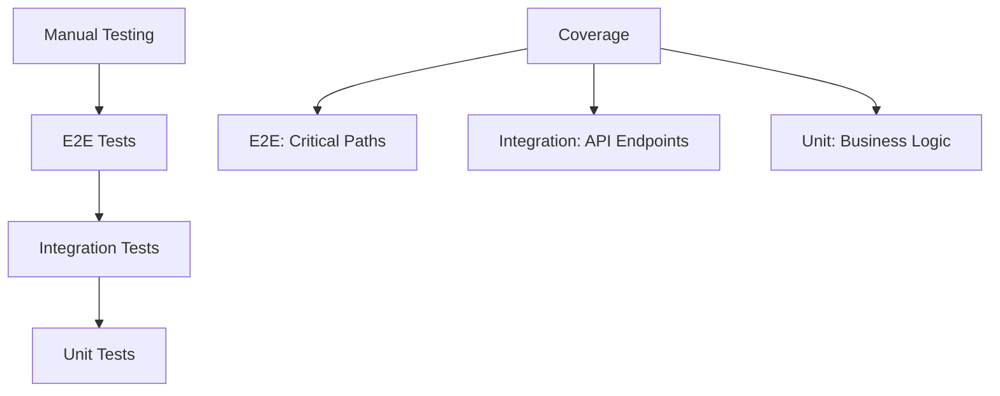

**Testing Approach (2-Week MVP):**
- **Unit Tests:** Core utilities and helpers (pytest, Jest)
- **Integration Tests:** API endpoints (FastAPI TestClient)
- **Accessibility Tests:** Automated axe-core scans
- **Manual Testing:** User flows with diverse personas
- **Load Testing:** Basic stress testing (100 concurrent users)

---

**Document Status:** Complete - MVP Design  
**Next Steps:** Begin implementation, user testing with accessibility focus
