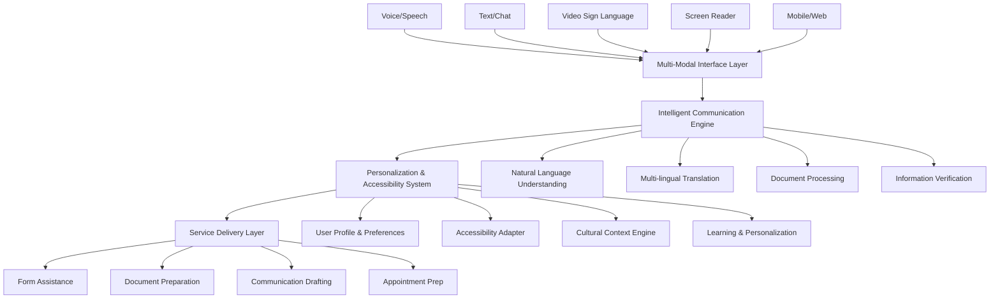
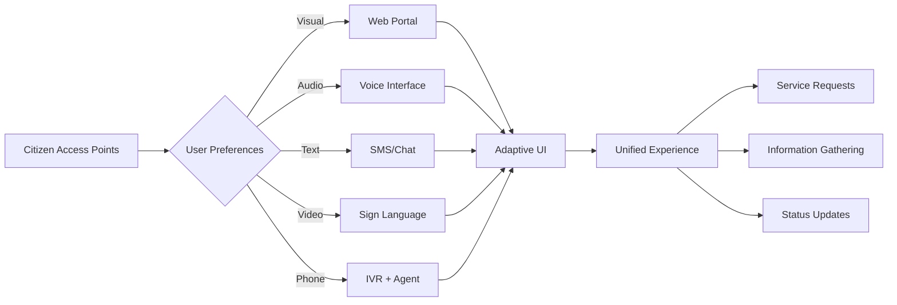
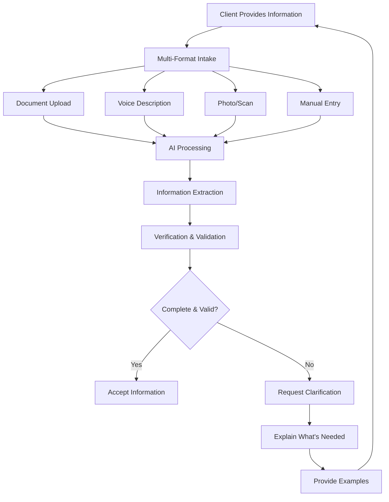
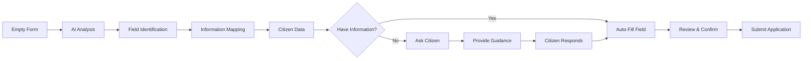
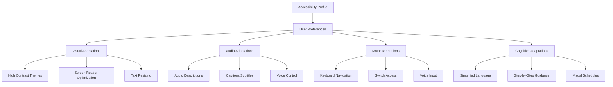
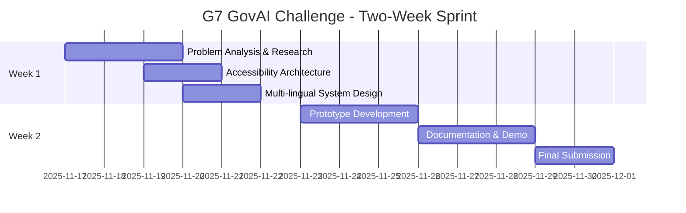
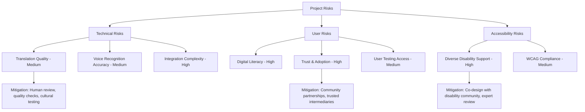

# Feature Idea: Accessible Citizen Service Assistant

## G7 GovAI Grand Challenge Submission

**Challenge:** Statement 4 - Accessible Government Communication  
**Competition Period:** November 17 to December 1, 2025  
**Challenge Host:** Government of Canada (Treasury Board Secretariat)  
**Objective:** Communicate with people in ways accessible to a wide range of languages, cultures, and abilities—reducing barriers and frustration in government interactions

## Overview

An AI-powered universal access platform that transforms how citizens interact with government services by providing personalized, culturally sensitive, and accessible communication across all channels. The system intelligently ingests and verifies client information, requests additional details based on program requirements, and assists with form completion, email drafting, and preparation for government interactions—all adapted to individual communication needs, languages, cultural contexts, and accessibility requirements.

This proposal responds to the G7 GovAI Grand Challenge by presenting an inclusive, equitable solution that can be adopted across G7 countries to ensure all citizens can effectively access government services regardless of their language, culture, or abilities.

## Problem Statement (Citizen Experience Context)

Citizens face significant barriers when trying to access government services:

1. **Language Barriers**: 20-30% of G7 residents speak languages other than official languages; limited translation services create access gaps
2. **Complex Forms**: Government applications use technical language and complex requirements that confuse average citizens
3. **Accessibility Gaps**: Digital services often fail to meet needs of people with visual, hearing, cognitive, or motor disabilities
4. **Cultural Disconnect**: Government communication doesn't account for cultural differences in how information is shared and understood
5. **Information Overload**: Citizens don't know what documents they need or what questions will be asked
6. **Limited Literacy**: 15-20% of adults have low literacy skills, making written forms nearly impossible to complete
7. **Digital Divide**: Elderly, low-income, and rural populations lack digital literacy to navigate online services
8. **Inconsistent Support**: In-person help is limited and varies by location; phone support has long wait times
9. **Intimidation Factor**: Fear and anxiety about interacting with government, especially for vulnerable populations
10. **Fragmented Services**: Different agencies have different processes, creating confusion and requiring duplicate information

## Proposed Solution

### Core System Architecture

### Key Components

#### 1. **Universal Multi-Modal Interface**

**Access Channels:**
- **Web Portal**: Responsive design with WCAG AAA compliance, customizable fonts, colors, layouts
- **Mobile Apps**: iOS/Android with native accessibility features (VoiceOver, TalkBack)
- **Voice Interface**: Natural conversation with Alexa, Google Assistant, Siri, phone IVR
- **SMS/WhatsApp**: Text-based interaction for basic phones and low bandwidth
- **Video Chat**: Live interpretation with sign language recognition and generation
- **In-Person Kiosks**: Accessible terminals in community centers, libraries, government offices
- **Assisted Mode**: Connect to human agents who use AI to provide real-time support

#### 2. **Intelligent Communication Engine**

**Natural Language Processing:**
- **Intent Recognition**: Understand what service/program the citizen needs
- **Entity Extraction**: Identify key information (names, dates, addresses, amounts)
- **Context Maintenance**: Remember conversation history across sessions and channels
- **Clarification Management**: Ask follow-up questions when information is incomplete or ambiguous
- **Plain Language Generation**: Explain requirements in simple, clear language

**Multi-lingual Support:**
- **100+ Languages**: Real-time translation for text, speech, and documents
- **Dialect Recognition**: Handle regional variations and accents
- **Code-Switching**: Support mixing languages within conversations
- **Cultural Localization**: Adapt examples, metaphors, and explanations to cultural context
- **Quality Assurance**: Human review for high-stakes translations

#### 3. **Information Ingestion & Verification**

**Capabilities:**
- **Document Intelligence**: Extract information from uploaded IDs, bills, pay stubs, certificates
- **OCR & Image Analysis**: Process photos taken with phones (auto-crop, enhance, extract text)
- **Voice Transcription**: Convert verbal descriptions to structured data
- **Verification Rules**: Check for completeness, consistency, and validity
- **External Verification**: Connect to trusted databases (credit bureaus, employers, educational institutions) with consent
- **Fraud Detection**: Flag suspicious patterns while minimizing false positives

#### 4. **Dynamic Information Gathering**

**Intelligent Questionnaire:**
- **Program-Specific Logic**: Show only relevant questions based on citizen's situation
- **Conditional Branching**: Skip irrelevant sections, ask follow-ups based on answers
- **Progress Indication**: Show how much is complete and what's remaining
- **Save & Resume**: Allow completion over multiple sessions
- **Prefill Known Information**: Use previous submissions and government records (with consent)

**Adaptive Explanations:**
- **Why We're Asking**: Explain the purpose of each question
- **Examples**: Provide concrete examples for abstract questions
- **Visual Aids**: Use icons, diagrams, and videos to clarify concepts
- **Multiple Formats**: Present information as text, audio, video, or interactive based on preference

#### 5. **Form Completion Assistant**

**Features:**
- **Auto-Fill Intelligence**: Populate fields from previous interactions and verified documents
- **Field-by-Field Guidance**: Explain each field in plain language with examples
- **Error Prevention**: Validate inputs in real-time before submission
- **Attachment Management**: Automatically match documents to required attachments
- **Preview & Review**: Show completed form in accessible format before submission
- **Accessibility Compliance**: Support keyboard navigation, screen readers, voice input

#### 6. **Communication Drafting Support**

**Email/Letter Assistant:**
- **Template Generation**: Create properly formatted correspondence for common scenarios
- **Tone Adjustment**: Professional yet friendly language appropriate for government
- **Cultural Adaptation**: Adjust formality and style for different cultural norms
- **Grammar & Clarity**: Check and improve writing while preserving citizen's intent
- **Translation**: Draft in citizen's preferred language, translate to official language if needed

**Meeting Preparation:**
- **Agenda Preview**: Explain what will be discussed in appointment
- **Question Prep**: Suggest questions citizen should ask
- **Document Checklist**: List what to bring to meeting
- **Role-Play**: Practice conversation with AI before real meeting
- **Rights & Options**: Inform citizen of their rights and available choices

#### 7. **Accessibility Adaptation System**

**Disability Support:**
- **Visual Impairments**: Screen reader compatibility, high contrast, audio descriptions
- **Hearing Impairments**: Captions, visual alerts, sign language video, text alternatives
- **Motor Disabilities**: Voice control, switch access, large touch targets, keyboard navigation
- **Cognitive Disabilities**: Plain language, visual aids, consistent layouts, predictable patterns
- **Neurodiversity**: Sensory controls (animations, sounds), flexible pacing, alternative formats
- **Temporary Disabilities**: Injury, illness, or situational (e.g., bright sunlight) adaptations

## Expected Benefits (Citizen & Government Impact)

### For Citizens

**Access & Equity:**
- **100% of citizens** can access services in their preferred language and format
- **70% reduction** in barriers for people with disabilities
- **80% decrease** in citizens giving up on applications due to complexity
- **90% of applications** completed successfully on first attempt

**Time & Convenience:**
- **50-70% reduction** in time to complete applications (from hours to 30-45 minutes)
- **24/7 access** to assistance without waiting for office hours
- **Complete from anywhere** - home, work, mobile, community center
- **Save and resume** across devices and sessions

**Confidence & Understanding:**
- **85% of citizens** report feeling confident about their submissions
- **90% reduction** in anxiety about government interactions
- **Clear explanations** of requirements, process, and timeline
- **Know before you go** - understand what to expect in meetings

**Quality & Accuracy:**
- **60-80% reduction** in application errors and rejections
- **Automatic validation** catches mistakes before submission
- **Guided assistance** prevents common mistakes
- **Complete submissions** with all required documentation

### For Government

**Efficiency Gains:**
- **40-60% reduction** in processing time for applications
- **50-70% fewer** incomplete applications requiring follow-up
- **30-40% reduction** in call center volume as citizens self-serve
- **Faster approvals** with accurate, complete information

**Cost Savings:**
- $5-15M annually per large agency through efficiency gains
- **Reduced translation costs** through automated multilingual support
- **Lower support costs** with AI-powered self-service
- **Fewer appeals and corrections** due to improved accuracy

**Reach & Inclusion:**
- **Serve underserved populations** who previously couldn't access services
- **Increase uptake** of programs by 20-40% through easier access
- **Demonstrate commitment** to diversity, equity, and inclusion
- **Comply with accessibility regulations** (AODA, ADA, etc.)

**Service Quality:**
- **Consistent experience** across all channels and languages
- **Measurable satisfaction** with real-time feedback
- **Continuous improvement** through AI learning from interactions
- **Proactive support** identifying and addressing common issues

## Technical Considerations (System Integration)

### Technology Stack

```mermaid
flowchart TD
    A[Frontend] --> B[React/Next.js - Web]
    A --> C[React Native - Mobile]
    A --> D[Voice UI - Amazon/Google]
    
    E[API Gateway] --> F[REST/GraphQL APIs]
    E --> G[WebSocket - Real-time]
    E --> H[Twilio - SMS/Voice]
    
    I[Backend Services] --> J[Node.js/Python Microservices]
    I --> K[Translation Services]
    I --> L[Document Processing]
    
    M[AI/ML Layer] --> N[NLP - Intent/Entity]
    M --> O[Speech-to-Text/Text-to-Speech]
    M --> P[Computer Vision - OCR]
    M --> Q[LLMs - GPT-4/Claude]
    
    R[Data Layer] --> S[PostgreSQL - User Data]
    R --> T[MongoDB - Conversations]
    R --> U[Redis - Sessions]
    R --> V[S3 - Documents]
```

### AI/ML Components

**Natural Language Processing:**
- **Multilingual Models**: mBERT, XLM-R for 100+ languages
- **Speech Recognition**: Whisper, Google Speech-to-Text for voice input
- **Text-to-Speech**: ElevenLabs, Azure Neural TTS for natural-sounding output
- **Translation**: DeepL, Google Translate with custom government terminology
- **Simplification**: Models fine-tuned to convert complex to plain language
- **Intent Classification**: Custom models for government service categorization

**Computer Vision & Document AI:**
- **OCR**: Tesseract, AWS Textract, Google Document AI
- **Document Classification**: Identify ID types, supporting documents
- **Information Extraction**: Pull structured data from unstructured documents
- **Image Quality Assessment**: Detect blurry, cropped, or unclear uploads
- **Signature Detection**: Verify signatures on forms

**RAG & Document Management Options:**
- **Gemini API File Search**: Google's managed RAG solution for document grounding
  - Integrated file upload and management capabilities
  - Automatic chunking, embedding generation, and semantic search
  - Supports PDF, TXT, HTML, and other common document formats
  - Built-in caching for improved performance and reduced costs
  - Seamless integration with Gemini models for Q&A and summarization
  - Documentation: https://ai.google.dev/gemini-api/docs/file-search
- **Custom RAG Implementation**: Vector databases (Pinecone, Weaviate, Chroma) with embedding models
- **Hybrid Approach**: Combine Gemini API for core RAG with custom pipelines for specialized needs

**Accessibility AI:**
- **Sign Language Recognition**: MediaPipe, custom models for ASL/LSQ
- **Sign Language Generation**: Animated avatars for deaf users
- **Audio Description Generation**: Describe visual content for blind users
- **Content Simplification**: Adapt to literacy levels and cognitive abilities

### Integration Requirements

**Government Systems:**
- Identity verification systems
- Application processing platforms
- Case management systems
- Document management and records
- Payment and benefit systems
- Appointment scheduling systems

**External Services:**
- Translation APIs (DeepL, Google, Microsoft)
- Speech services (AWS Polly, Azure TTS, Google)
- SMS/Voice platforms (Twilio, Vonage)
- Video platforms (Zoom, WebEx for live interpretation)
- Identity verification (credit bureaus, digital ID)
- Accessibility testing tools

### Security & Privacy

**Data Protection:**
- End-to-end encryption for all personal information
- Minimal data retention - delete after processing
- Secure document storage with access controls
- PII detection and automatic redaction
- Consent management for data sharing

**Authentication:**
- Multi-factor authentication options
- Biometric support (fingerprint, face)
- Secure recovery options
- Support for delegates/representatives
- Single sign-on with government ID

**Compliance:**
- WCAG 2.2 Level AAA for accessibility
- PIPEDA, GDPR for privacy
- Accessibility for Ontarians with Disabilities Act (AODA)
- Americans with Disabilities Act (ADA)
- Official Languages Act compliance
- Plain Language standards

### Performance & Scalability

**Performance Targets:**
- **Response Time**: <1 second for 95% of interactions
- **Translation**: <2 seconds for text, <5 seconds for speech
- **Document Processing**: <10 seconds for OCR and extraction
- **Availability**: 99.95% uptime
- **Concurrent Users**: 50,000+ simultaneous users

**Scalability:**
- Cloud-native architecture (auto-scaling)
- CDN for global content delivery
- Edge computing for voice processing
- Load balancing across regions
- Horizontal scaling for all services

## G7 Challenge Proposal: Two-Week Rapid Solution Design

### Challenge Timeline (Nov 17 - Dec 1, 2025)

**Challenge Deliverables (by December 1, 2025):**
1. Comprehensive solution architecture for accessible citizen services
2. Working prototype demonstrating multilingual, multi-modal interactions
3. Accessibility framework addressing WCAG AAA and diverse abilities
4. Cultural sensitivity guidelines and adaptation strategies
5. Implementation roadmap for G7 government adoption
6. Presentation demonstrating impact on underserved populations

### Post-Challenge Pathway (if selected)

**Early 2026: Showcase & Funding**
- Present to G7 GovAI network and judging panel
- Potential award of up to $10,000 CAD
- Partnership with G7 government agency

**Months 1-3 (if funded):**
- Enhanced accessibility features (AAA compliance)
- Expand to 10+ languages
- Develop mobile applications
- Test with diverse user groups

**Months 4-6:**
- Government system integrations
- Deploy to 1-2 programs
- Serve 5,000+ users pilot
- Full accessibility validation

**Months 7-12:**
- Multi-department deployment
- Advanced AI features
- 20+ languages support
- Share with G7 AI Network (GAIN)

## Initial Scope

### In Scope for G7 Challenge Submission (Nov 17 - Dec 1, 2025)

**What We'll Deliver in Two Weeks:**
1. **Solution Architecture & Design**
   - End-to-end system architecture
   - Multi-modal interface design
   - Accessibility adaptation framework
   - Cultural sensitivity approach
   - Integration specifications

2. **Working Proof-of-Concept**
   - Web interface demonstrating key interactions
   - Support for 3-5 languages (English, French, Spanish, Mandarin, Arabic)
   - Form completion assistant demo
   - Document upload and verification
   - Accessibility features showcase (screen reader, voice, high contrast)
   - Communication drafting example

3. **Accessibility & Inclusion Framework**
   - WCAG AAA compliance strategy
   - Support matrix for various disabilities
   - Cultural adaptation guidelines
   - Plain language standards
   - Testing methodology with diverse users

4. **G7 Adoption Roadmap**
   - Phased deployment plan
   - Cost-benefit analysis
   - Risk assessment
   - Success metrics and KPIs
   - Cross-country adaptability

5. **Demonstration Package**
   - Video showing diverse user scenarios
   - Technical documentation
   - User stories from underserved populations
   - Presentation slides
   - Code samples

### In Scope for MVP (if selected for funding)

**Core Features:**
1. **Multi-Channel Access**
   - Web portal (WCAG AAA compliant)
   - Mobile apps (iOS/Android)
   - Voice interface (phone IVR)
   - SMS/text messaging

2. **Multilingual Support**
   - 10-15 major languages
   - Real-time translation
   - Cultural localization
   - Bilingual forms

3. **Information Gathering**
   - Document upload and OCR
   - Voice input and transcription
   - Information verification
   - Intelligent follow-up questions

4. **Form Assistance**
   - Auto-fill from documents
   - Field-by-field guidance
   - Real-time validation
   - Accessible review

5. **Communication Support**
   - Email drafting assistance
   - Meeting preparation guide
   - Question suggestions
   - Plain language explanations

6. **Accessibility Features**
   - Screen reader optimization
   - Voice control
   - High contrast themes
   - Keyboard navigation
   - Adjustable text size
   - Audio descriptions

7. **Pilot Scale**
   - 2-3 government programs
   - 5,000-10,000 users
   - 10-15 languages
   - Full accessibility support

### Out of Scope for MVP
- Sign language video (Phase 2)
- Advanced AI agents (Phase 2)
- Blockchain identity verification (Phase 3)
- AR/VR interfaces (Phase 3)
- Biometric authentication (Phase 2)
- 50+ rare languages (Phase 3)

### Success Criteria for MVP

**Technical Metrics:**
- **Accessibility**: 100% WCAG AAA compliance
- **Translation Accuracy**: >95% for pilot languages
- **Document Processing**: >90% successful extraction
- **System Availability**: >99.5% uptime
- **Response Time**: <2 seconds for 95% of interactions

**User Adoption:**
- **Diverse Users**: 30% from underserved populations
- **Completion Rate**: >80% of started applications completed
- **Multi-Channel**: 60% use multiple channels
- **Accessibility Features**: 20% actively use accessibility features
- **Satisfaction**: 4.5/5 average rating

**Impact Metrics:**
- **Barrier Reduction**: 60% fewer reported access barriers
- **Time Savings**: 50% reduction in completion time
- **Error Reduction**: 70% fewer incomplete/incorrect applications
- **Reach Expansion**: 30% increase in applications from non-English speakers
- **Cost per Transaction**: 40% reduction vs. traditional channels

## Implementation Approach

### Development Methodology
- **Agile/Scrum**: 2-week sprints with user testing every sprint
- **Human-Centered Design**: Co-design with diverse users
- **Accessibility-First**: Build with accessibility from day one
- **AI-TDD**: Test-driven development with diverse datasets
- **Continuous Testing**: Regular testing with real users across abilities

### Team Structure (2-Week MVP / 4-Person Team)
- **Full-Stack Developer**: 1 (React + FastAPI/Node.js)
- **AI/ML Engineer**: 1 (NLP, Translation, Speech)
- **Accessibility Specialist**: 1 (WCAG, Testing)
- **Product Designer**: 1 (UX/UI, User Testing)

### Timeline & Budget Estimate

**G7 Challenge Phase (Nov 17 - Dec 1, 2025):**
- **Duration**: 2 weeks to MVP
- **Team**: 4 people (Full-Stack Dev, AI/ML Engineer, Accessibility Specialist, Product Designer)
- **Competition Effort**: Intensive 2-week sprint
- **Potential Award**: Up to $10,000 CAD (if selected)

**Post-Challenge Development (if funded):**
- **Months 1-3**: Enhanced features (AAA compliance, 10+ languages, mobile apps), $100-200K
- **Months 4-6**: Government integrations, 5K+ users pilot, $200-400K
- **Months 7-12**: Multi-department deployment, advanced AI features, $500K-1M

### Risk Assessment

### Next Steps for G7 Challenge Submission

**Week 1 (Nov 17-23, 2025):**
1. **Research & Analysis** (Days 1-2)
   - Study accessibility barriers across G7 countries
   - Research best practices in inclusive design
   - Analyze Statement 4 requirements
   - Connect with disability and immigrant advocacy groups

2. **Solution Design** (Days 3-5)
   - Finalize architecture and components
   - Design accessible user interfaces
   - Plan multilingual approach
   - Develop cultural sensitivity framework
   - Create accessibility testing plan

**Week 2 (Nov 24-Dec 1, 2025):**
3. **Prototype Development** (Days 6-8)
   - Build accessible web prototype
   - Implement multilingual support
   - Create form assistance demo
   - Develop voice interaction
   - Test with diverse users

4. **Documentation & Submission** (Days 9-14)
   - Complete technical documentation
   - Create video demonstration showing diverse users
   - Write impact analysis emphasizing equity
   - Prepare accessibility compliance report
   - Submit to Impact Canada by December 1, 2025

**Post-Submission:**
- Await judging (December 2025 - January 2026)
- Prepare for showcase presentation (Early 2026)
- If selected: Begin partnership with G7 government

---

*This proposal is submitted for the G7 GovAI Grand Challenge (Nov 17 - Dec 1, 2025), addressing the critical need for accessible, inclusive government services. The solution prioritizes equity, ensuring that all citizens—regardless of language, culture, or ability—can effectively interact with their government and access the services they need.*
