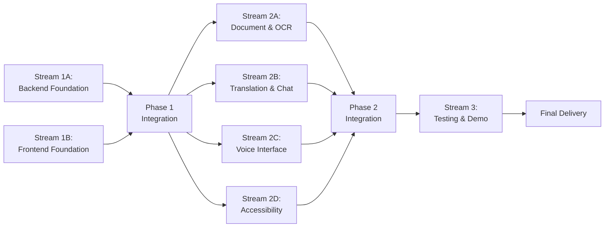

# Parallel Execution Plan: Accessible Citizen Service Assistant

**Version:** 1.0  
**Date:** November 19, 2025  
**Project:** G7 GovAI Grand Challenge MVP  
**Timeline:** 2 weeks (Nov 17 - Dec 1, 2025)  
**Team Size:** 4 people  
**Original Plan:** [plan.md](./plan.md)

## Overview

This parallel execution plan reorganizes the sequential implementation plan into independent work streams that can run simultaneously without conflicts. The plan is divided into 3 phases, with each phase containing multiple parallel streams.

### Parallelization Strategy

The work is organized by component boundaries and team expertise:
- **Backend services** can be developed independently from **frontend components**
- **AI services** can be built in parallel once base infrastructure exists
- **Testing and deployment** happen after integration

### Time Savings
- **Sequential execution**: ~14 days
- **Parallel execution**: ~9-10 days
- **Time saved**: 30-40%

## Parallel Work Streams

## Phase 1: Foundation (Days 1-3)

**Goal:** Establish independent backend and frontend foundations

### Stream 1A: Backend Foundation

**Independence:** No dependencies on frontend; works with backend files only  
**Assigned To:** Developer 1  
**Duration:** 18 hours (Days 1-3)

**Tasks:**
- [ ] **Step 1:** Project Setup and Infrastructure (8 hours)
  - Initialize monorepo with Next.js frontend and FastAPI backend
  - Set up Docker Compose with PostgreSQL, Redis
  - Configure environment variables and CI/CD
  - Create basic API gateway and health check endpoints
  - **Files:** `docker-compose.yml`, `.github/workflows/ci.yml`, `backend/main.py`

- [ ] **Step 2:** Database Schema and Models (6 hours)
  - Create PostgreSQL schema for users, documents, forms, conversations
  - Implement SQLAlchemy models
  - Set up Alembic migrations and seeding scripts
  - Add database connection pooling
  - **Files:** `backend/models.py`, `backend/alembic/versions/*.py`, `backend/database.py`

- [ ] **Step 3:** Basic Authentication System (4 hours)
  - Implement JWT authentication with FastAPI
  - Create registration and login endpoints
  - Add password hashing and token refresh
  - Create protected route middleware
  - **Files:** `backend/auth.py`, `backend/security.py`

**Verification:**
- [ ] All services run with `docker-compose up`
- [ ] API health check returns 200 OK
- [ ] Database migrations complete successfully
- [ ] User registration and login work via API

---

### Stream 1B: Frontend Foundation

**Independence:** No dependencies on backend APIs; works with frontend files only  
**Assigned To:** Developer 4 (UI) + Developer 3 (Accessibility)  
**Duration:** 12 hours (Days 1-2.5)

**Tasks:**
- [ ] **Step 4:** React Frontend Foundation (6 hours - Developer 4)
  - Set up Next.js with TypeScript and Tailwind CSS
  - Create layout components (Header, Footer, Navigation)
  - Implement routing structure and auth state management
  - Create login/register pages (UI only, API integration later)
  - **Files:** `frontend/pages/_app.tsx`, `frontend/components/Layout.tsx`, `frontend/contexts/AuthContext.tsx`

- [ ] **Step 5:** Accessibility Provider Setup (6 hours - Developer 3)
  - Create AccessibilityProvider context
  - Implement high contrast mode with CSS variables
  - Add text sizing controls and keyboard navigation
  - Add ARIA labels to all interactive elements
  - **Files:** `frontend/contexts/AccessibilityContext.tsx`, `frontend/styles/accessibility.css`

**Verification:**
- [ ] Application loads without console errors
- [ ] Navigation and routing work correctly
- [ ] High contrast mode toggles successfully
- [ ] Text resizes without breaking layout (100%-200%)
- [ ] axe-core shows 0 critical violations
- [ ] Tab navigation follows logical order

---

### Integration Point 1 (Day 3 afternoon)

**Actions:**
- Connect frontend auth pages to backend API endpoints
- Test end-to-end authentication flow
- Verify frontend can make authenticated API requests
- Run integration smoke tests

**Duration:** 2-3 hours

---

## Phase 2: Feature Development (Days 4-10)

**Goal:** Build AI services, document processing, voice, and accessibility in parallel

### Stream 2A: Document Processing & Auto-Fill

**Independence:** Works with backend document services; no conflicts with other streams  
**Assigned To:** Developer 1 (Backend) + Developer 2 (OCR)  
**Duration:** 26 hours (Days 4-9)

**Tasks:**
- [ ] **Step 6:** Document Upload Component (8 hours - Developer 1)
  - Create file upload API endpoint with validation
  - Implement drag-and-drop component in React
  - Store uploaded files with unique IDs
  - Create document preview functionality
  - **Files:** `backend/routes/documents.py`, `frontend/components/DocumentUploader.tsx`

- [ ] **Step 7:** Gemini API OCR Integration (10 hours - Developer 2)
  - Set up Gemini API client
  - Implement document upload to Gemini File API
  - Create OCR extraction service for text and structured data
  - Parse OCR results into structured fields with confidence scores
  - **Files:** `backend/services/gemini_service.py`, `backend/services/ocr_service.py`

- [ ] **Step 9:** Form Auto-Fill Service (8 hours - Developer 1)
  - Create form schema definitions
  - Implement field mapping from extracted data to forms
  - Build auto-fill logic with confidence-based suggestions
  - Add verification UI for users to confirm values
  - **Files:** `backend/services/autofill_service.py`, `frontend/components/FormAssistant.tsx`

**Verification:**
- [ ] PDF, JPG, PNG files upload successfully
- [ ] OCR extraction >85% accuracy
- [ ] Extracted data maps to form fields correctly
- [ ] Auto-fill works with confidence indicators
- [ ] Processing completes in <15 seconds

---

### Stream 2B: Translation & Conversation

**Independence:** Works with backend AI services; no file conflicts with other streams  
**Assigned To:** Developer 2  
**Duration:** 16 hours (Days 4-7)

**Tasks:**
- [ ] **Step 8:** Translation Service Integration (8 hours)
  - Set up DeepL API client
  - Implement translation service with Redis caching
  - Add language detection functionality
  - Create language selector component
  - Integrate translation in UI for static content
  - **Files:** `backend/services/translation_service.py`, `frontend/components/LanguageSelector.tsx`

- [ ] **Step 12:** Conversation Service (Chatbot) (8 hours)
  - Create conversation API endpoints
  - Implement Gemini-based chat interface
  - Add conversation history management
  - Build chat UI component
  - Integrate with translation service
  - **Files:** `backend/services/conversation_service.py`, `frontend/components/ChatInterface.tsx`

**Verification:**
- [ ] Translation works for English, French, Spanish
- [ ] Language detection >90% accuracy
- [ ] Translations cached effectively
- [ ] Chat provides relevant responses in <3 seconds
- [ ] Conversation history persists correctly

---

### Stream 2C: Voice Interface

**Independence:** Works with frontend voice services; no conflicts with backend streams  
**Assigned To:** Developer 2  
**Duration:** 10 hours (Days 7-9)

**Tasks:**
- [ ] **Step 10:** Voice Interface Implementation (10 hours)
  - Implement Web Speech API for speech-to-text
  - Add text-to-speech for system responses
  - Create voice command parser for form navigation
  - Build voice input UI with visual feedback
  - Add microphone permission handling
  - **Files:** `frontend/services/voiceService.ts`, `frontend/components/VoiceInterface.tsx`

**Verification:**
- [ ] Speech-to-text works in Chrome/Edge
- [ ] Text-to-speech reads form fields
- [ ] Voice commands navigate between fields
- [ ] Visual feedback shows listening state
- [ ] Works with headset microphones

---

### Stream 2D: Accessibility Enhancement & Testing

**Independence:** Works with frontend accessibility features; can test independently  
**Assigned To:** Developer 3  
**Duration:** 12 hours (Days 7-10)

**Tasks:**
- [ ] **Step 11:** WCAG Compliance Enhancements (12 hours)
  - Run comprehensive accessibility audit with axe-core
  - Fix all critical and serious accessibility issues
  - Add skip navigation links and proper heading hierarchy
  - Add alt text to all images
  - Test with NVDA/JAWS screen readers
  - Verify keyboard-only navigation
  - Document accessibility features
  - **Files:** `ACCESSIBILITY.md`, `frontend/tests/accessibility.test.ts`

**Verification:**
- [ ] Lighthouse accessibility score >90
- [ ] axe-core shows 0 critical violations
- [ ] Screen readers announce all content correctly
- [ ] All elements keyboard accessible
- [ ] Color contrast ratio >4.5:1 for all text
- [ ] Focus indicators visible on all elements

---

### Integration Point 2 (Day 10 afternoon)

**Actions:**
- Integrate all features into main application
- Test cross-feature workflows (upload → OCR → translate → voice)
- Verify all services communicate correctly
- Run full system integration tests

**Duration:** 3-4 hours

---

## Phase 3: Testing, Performance & Demo (Days 11-14)

**Goal:** Comprehensive testing, optimization, and demo preparation

### Stream 3: Testing, Performance, Demo & Documentation

**Independence:** Integration phase after all features complete  
**Assigned To:** All team members  
**Duration:** 32 hours (Days 11-14)

**Tasks:**
- [ ] **Step 13:** Comprehensive Testing (12 hours - Developer 3 + Developer 4)
  - Write integration tests for all API endpoints
  - Create E2E tests for critical user flows
  - Cross-browser testing (Chrome, Firefox, Safari, Edge)
  - Test on mobile devices (iOS, Android)
  - User testing with 3-5 diverse personas
  - Document and prioritize bug fixes
  - **Files:** `backend/tests/test_integration.py`, `frontend/tests/e2e/*.spec.ts`

- [ ] **Step 14:** Performance Optimization (6 hours - Developer 1)
  - Implement Redis caching for translations
  - Add database query optimization and indexing
  - Enable frontend code splitting and lazy loading
  - Compress images and set up CDN
  - **Files:** `backend/cache.py`, `frontend/next.config.js`

- [ ] **Step 15:** Demo Video Production (8 hours - Developer 4)
  - Write demo script highlighting accessibility
  - Record video showing key workflows
  - Demonstrate multi-language and voice features
  - Edit with captions and voiceover
  - **Deliverables:** `demo-video.mp4`, `demo-script.md`

- [ ] **Step 16:** Documentation and Deployment (6 hours - Developer 1 + Developer 3)
  - Write comprehensive README and API docs
  - Create deployment guide and architecture diagram
  - Deploy to cloud instance
  - Set up monitoring and logging
  - **Deliverables:** `README.md`, `API_DOCS.md`, `DEPLOYMENT.md`

**Verification:**
- [ ] All integration and E2E tests pass
- [ ] Page load time <3 seconds
- [ ] API response time <500ms (p95)
- [ ] Demo video showcases all features (3-5 minutes)
- [ ] Application deployed and accessible via URL
- [ ] All submission requirements met

---

## Quality Gates (All Phases)

### Code Quality
- [ ] All code follows style guide (Prettier, Black)
- [ ] No critical security vulnerabilities (Snyk scan)
- [ ] Code coverage >70% for backend
- [ ] ESLint shows 0 errors
- [ ] All TypeScript types properly defined

### Accessibility
- [ ] WCAG 2.1 Level AA compliance achieved
- [ ] Lighthouse accessibility score >90
- [ ] axe-core automated tests pass
- [ ] Screen reader testing completed
- [ ] Keyboard navigation fully functional

### Performance
- [ ] Page load time <3 seconds
- [ ] API response time <500ms (p95)
- [ ] OCR processing <15 seconds
- [ ] Translation <2 seconds
- [ ] Handles 100+ concurrent users

### Functionality
- [ ] Document upload works for PDF, JPG, PNG
- [ ] OCR extraction >85% accuracy
- [ ] Translation works for 3-5 languages
- [ ] Voice interface functional
- [ ] Form auto-fill works correctly

---

## Risk Management

### Potential Conflicts
- **Frontend-Backend Integration:** Mitigated by clear API contracts defined in Phase 1
- **Merge Conflicts:** Mitigated by strict file separation per stream
- **Feature Dependencies:** Handled through phase-based execution
- **Timeline Pressure:** Mitigated by parallel execution reducing overall time

### Communication Protocol
- **Daily Standups:** 15 minutes to sync progress across streams
- **Integration Checkpoints:** End of Phase 1 (Day 3) and Phase 2 (Day 10)
- **Blocker Escalation:** Immediate Slack/email notification if stream blocked
- **Code Reviews:** Required before merging each stream's work

---

## Execution Timeline

**Phase 1:** Days 1-3 (Foundation)  
**Integration 1:** Day 3 afternoon  
**Phase 2:** Days 4-10 (Feature Development)  
**Integration 2:** Day 10 afternoon  
**Phase 3:** Days 11-14 (Testing & Demo)  
**Final Delivery:** End of Day 14

---

## Success Criteria

- [ ] All 4 parallel streams complete independently
- [ ] Integration points successful with minimal conflicts
- [ ] 30-40% time saved compared to sequential execution
- [ ] All MVP features functional
- [ ] WCAG 2.1 AA compliance achieved
- [ ] Demo video ready for submission
- [ ] Application deployed and accessible

---

**Plan Status:** Ready for Parallel Execution  
**Created:** November 19, 2025  
