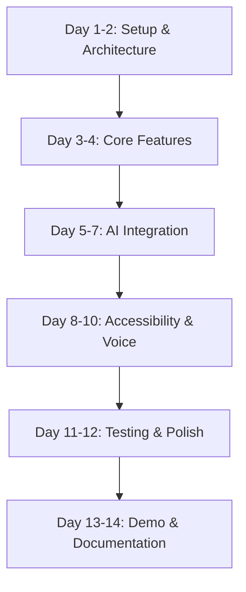
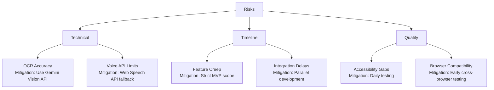

# Implementation Plan: Accessible Citizen Service Assistant

**Version:** 1.0  
**Date:** November 19, 2025  
**Project:** G7 GovAI Grand Challenge MVP  
**Timeline:** 2 weeks (Nov 17 - Dec 1, 2025)  
**Team Size:** 4 people  

## Overview

This plan provides a step-by-step implementation roadmap for building the Accessible Citizen Service Assistant MVP. The plan is optimized for a 4-person team with a 2-week timeline, focusing on core features that demonstrate the platform's value for the G7 Challenge.

### Team Roles
- **Developer 1:** Full-Stack (React + FastAPI/Node.js)
- **Developer 2:** AI/ML Engineer (NLP, Translation, Speech)
- **Developer 3:** Accessibility Specialist (WCAG, Testing)
- **Developer 4:** Product Designer (UX/UI, User Testing)

### MVP Scope
- Web portal with WCAG 2.1 AA compliance
- Support for 3-5 languages (English, French, Spanish + 2)
- Basic voice interface using Web Speech API
- Document upload with OCR (PDF/JPG)
- Simple form auto-fill from uploaded docs
- Demo video showcasing accessibility features

## Implementation Flow

## Pre-Implementation Checklist

- [ ] Development environment setup complete
- [ ] API keys obtained (Gemini, DeepL, cloud provider)
- [ ] GitHub repository created with CI/CD
- [ ] Docker and Docker Compose installed
- [ ] Cloud account setup (AWS/GCP/Azure)
- [ ] Design assets and mockups ready
- [ ] Accessibility testing tools installed (axe-core, Lighthouse)
- [ ] Sample documents prepared for testing

## Implementation Steps

### Phase 1: Foundation (Days 1-2)

#### Step 1: Project Setup and Infrastructure
**Status:** [ ] Not Started  
**Assigned To:** Developer 1  
**Effort:** 8 hours  
**Dependencies:** None

**Actions:**
1. Initialize monorepo structure with Next.js frontend and FastAPI backend
2. Set up Docker Compose with PostgreSQL, Redis containers
3. Configure environment variables and secrets management
4. Set up GitHub Actions for CI/CD
5. Create basic API gateway and health check endpoints

**Verification:**
- [ ] `docker-compose up` runs all services successfully
- [ ] Health check endpoint returns 200 OK
- [ ] GitHub Actions workflow passes on push
- [ ] Environment variables loaded correctly

**Files Created:**
- `docker-compose.yml`
- `.github/workflows/ci.yml`
- `frontend/package.json`
- `backend/requirements.txt`
- `backend/main.py`

---

#### Step 2: Database Schema and Models
**Status:** [ ] Not Started  
**Assigned To:** Developer 1  
**Effort:** 6 hours  
**Dependencies:** Step 1

**Actions:**
1. Create PostgreSQL database schema from design document
2. Implement SQLAlchemy/Prisma models for users, documents, forms, conversations
3. Set up Alembic/Prisma migrations
4. Create database seeding scripts with sample data
5. Add database connection pooling

**Verification:**
- [ ] All tables created successfully
- [ ] Migration scripts run without errors
- [ ] Sample data seeds correctly
- [ ] Database queries execute in <100ms

**Files Created:**
- `backend/models.py`
- `backend/alembic/versions/*.py`
- `backend/database.py`

---

#### Step 3: Basic Authentication System
**Status:** [ ] Not Started  
**Assigned To:** Developer 1  
**Effort:** 4 hours  
**Dependencies:** Step 2

**Actions:**
1. Implement JWT authentication with FastAPI
2. Create registration and login endpoints
3. Add password hashing with bcrypt
4. Implement token refresh mechanism
5. Create protected route middleware

**Verification:**
- [ ] User can register successfully
- [ ] User can login and receive JWT token
- [ ] Protected endpoints reject invalid tokens
- [ ] Token refresh works correctly

**Files Created:**
- `backend/auth.py`
- `backend/security.py`

---

### Phase 2: Core Features (Days 3-4)

#### Step 4: React Frontend Foundation
**Status:** [ ] Not Started  
**Assigned To:** Developer 4  
**Effort:** 6 hours  
**Dependencies:** Step 1

**Actions:**
1. Set up Next.js with TypeScript and Tailwind CSS
2. Create layout components (Header, Footer, Navigation)
3. Implement routing structure
4. Add authentication state management (React Context/Redux)
5. Create login/register pages

**Verification:**
- [ ] Application loads without console errors
- [ ] Navigation between pages works
- [ ] Responsive design works on mobile/tablet/desktop
- [ ] Authentication state persists across page refreshes

**Files Created:**
- `frontend/pages/_app.tsx`
- `frontend/components/Layout.tsx`
- `frontend/contexts/AuthContext.tsx`

---

#### Step 5: Accessibility Provider Setup
**Status:** [ ] Not Started  
**Assigned To:** Developer 3  
**Effort:** 6 hours  
**Dependencies:** Step 4

**Actions:**
1. Create AccessibilityProvider context with settings state
2. Implement high contrast mode with CSS variables
3. Add text sizing controls (100%, 125%, 150%, 200%)
4. Implement keyboard navigation focus indicators
5. Add ARIA labels to all interactive elements

**Verification:**
- [ ] High contrast mode toggles correctly
- [ ] Text resizes without breaking layout
- [ ] Tab navigation follows logical order
- [ ] Screen reader announces context changes
- [ ] axe-core shows 0 critical accessibility violations

**Files Created:**
- `frontend/contexts/AccessibilityContext.tsx`
- `frontend/styles/accessibility.css`
- `frontend/hooks/useAccessibility.ts`

---

#### Step 6: Document Upload Component
**Status:** [ ] Not Started  
**Assigned To:** Developer 1  
**Effort:** 8 hours  
**Dependencies:** Step 3

**Actions:**
1. Create file upload API endpoint with validation
2. Implement drag-and-drop upload component in React
3. Add file type validation (PDF, JPG, PNG, DOCX)
4. Store uploaded files in local filesystem
5. Create document preview functionality

**Verification:**
- [ ] Can upload PDF, JPG, PNG files
- [ ] Drag-and-drop works correctly
- [ ] File size limits enforced (10MB)
- [ ] Uploaded files stored with unique IDs
- [ ] Preview displays for uploaded documents

**Files Created:**
- `backend/routes/documents.py`
- `frontend/components/DocumentUploader.tsx`

---

### Phase 3: AI Integration (Days 5-7)

#### Step 7: Gemini API OCR Integration
**Status:** [ ] Not Started  
**Assigned To:** Developer 2  
**Effort:** 10 hours  
**Dependencies:** Step 6

**Actions:**
1. Set up Gemini API client with authentication
2. Implement document upload to Gemini File API
3. Create OCR extraction service for text and structured data
4. Parse OCR results into structured fields
5. Store extracted data in database with confidence scores

**Verification:**
- [ ] PDF documents processed with >85% accuracy
- [ ] Image documents (JPG/PNG) OCR works
- [ ] Extracted data includes names, dates, addresses
- [ ] Confidence scores calculated for each field
- [ ] Processing completes in <15 seconds per document

**Files Created:**
- `backend/services/gemini_service.py`
- `backend/services/ocr_service.py`

---

#### Step 8: Translation Service Integration
**Status:** [ ] Not Started  
**Assigned To:** Developer 2  
**Effort:** 8 hours  
**Dependencies:** Step 7

**Actions:**
1. Set up DeepL API client
2. Implement translation service with caching
3. Add language detection functionality
4. Create language selector component
5. Integrate translation in UI for static content

**Verification:**
- [ ] Translation works for English, French, Spanish
- [ ] Language detection accuracy >90%
- [ ] Translations cached in Redis
- [ ] UI text changes when language selected
- [ ] Translation latency <2 seconds

**Files Created:**
- `backend/services/translation_service.py`
- `frontend/components/LanguageSelector.tsx`
- `frontend/i18n/translations.json`

---

#### Step 9: Form Auto-Fill Service
**Status:** [ ] Not Started  
**Assigned To:** Developer 1  
**Effort:** 8 hours  
**Dependencies:** Step 7

**Actions:**
1. Create form schema definitions for common government forms
2. Implement field mapping from extracted data to form fields
3. Build auto-fill logic with confidence-based suggestions
4. Add verification UI for users to confirm extracted values
5. Store verified data for future use

**Verification:**
- [ ] Extracted data maps to form fields correctly
- [ ] User can verify/edit auto-filled values
- [ ] High-confidence fields (>90%) pre-filled
- [ ] Low-confidence fields flagged for review
- [ ] Form submission includes data sources

**Files Created:**
- `backend/services/autofill_service.py`
- `backend/schemas/forms.py`
- `frontend/components/FormAssistant.tsx`

---

### Phase 4: Accessibility & Voice (Days 8-10)

#### Step 10: Voice Interface Implementation
**Status:** [ ] Not Started  
**Assigned To:** Developer 2  
**Effort:** 10 hours  
**Dependencies:** Step 8

**Actions:**
1. Implement Web Speech API for speech-to-text
2. Add text-to-speech for system responses
3. Create voice command parser for form navigation
4. Build voice input UI component with visual feedback
5. Add microphone permission handling

**Verification:**
- [ ] Speech-to-text works in Chrome/Edge
- [ ] Text-to-speech reads form fields
- [ ] Voice commands navigate between fields
- [ ] Visual feedback shows listening state
- [ ] Works with headset microphones

**Files Created:**
- `frontend/services/voiceService.ts`
- `frontend/components/VoiceInterface.tsx`
- `frontend/hooks/useSpeechRecognition.ts`

---

#### Step 11: WCAG Compliance Enhancements
**Status:** [ ] Not Started  
**Assigned To:** Developer 3  
**Effort:** 12 hours  
**Dependencies:** Step 5, 10

**Actions:**
1. Run comprehensive accessibility audit with axe-core
2. Fix all critical and serious accessibility issues
3. Add skip navigation links
4. Implement proper heading hierarchy
5. Add alt text to all images
6. Test with NVDA/JAWS screen readers
7. Verify keyboard-only navigation
8. Document accessibility features

**Verification:**
- [ ] Lighthouse accessibility score >90
- [ ] axe-core shows 0 critical violations
- [ ] NVDA screen reader announces all content correctly
- [ ] All interactive elements keyboard accessible
- [ ] Color contrast ratio >4.5:1 for all text
- [ ] Focus indicators visible on all elements

**Files Created:**
- `ACCESSIBILITY.md`
- `frontend/tests/accessibility.test.ts`

---

#### Step 12: Conversation Service (Chatbot)
**Status:** [ ] Not Started  
**Assigned To:** Developer 2  
**Effort:** 8 hours  
**Dependencies:** Step 8

**Actions:**
1. Create conversation API endpoints
2. Implement Gemini-based chat interface
3. Add conversation history management
4. Build chat UI component
5. Integrate with translation service

**Verification:**
- [ ] User can ask questions in natural language
- [ ] Gemini provides relevant responses
- [ ] Conversation history persists
- [ ] Chat works in multiple languages
- [ ] Response time <3 seconds

**Files Created:**
- `backend/services/conversation_service.py`
- `frontend/components/ChatInterface.tsx`

---

### Phase 5: Testing & Polish (Days 11-12)

#### Step 13: Comprehensive Testing
**Status:** [ ] Not Started  
**Assigned To:** Developer 3, Developer 4  
**Effort:** 12 hours  
**Dependencies:** All previous steps

**Actions:**
1. Write integration tests for all API endpoints
2. Create E2E tests for critical user flows
3. Perform cross-browser testing (Chrome, Firefox, Safari, Edge)
4. Test on mobile devices (iOS, Android)
5. Conduct user testing with 3-5 diverse personas
6. Document bugs and prioritize fixes

**Verification:**
- [ ] All integration tests pass
- [ ] E2E tests cover upload → OCR → form fill flow
- [ ] Works on all major browsers
- [ ] Mobile responsive on iPhone and Android
- [ ] User testing reveals no critical UX issues
- [ ] All P0 bugs fixed

**Files Created:**
- `backend/tests/test_integration.py`
- `frontend/tests/e2e/*.spec.ts`
- `TESTING.md`

---

#### Step 14: Performance Optimization
**Status:** [ ] Not Started  
**Assigned To:** Developer 1  
**Effort:** 6 hours  
**Dependencies:** Step 13

**Actions:**
1. Implement Redis caching for translations
2. Add database query optimization and indexing
3. Enable frontend code splitting and lazy loading
4. Compress and optimize images
5. Set up CDN for static assets

**Verification:**
- [ ] Page load time <3 seconds
- [ ] API response time <500ms (p95)
- [ ] Translation cache hit rate >80%
- [ ] Lighthouse performance score >80
- [ ] Handles 100+ concurrent users

**Files Created:**
- `backend/cache.py`
- `frontend/next.config.js` (optimizations)

---

### Phase 6: Demo & Documentation (Days 13-14)

#### Step 15: Demo Video Production
**Status:** [ ] Not Started  
**Assigned To:** Developer 4  
**Effort:** 8 hours  
**Dependencies:** Step 13

**Actions:**
1. Write demo script highlighting accessibility features
2. Record video showing key workflows
3. Demonstrate multi-language support
4. Show voice interface and screen reader compatibility
5. Edit video with captions and voiceover
6. Export final video in required format

**Verification:**
- [ ] Video clearly demonstrates accessibility features
- [ ] All key features shown (upload, OCR, translate, voice)
- [ ] Video length 3-5 minutes
- [ ] Audio quality is clear
- [ ] Captions included for accessibility

**Deliverables:**
- `demo-video.mp4`
- `demo-script.md`

---

#### Step 16: Documentation and Deployment
**Status:** [ ] Not Started  
**Assigned To:** Developer 1, Developer 3  
**Effort:** 8 hours  
**Dependencies:** Step 15

**Actions:**
1. Write comprehensive README.md
2. Document API endpoints with examples
3. Create deployment guide
4. Document accessibility features
5. Deploy to cloud instance
6. Set up monitoring and logging
7. Create architecture diagram for submission

**Verification:**
- [ ] README includes setup instructions
- [ ] API documentation complete
- [ ] Application deployed and accessible via URL
- [ ] Monitoring dashboard shows system health
- [ ] All submission requirements met

**Deliverables:**
- `README.md`
- `API_DOCS.md`
- `DEPLOYMENT.md`
- `ARCHITECTURE.md`

---

## Quality Gates

### Code Quality
- [ ] All code follows style guide (Prettier, Black)
- [ ] No critical security vulnerabilities (Snyk scan)
- [ ] Code coverage >70% for backend
- [ ] ESLint shows 0 errors
- [ ] All TypeScript types properly defined

### Accessibility
- [ ] WCAG 2.1 Level AA compliance achieved
- [ ] Lighthouse accessibility score >90
- [ ] axe-core automated tests pass
- [ ] Screen reader testing completed
- [ ] Keyboard navigation fully functional

### Performance
- [ ] Page load time <3 seconds
- [ ] API response time <500ms (p95)
- [ ] OCR processing <15 seconds
- [ ] Translation <2 seconds
- [ ] Handles 100+ concurrent users

### Functionality
- [ ] Document upload works for PDF, JPG, PNG
- [ ] OCR extraction >85% accuracy
- [ ] Translation works for 3-5 languages
- [ ] Voice interface functional
- [ ] Form auto-fill works correctly

## Risk Management

## Post-Implementation

### Submission Checklist
- [ ] Demo video uploaded
- [ ] Source code repository shared
- [ ] Live demo URL provided
- [ ] Architecture documentation complete
- [ ] Team bios and contact info submitted

### Success Metrics
- [ ] Demonstrates value for 4+ user personas
- [ ] WCAG 2.1 AA compliance achieved
- [ ] Supports 3-5 languages effectively
- [ ] OCR accuracy >85%
- [ ] Positive user testing feedback

---

**Plan Status:** Ready for Implementation  
**Last Updated:** November 19, 2025  
**Next Review:** End of Week 1 (Nov 24, 2025)
