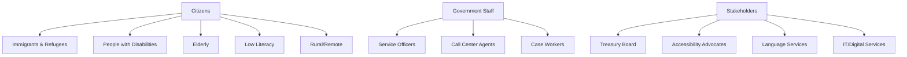
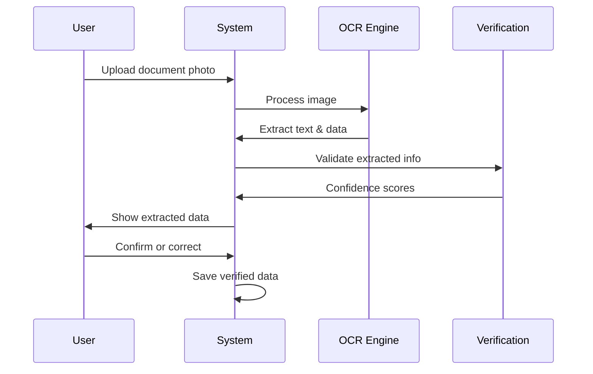
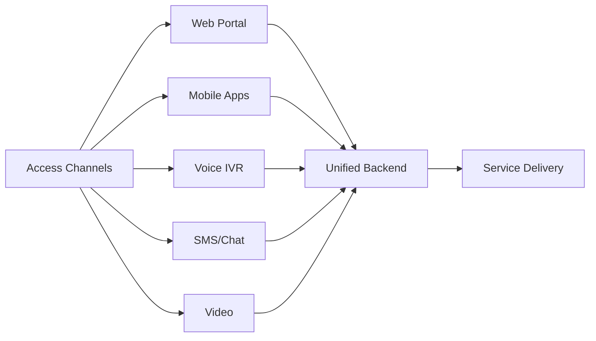
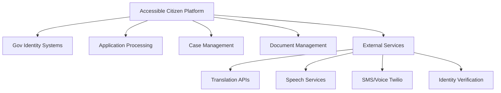
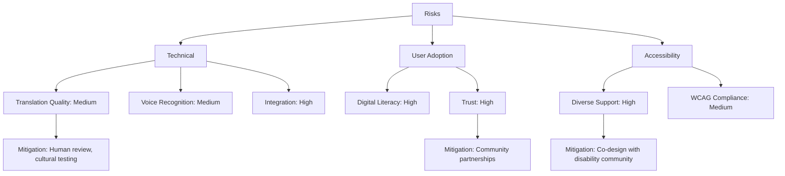

# Product Requirements Document: Accessible Citizen Service Assistant

## Executive Summary

**Product Name:** Accessible Citizen Service Assistant  
**Version:** 1.0  
**Date:** November 18, 2025  
**Project Context:** G7 GovAI Grand Challenge - Statement 4 (Accessible Government Communication)  
**Priority:** High  
**Project Impact:** High - Critical for reducing barriers in government service access for vulnerable populations

### Vision
Transform government service delivery by creating an AI-powered universal access platform that enables all citizens—regardless of language, culture, or ability—to effectively access government services through personalized, accessible, and culturally sensitive communication.

### Success Criteria
- 70% reduction in access barriers for people with disabilities
- 80% decrease in citizens abandoning applications due to complexity
- 90% first-attempt application completion rate
- Support for 100+ languages with >95% translation accuracy
- 100% WCAG AAA accessibility compliance

## Project Context

### G7 GovAI Challenge Context
- **Competition Period:** November 17 - December 1, 2025
- **Host:** Government of Canada (Treasury Board Secretariat)
- **Objective:** Communicate with people in ways accessible to a wide range of languages, cultures, and abilities
- **Funding:** Up to $10,000 CAD for selected solutions
- **Scope:** Two-week rapid solution design, followed by potential partnership with G7 governments

### Target Users & Stakeholders

## User Stories

### Epic 1: Multi-Modal Access

#### US-1.1: Web Portal Access
**As a** citizen with visual impairment  
**I want to** access government services through a screen-reader-compatible web portal  
**So that** I can independently complete applications without assistance

**Acceptance Criteria:**
- Portal achieves WCAG 2.2 Level AAA compliance
- All interactive elements have proper ARIA labels
- Keyboard navigation works for all workflows
- Screen reader announces context changes clearly
- High contrast mode available with customizable colors
- Text resizing up to 200% without layout breaking

#### US-1.2: Voice Interface
**As a** senior citizen with limited digital literacy  
**I want to** use voice commands to complete forms  
**So that** I don't need to navigate complex web interfaces

**Acceptance Criteria:**
- Voice recognition supports natural conversational language
- System handles regional accents and dialects
- Voice commands work for all form fields
- System provides verbal confirmation of inputs
- Error correction through voice interaction
- Fallback to human agent available

#### US-1.3: Mobile Accessibility
**As a** person with motor disabilities  
**I want to** use mobile accessibility features (VoiceOver, TalkBack)  
**So that** I can access services from my smartphone

**Acceptance Criteria:**
- Native iOS and Android accessibility features supported
- Large touch targets (minimum 44x44 pixels)
- Switch control compatible
- Voice input functional for all fields
- Orientation-agnostic design
- Offline capability for form drafts

### Epic 2: Multilingual Support

#### US-2.1: Real-Time Translation
**As an** immigrant who speaks Spanish  
**I want to** interact with government services in my native language  
**So that** I can understand requirements and submit accurate information

**Acceptance Criteria:**
- Support for 10-15 major languages in MVP
- Translation accuracy >95% for government terminology
- Consistent translation of legal/technical terms
- Cultural localization of examples and explanations
- Language preference saved across sessions
- Bilingual document generation

#### US-2.2: Cultural Adaptation
**As a** newcomer from a different cultural background  
**I want** explanations adapted to my cultural context  
**So that** I can better understand government processes

**Acceptance Criteria:**
- System adjusts formality levels based on cultural norms
- Examples use culturally relevant scenarios
- Date/number formats follow cultural conventions
- Metaphors and idioms culturally appropriate
- Respect for cultural communication preferences
- Cultural sensitivity in visual design

### Epic 3: Document Intelligence

#### US-3.1: Document Upload & Extraction
**As a** citizen applying for benefits  
**I want to** upload photos of documents from my phone  
**So that** I don't need to manually type information

**Acceptance Criteria:**
- Support for PDF, JPG, PNG document uploads
- OCR accuracy >90% for printed documents
- Auto-crop and enhancement of phone photos
- Information extraction into structured fields
- Verification of extracted data with user
- Support for handwritten documents

### Epic 4: Form Assistance

#### US-4.1: Intelligent Auto-Fill
**As a** returning user  
**I want** the system to remember my information  
**So that** I don't re-enter the same data for multiple applications

**Acceptance Criteria:**
- Auto-fill from verified documents
- Prefill from previous applications (with consent)
- Smart suggestions based on context
- Secure storage of personal information
- Option to clear saved data
- Audit trail of data sources

#### US-4.2: Field-by-Field Guidance
**As a** person with cognitive disabilities  
**I want** simple explanations for each form field  
**So that** I understand what information to provide

**Acceptance Criteria:**
- Plain language explanation for every field
- Concrete examples provided
- Visual aids (icons, diagrams) available
- "Why we ask" context for each question
- Step-by-step progress indicator
- Option to see detailed vs. simplified help

## Functional Requirements

### FR-1: Multi-Modal Interface System

**Requirements:**
- FR-1.1: System shall provide responsive web portal (desktop, tablet, mobile)
- FR-1.2: System shall offer iOS and Android native applications
- FR-1.3: System shall support voice interaction via phone IVR
- FR-1.4: System shall enable SMS/WhatsApp text-based interaction
- FR-1.5: System shall maintain user context across channels
- FR-1.6: System shall synchronize data in real-time across channels

### FR-2: Natural Language Processing
- FR-2.1: System shall recognize user intent with >85% accuracy
- FR-2.2: System shall extract entities (names, dates, addresses) with >90% accuracy
- FR-2.3: System shall maintain conversation context across sessions
- FR-2.4: System shall ask clarifying questions when information is ambiguous
- FR-2.5: System shall generate responses in plain language (Grade 8 reading level)

### FR-3: Translation & Localization
- FR-3.1: System shall translate text in real-time for 10-15 languages (MVP)
- FR-3.2: System shall achieve >95% translation accuracy for government terms
- FR-3.3: System shall adapt content to cultural contexts
- FR-3.4: System shall support bidirectional languages (Arabic, Hebrew)
- FR-3.5: System shall handle code-switching within conversations

### FR-4: Document Processing
- FR-4.1: System shall accept PDF, JPG, PNG, DOCX document uploads
- FR-4.2: System shall perform OCR with >90% accuracy
- FR-4.3: System shall auto-enhance low-quality images
- FR-4.4: System shall extract structured data from documents
- FR-4.5: System shall verify extracted information with external sources (with consent)
- FR-4.6: System shall detect potential fraud patterns

### FR-5: Accessibility Features
- FR-5.1: System shall comply with WCAG 2.2 Level AAA standards
- FR-5.2: System shall support screen readers (JAWS, NVDA, VoiceOver, TalkBack)
- FR-5.3: System shall provide high contrast themes
- FR-5.4: System shall enable keyboard-only navigation
- FR-5.5: System shall support voice control
- FR-5.6: System shall offer adjustable text sizing (up to 200%)
- FR-5.7: System shall provide captions for all audio content
- FR-5.8: System shall generate audio descriptions for visual content

## Non-Functional Requirements

### NFR-1: Performance
- NFR-1.1: System response time <1 second for 95% of interactions
- NFR-1.2: Translation latency <2 seconds for text, <5 seconds for speech
- NFR-1.3: Document OCR processing <10 seconds
- NFR-1.4: System uptime >99.95%
- NFR-1.5: Support 50,000+ concurrent users

### NFR-2: Security & Privacy
- NFR-2.1: End-to-end encryption for all personal data
- NFR-2.2: PII detection and automatic redaction
- NFR-2.3: Multi-factor authentication options
- NFR-2.4: Role-based access control (RBAC)
- NFR-2.5: Compliance with PIPEDA, GDPR, AODA, ADA
- NFR-2.6: Audit logging of all data access
- NFR-2.7: Data retention limited to 90 days post-processing

### NFR-3: Usability
- NFR-3.1: User satisfaction score >4.5/5
- NFR-3.2: Application completion rate >80%
- NFR-3.3: Error rate <5% for completed applications
- NFR-3.4: First-time user completion without assistance >70%
- NFR-3.5: Average time to complete application reduced by 50%

### NFR-4: Scalability
- NFR-4.1: Cloud-native architecture with auto-scaling
- NFR-4.2: Horizontal scaling for all services
- NFR-4.3: CDN for global content delivery
- NFR-4.4: Load balancing across regions
- NFR-4.5: Database sharding for user data

## System Integration

### Integration Architecture

### Integration Points
1. **Government Identity Systems:** SSO, digital ID verification
2. **Application Processing Platforms:** Submit completed applications
3. **Case Management:** Track application status
4. **Document Management:** Store uploaded documents
5. **Payment Systems:** Process fees
6. **Appointment Scheduling:** Book in-person meetings
7. **Translation Services:** DeepL, Google Translate
8. **Speech Services:** AWS Polly, Azure TTS, Google
9. **SMS/Voice:** Twilio, Vonage
10. **Accessibility Testing:** Automated WCAG validation

## Dependencies

### Technology Dependencies
- **Frontend:** React/Next.js, React Native
- **Backend:** Node.js, Python (FastAPI)
- **AI/ML:** OpenAI GPT-4, Claude, Whisper, Gemini API
- **Databases:** PostgreSQL, MongoDB, Redis
- **Cloud:** AWS/Azure/GCP (multi-cloud strategy)
- **CDN:** CloudFlare, Fastly

### External Service Dependencies
- Translation APIs (DeepL, Google, Microsoft)
- Speech recognition and synthesis services
- OCR services (AWS Textract, Google Document AI)
- SMS/Voice platforms (Twilio)
- Identity verification services

### Government System Dependencies
- Identity verification systems
- Application processing backends
- Case management platforms
- Document repositories
- Scheduling systems

## Success Metrics

### Accessibility Metrics
- WCAG AAA compliance: 100%
- Screen reader compatibility: 100%
- Keyboard navigation coverage: 100%
- Users actively using accessibility features: >20%

### Translation & Localization Metrics
- Translation accuracy: >95%
- Cultural adaptation satisfaction: >4/5
- Non-English speaker applications: +30% increase

### Efficiency Metrics
- Application completion time: -50% reduction
- Error rate: -70% reduction
- Abandonment rate: -80% reduction
- Processing time: -40-60% reduction

### Adoption Metrics
- Diverse user representation: >30%
- Multi-channel usage: >60%
- User satisfaction: >4.5/5
- Repeat usage rate: >75%

### Business Impact Metrics
- Cost per transaction: -40% reduction
- Call center volume: -30-40% reduction
- Program uptake: +20-40% increase
- Annual cost savings: $5-15M per large agency

## Timeline & Milestones

### 2-Week MVP Sprint (Nov 17 - Dec 1, 2025)

**Team Composition (4 people):**
- 1 Full-Stack Developer (React + FastAPI/Node.js)
- 1 AI/ML Engineer (NLP, Translation, Speech)
- 1 Accessibility Specialist (WCAG, Testing)
- 1 Product Designer (UX/UI, User Testing)

**Week 1: Foundation & Core Features**
- Days 1-2: Architecture design, project setup, API integrations
- Days 3-4: Multi-language support (3-5 languages), basic accessibility
- Days 5-7: Document OCR integration, form auto-fill prototype

**Week 2: Integration & Demo**
- Days 8-10: Voice interface prototype, accessibility testing
- Days 11-12: User testing with diverse personas, bug fixes
- Days 13-14: Demo preparation, documentation, video submission

**MVP Deliverables (2-Week Scope):**
- Web portal with WCAG 2.1 AA compliance (AAA stretch goal)
- Support for 3-5 languages (English, French, Spanish + 2)
- Basic voice interface using Web Speech API
- Document upload with OCR (PDF/JPG)
- Simple form auto-fill from uploaded docs
- Demo video showcasing accessibility features
- Architecture documentation for future scaling

**Post-Challenge Roadmap (If Selected):**
- Months 1-3: Enhanced accessibility (AAA), 10+ languages, mobile apps
- Months 4-6: Government system integrations, 5K+ users pilot
- Months 7-12: Multi-department deployment, advanced AI features

## Risk Assessment

### Risk Mitigation Strategies
1. **Translation Quality:** Human review for high-stakes content, cultural testing, quality assurance processes
2. **User Trust:** Partner with community organizations, trusted intermediaries, transparent communication
3. **Diverse Disability Support:** Co-design with disability community, expert accessibility reviews, continuous testing
4. **Digital Literacy:** Assisted modes, human agent fallback, community support centers, comprehensive training

---

**Document Version:** 1.0  
**Last Updated:** November 18, 2025  
**Status:** Draft - G7 Challenge Submission
