# Technical Design Document: Intelligent Document Processing & Knowledge Management System

**Version:** 1.0  
**Date:** November 19, 2025  
**Project:** G7 GovAI Grand Challenge - Statement 1 (Managing High Volumes of Information)  
**Status:** Draft - Challenge Submission

## 1. Architecture Overview

### 1.1 High-Level System Architecture


### 1.2 2-Week MVP Architecture Decisions

**Simplified Stack for Rapid Development:**
- **Frontend:** React SPA with simple upload/search interface
- **Backend:** FastAPI monolith with modular services
- **Document Processing:** Python-based pipeline with Celery
- **Search:** Single Elasticsearch instance (combines full-text + vectors)
- **Storage:** PostgreSQL + local file system (migrate to S3 later)
- **AI Services:** Direct API calls to managed services (OpenAI, Gemini)


## 2. Component Design

### 2.1 Document Ingestion Pipeline


**Key Components:**

1. **FileUploadService**
   - Purpose: Handle multi-format document uploads
   - Features: Validation, virus scanning, duplicate detection
   - Supported formats: PDF, DOCX, TXT, JPG, PNG

2. **TextExtractionService**
   - Purpose: Extract text from various document formats
   - Libraries: PyPDF2 (PDF), python-docx (Word), Gemini API (OCR)
   - Output: Clean, structured text with metadata

3. **MetadataExtractor**
   - Purpose: Extract document metadata
   - Fields: Title, author, creation date, file size, page count
   - Techniques: File properties + NLP-based extraction

4. **DocumentQueue**
   - Purpose: Manage processing workflow
   - Technology: Celery with Redis broker
   - Features: Priority queuing, retry logic, status tracking

### 2.2 Classification Engine


**Classification Architecture:**

1. **Preprocessing Pipeline**
   - Text cleaning (remove special chars, normalize whitespace)
   - Tokenization using sentence-transformers
   - Chunk long documents (500 tokens)

2. **Classification Models**
   - **Primary:** Zero-shot classification using Gemini/GPT-4
   - **Backup:** Fine-tuned DistilBERT for specific categories
   - **Multi-label:** Support multiple categories per document

3. **Taxonomy Structure**
   ```
   Level 1: Department (Finance, HR, Legal, Policy, etc.)
   Level 2: Document Type (Report, Memo, Application, etc.)
   Level 3: Topic (Budget, Compliance, Research, etc.)
   ```

4. **Confidence Scoring**
   - Threshold: 0.7 for automatic classification
   - Below threshold: Flag for human review
   - Track accuracy metrics for model improvement

### 2.3 Search Architecture


**Search Components:**

1. **QueryProcessor**
   - Parse user input
   - Detect query intent (keyword vs semantic)
   - Apply query expansion (synonyms, related terms)

2. **VectorSearchEngine**
   - Embedding model: sentence-transformers/all-MiniLM-L6-v2
   - Vector DB: Elasticsearch with dense_vector field
   - Similarity metric: Cosine similarity

3. **HybridSearch**
   - Combine BM25 (keyword) + vector (semantic) scores
   - Weighted fusion: 0.4 * BM25 + 0.6 * Vector
   - Adjustable weights based on query type

4. **RankingService**
   - Re-rank top 100 results using cross-encoder
   - Personalization: Boost recent/frequently accessed docs
   - Diversity: Ensure variety in results

### 2.4 Summarization Engine


**Summarization Types:**

1. **Extractive Summarization**
   - Extract top N most important sentences
   - Use TextRank algorithm or sentence scoring
   - Fast (<1 second) for quick previews

2. **Abstractive Summarization**
   - Generate human-like summaries using LLMs
   - Gemini API with prompt engineering
   - Configurable length (50, 100, 200 words)

3. **Key Highlights**
   - Extract important entities (names, dates, amounts)
   - Identify action items and recommendations
   - Flag sentiment and urgency indicators

## 3. Data Model

### 3.1 Entity-Relationship Diagram


### 3.2 Database Schema

**PostgreSQL Tables:**

```sql
-- Documents table
CREATE TABLE documents (
    id UUID PRIMARY KEY DEFAULT gen_random_uuid(),
    filename VARCHAR(255) NOT NULL,
    file_type VARCHAR(50) NOT NULL,
    storage_path TEXT NOT NULL,
    content TEXT,
    metadata JSONB DEFAULT '{}',
    status VARCHAR(50) DEFAULT 'processing',
    uploaded_at TIMESTAMP DEFAULT CURRENT_TIMESTAMP,
    uploaded_by VARCHAR(255),
    processed_at TIMESTAMP,
    INDEX idx_uploaded_at (uploaded_at DESC),
    INDEX idx_file_type (file_type),
    INDEX idx_status (status)
);

-- Classifications table
CREATE TABLE classifications (
    id UUID PRIMARY KEY DEFAULT gen_random_uuid(),
    document_id UUID REFERENCES documents(id) ON DELETE CASCADE,
    category_level1 VARCHAR(100) NOT NULL,
    category_level2 VARCHAR(100),
    category_level3 VARCHAR(100),
    confidence FLOAT NOT NULL,
    classified_at TIMESTAMP DEFAULT CURRENT_TIMESTAMP,
    INDEX idx_document_class (document_id),
    INDEX idx_categories (category_level1, category_level2, category_level3)
);

-- Summaries table
CREATE TABLE summaries (
    id UUID PRIMARY KEY DEFAULT gen_random_uuid(),
    document_id UUID REFERENCES documents(id) ON DELETE CASCADE,
    summary_type VARCHAR(50) NOT NULL,
    summary_text TEXT NOT NULL,
    key_highlights JSONB,
    quality_score FLOAT,
    generated_at TIMESTAMP DEFAULT CURRENT_TIMESTAMP,
    INDEX idx_document_summary (document_id)
);

-- Named entities table
CREATE TABLE entities (
    id UUID PRIMARY KEY DEFAULT gen_random_uuid(),
    document_id UUID REFERENCES documents(id) ON DELETE CASCADE,
    entity_type VARCHAR(50) NOT NULL,
    entity_value VARCHAR(255) NOT NULL,
    mention_count INT DEFAULT 1,
    INDEX idx_document_entities (document_id),
    INDEX idx_entity_type_value (entity_type, entity_value)
);

-- Users table
CREATE TABLE users (
    id UUID PRIMARY KEY DEFAULT gen_random_uuid(),
    email VARCHAR(255) UNIQUE NOT NULL,
    role VARCHAR(50) DEFAULT 'user',
    preferences JSONB DEFAULT '{}',
    created_at TIMESTAMP DEFAULT CURRENT_TIMESTAMP
);

-- Search history table
CREATE TABLE search_history (
    id UUID PRIMARY KEY DEFAULT gen_random_uuid(),
    user_id UUID REFERENCES users(id) ON DELETE CASCADE,
    query TEXT NOT NULL,
    filters JSONB,
    result_count INT,
    clicked_results JSONB,
    searched_at TIMESTAMP DEFAULT CURRENT_TIMESTAMP,
    INDEX idx_user_searches (user_id, searched_at DESC)
);
```

**Elasticsearch Index Mapping:**

```json
{
  "mappings": {
    "properties": {
      "document_id": { "type": "keyword" },
      "filename": { "type": "text" },
      "content": { 
        "type": "text",
        "analyzer": "english"
      },
      "content_vector": {
        "type": "dense_vector",
        "dims": 384,
        "index": true,
        "similarity": "cosine"
      },
      "category_level1": { "type": "keyword" },
      "category_level2": { "type": "keyword" },
      "uploaded_at": { "type": "date" },
      "file_type": { "type": "keyword" },
      "metadata": { "type": "object" }
    }
  }
}
```

## 4. API Design

### 4.1 RESTful API Endpoints

**Document Management:**
```
POST   /api/v1/documents              - Upload document(s)
GET    /api/v1/documents              - List documents (paginated)
GET    /api/v1/documents/{id}         - Get document details
GET    /api/v1/documents/{id}/content - Get document content
DELETE /api/v1/documents/{id}         - Delete document
GET    /api/v1/documents/{id}/status  - Get processing status
```

**Search:**
```
POST   /api/v1/search                 - Search documents
GET    /api/v1/search/suggestions     - Get search suggestions
POST   /api/v1/search/similar         - Find similar documents
GET    /api/v1/search/facets          - Get available filters
```

**Classification:**
```
GET    /api/v1/classifications/categories - List all categories
GET    /api/v1/documents/{id}/classification - Get document classification
POST   /api/v1/documents/{id}/reclassify - Manually reclassify document
```

**Summarization:**
```
GET    /api/v1/documents/{id}/summary - Get document summary
POST   /api/v1/documents/{id}/summary - Generate new summary
GET    /api/v1/documents/{id}/highlights - Get key highlights
```

**Analytics:**
```
GET    /api/v1/analytics/themes       - Get trending themes
GET    /api/v1/analytics/entities     - Get top entities
GET    /api/v1/analytics/stats        - Get system statistics
```

### 4.2 API Request/Response Examples

**Document Upload:**

```json
POST /api/v1/documents
Content-Type: multipart/form-data

{
  "file": <binary>,
  "metadata": {
    "author": "John Smith",
    "department": "Finance"
  }
}

Response (202 Accepted):
{
  "document_id": "uuid",
  "filename": "report.pdf",
  "status": "processing",
  "message": "Document queued for processing"
}
```

**Search Request:**

```json
POST /api/v1/search
{
  "query": "climate policy recommendations",
  "filters": {
    "category_level1": ["Policy"],
    "date_range": {
      "start": "2024-01-01",
      "end": "2025-01-01"
    }
  },
  "limit": 10,
  "offset": 0
}

Response (200):
{
  "total": 45,
  "results": [
    {
      "document_id": "uuid",
      "filename": "climate_policy_2024.pdf",
      "score": 0.95,
      "highlights": ["...climate policy recommendations..."],
      "summary": "This document outlines key policy recommendations...",
      "metadata": {
        "author": "Policy Team",
        "date": "2024-03-15"
      }
    }
  ],
  "facets": {
    "category_level1": {"Policy": 30, "Research": 15},
    "file_type": {"PDF": 35, "DOCX": 10}
  }
}
```

## 5. AI/ML Integration

### 5.1 Document Processing Pipeline


### 5.2 Gemini API File Search Integration

**For RAG and Document Intelligence:**

```python
# Upload documents to Gemini API File Search
async def upload_to_gemini(document_path: str):
    file = genai.upload_file(document_path)
    
    # Use for semantic search
    response = model.generate_content([
        "Find documents about climate policy",
        file
    ])
    
    return response.text

# Use Gemini for document Q&A
async def answer_question(question: str, document_ids: list):
    files = [genai.get_file(doc_id) for doc_id in document_ids]
    
    response = model.generate_content([
        f"Based on these documents, {question}",
        *files
    ])
    
    return response.text
```

**Gemini API Benefits:**
- Automatic chunking and embedding generation
- Built-in semantic search capabilities
- Caching for improved performance
- Native support for PDF, DOCX, TXT formats
- Integrated with Gemini LLM for Q&A and summarization

### 5.3 Classification Strategy

**Zero-Shot Classification (MVP Approach):**

```python
async def classify_document(text: str, categories: list) -> dict:
    prompt = f"""
    Classify this document into one or more categories:
    Categories: {', '.join(categories)}
    
    Document: {text[:2000]}
    
    Return JSON with category and confidence score.
    """
    
    response = await gemini_api.generate(prompt)
    return parse_classification(response)
```

**Custom Model (Post-MVP):**
- Fine-tune DistilBERT on labeled government documents
- Multi-label classification with threshold tuning
- Active learning loop for continuous improvement

## 6. Search Implementation

### 6.1 Hybrid Search Algorithm


**Implementation Details:**

1. **Query Processing:**
   - Tokenization and stemming
   - Stop word removal
   - Query expansion using synonyms

2. **Vector Search:**
   - Generate query embedding using sentence-transformers
   - Cosine similarity search in Elasticsearch
   - Return top 50 candidates

3. **Keyword Search:**
   - BM25 algorithm in Elasticsearch
   - Boost title and filename fields
   - Return top 50 candidates

4. **Score Fusion:**
   - Reciprocal Rank Fusion (RRF)
   - Combined score = 0.6 * vector + 0.4 * BM25

5. **Re-Ranking:**
   - Cross-encoder model for final ranking
   - Consider user context and document freshness

### 6.2 Performance Optimization

**Caching Strategy:**
- Cache popular queries (Redis)
- TTL: 1 hour for search results
- Invalidate on new document uploads

**Index Optimization:**
- Use separate indices for different document types
- Shard by date for time-based queries
- Replica shards for read scalability

## 7. Security & Compliance

### 7.1 Security Architecture


**Security Measures:**

1. **Document Classification:**
   - Auto-detect sensitivity levels
   - Apply access controls based on classification
   - Support government security labels (Protected A/B/C)

2. **PII Detection:**
   - Regex patterns for SSN, email, phone numbers
   - NER models for names and addresses
   - Option to redact or restrict access

3. **Access Control:**
   - RBAC with fine-grained permissions
   - Department-based access restrictions
   - Document-level access control lists

4. **Audit Logging:**
   - Log all document access
   - Track search queries and results
   - Retention: 7 years for compliance

## 8. Performance & Scalability

### 8.1 Processing Pipeline Performance

**Performance Targets (MVP):**
- Document ingestion: 100+ docs/hour (single worker)
- OCR processing: <30 seconds per page
- Classification: <2 seconds per document
- Embedding generation: <5 seconds per document
- Search latency: <500ms (p95)

**Scalability Approach:**
- Horizontal scaling: Add more Celery workers
- Queue prioritization: Fast-track small documents
- Batch processing: Group similar documents

### 8.2 Caching Architecture


**Cache Layers:**
1. **Redis Cache:**
   - Search results (1 hour TTL)
   - Document summaries (24 hour TTL)
   - User preferences (session duration)

2. **CDN Cache:**
   - Static assets
   - Frequently accessed documents
   - Public document previews

## 9. Deployment & DevOps

### 9.1 MVP Deployment Architecture


**Deployment Stack:**
- **Hosting:** Single cloud instance (4 CPU, 16GB RAM)
- **Containers:** Docker Compose orchestration
- **CI/CD:** GitHub Actions for automated testing
- **Monitoring:** Sentry for errors, Prometheus for metrics
- **Backups:** Daily PostgreSQL dumps, Elasticsearch snapshots

### 9.2 Docker Compose Configuration

```yaml
version: '3.8'
services:
  frontend:
    build: ./frontend
    ports: ["3000:80"]
  
  backend:
    build: ./backend
    ports: ["8000:8000"]
    environment:
      - DATABASE_URL=postgresql://db:5432/documents
      - REDIS_URL=redis://redis:6379
      - ELASTICSEARCH_URL=http://elasticsearch:9200
  
  celery:
    build: ./backend
    command: celery -A app.celery worker --loglevel=info
    deploy:
      replicas: 3
  
  redis:
    image: redis:7-alpine
    ports: ["6379:6379"]
  
  postgres:
    image: postgres:15-alpine
    environment:
      - POSTGRES_DB=documents
    volumes:
      - postgres_data:/var/lib/postgresql/data
  
  elasticsearch:
    image: elasticsearch:8.11.0
    environment:
      - discovery.type=single-node
      - xpack.security.enabled=false
    ports: ["9200:9200"]
    volumes:
      - es_data:/usr/share/elasticsearch/data
```

## 10. Testing Strategy

### 10.1 Test Coverage

```mermaid
flowchart TD
    A[Testing Strategy] --> B[Unit Tests]
    A --> C[Integration Tests]
    A --> D[E2E Tests]
    A --> E[Performance Tests]
    
    B --> F[Document Parsers<br/>Classification Logic<br/>Search Algorithms]
    
    C --> G[API Endpoints<br/>Database Operations<br/>Queue Processing]
    
    D --> H[Upload → Search Flow<br/>Classification Accuracy<br/>Summary Quality]
    
    E --> I[Load Testing<br/>Concurrent Users<br/>Processing Throughput]
```



**Testing Approach (2-Week MVP):**

1. **Unit Tests (pytest):**
   - Document parsing functions
   - Text extraction utilities
   - Classification logic
   - Search query processing

2. **Integration Tests:**
   - API endpoint functionality
   - Database CRUD operations
   - Celery task execution
   - Elasticsearch indexing

3. **AI Model Tests:**
   - Classification accuracy on test set
   - Search relevance metrics (P@10, R@10)
   - Summarization quality (ROUGE scores)

4. **Load Tests (Locust):**
   - 50 concurrent users
   - 100 documents/hour ingestion rate
   - 100 searches/minute

5. **Manual Tests:**
   - Upload various document formats
   - Verify classification results
   - Test search relevance
   - Review summary quality

---

**Document Status:** Complete - MVP Design  
