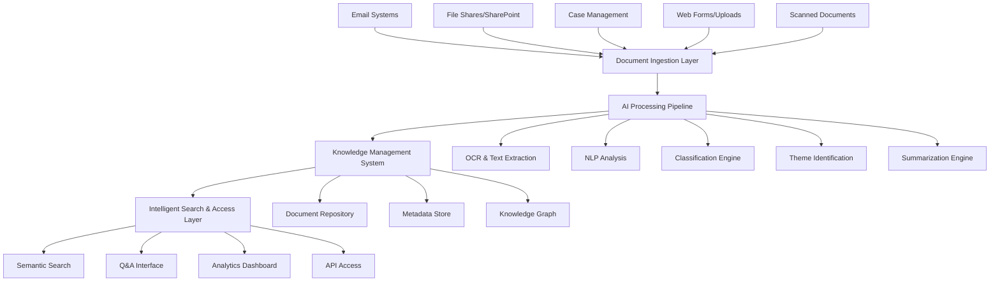
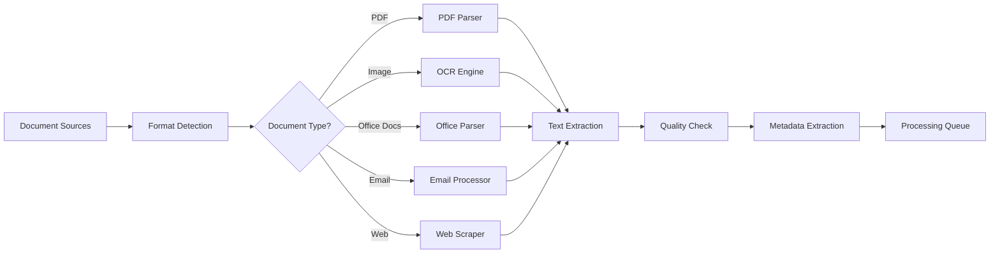
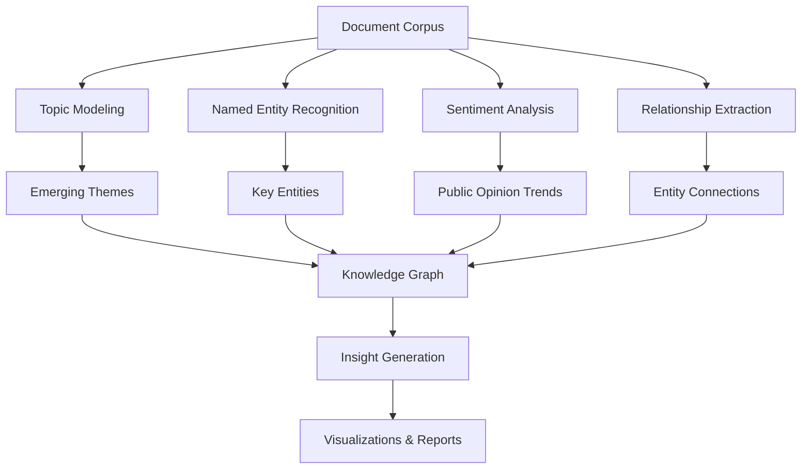
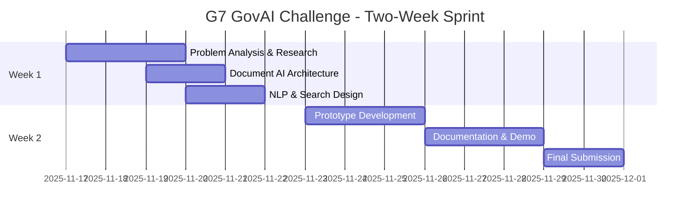
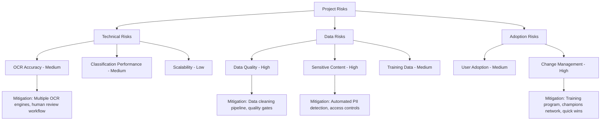

# Feature Idea: Intelligent Document Processing & Knowledge Management System

## G7 GovAI Grand Challenge Submission

**Challenge:** Statement 1 - Managing High Volumes of Information  
**Competition Period:** November 17 to December 1, 2025  
**Challenge Host:** Government of Canada (Treasury Board Secretariat)  
**Objective:** Improve the speed of processing and accessing information through AI-powered ingestion, categorization, theme identification, semantic search, and summarization

## Overview

An AI-powered document intelligence platform that transforms how public servants manage, process, and access vast volumes of unstructured information. The system automatically ingests documents from multiple sources, categorizes content, identifies themes and insights, enables semantic search across entire document repositories, and generates accurate summaries—dramatically reducing manual processing time while improving information accessibility and decision-making quality.

This proposal responds to the G7 GovAI Grand Challenge by presenting a practical, scalable solution that can be deployed across G7 governments to help public servants work more efficiently and make better-informed decisions.

## Problem Statement (Public Service Context)

Public servants face overwhelming information management challenges:

1. **Volume Overload**: Process thousands of documents daily—reports, emails, memos, applications, submissions, research papers, meeting minutes
2. **Manual Processing**: Employees spend 40-60% of their time reading, categorizing, and extracting information from documents
3. **Unstructured Data**: 80% of government information is unstructured (PDFs, Word docs, emails, scanned images), making it difficult to search and analyze
4. **Information Silos**: Critical knowledge locked in individual documents across disconnected systems
5. **Slow Response Times**: Finding relevant information requires hours of manual searching through files
6. **Inconsistent Categorization**: Different employees tag and organize documents differently, hampering collaboration
7. **Knowledge Loss**: Institutional knowledge walks out the door when employees retire or change roles
8. **Decision Delays**: Leaders lack quick access to synthesized information for timely decision-making
9. **Compliance Risks**: Difficulty tracking document retention, FOIA requests, and sensitive information

## Proposed Solution

### Core System Architecture

### Key Components

#### 1. **Intelligent Document Ingestion**

**Capabilities:**
- **Multi-Format Support**: PDF, Word, Excel, PowerPoint, emails, images, HTML, plain text
- **OCR Excellence**: Extract text from scanned documents and images with 98%+ accuracy
- **Structure Preservation**: Maintain tables, headers, footers, formatting context
- **Batch Processing**: Handle large volumes with parallel processing pipelines
- **Real-time Ingestion**: Automatic pickup from monitored folders, email inboxes, APIs
- **Version Control**: Track document revisions and maintain history
- **Duplicate Detection**: Identify and merge duplicate or near-duplicate documents

#### 2. **AI-Powered Classification & Categorization**

**Automated Classification:**
- **Document Type**: Reports, memos, policies, applications, correspondence, research, legal documents
- **Department/Program**: Automatically route to appropriate organizational units
- **Topic/Subject**: Multi-label classification across government domains
- **Sensitivity Level**: Public, internal, confidential, secret based on content analysis
- **Urgency**: Identify time-sensitive documents requiring immediate attention
- **Language**: Detect and label 100+ languages

**Machine Learning Models:**
- **Transformer-based Classifiers**: BERT/RoBERTa fine-tuned on government documents
- **Hierarchical Classification**: Multi-level taxonomy navigation
- **Active Learning**: Continuous improvement from user feedback
- **Zero-Shot Classification**: Handle new categories without retraining
- **Confidence Scoring**: Flag uncertain classifications for human review

#### 3. **Theme & Insight Identification**

**Analytical Capabilities:**
- **Topic Modeling**: Discover recurring themes across document collections using LDA, NMF, BERTopic
- **Trend Detection**: Identify emerging issues, policy concerns, or public sentiment shifts over time
- **Entity Extraction**: Automatically identify people, organizations, locations, dates, monetary values
- **Relationship Mapping**: Uncover connections between entities, events, and concepts
- **Sentiment Analysis**: Gauge public opinion from submissions, feedback, social media
- **Anomaly Detection**: Flag unusual patterns or outliers requiring investigation
- **Citation Networks**: Track how documents reference each other

#### 4. **Semantic Search Engine**

**Advanced Search Features:**
- **Natural Language Queries**: "Find all memos about climate policy from last quarter"
- **Semantic Understanding**: Matches concepts, not just keywords—understands synonyms, context
- **Multi-lingual Search**: Query in one language, find results in others
- **Faceted Filtering**: By date, author, department, document type, sensitivity, etc.
- **Relevance Ranking**: ML-powered scoring based on query intent and user context
- **Question Answering**: Direct answers extracted from documents, not just document links
- **Similar Document Discovery**: "Find documents like this one"
- **Temporal Queries**: "Show me how this topic evolved over time"

**Technical Implementation:**
- **Vector Search**: Dense embeddings with FAISS/Pinecone for semantic similarity
- **Hybrid Search**: Combine keyword (BM25) and semantic (vector) approaches
- **Re-ranking**: Neural re-ranking models for final result ordering
- **Query Expansion**: Automatically enhance queries with synonyms and related terms
- **Personalization**: Learn from user interactions to improve relevance

#### 5. **Intelligent Summarization**

**Summarization Types:**
- **Extractive Summaries**: Pull key sentences that capture document essence
- **Abstractive Summaries**: Generate human-like summaries in natural language
- **Multi-Document Summaries**: Synthesize information across multiple related documents
- **Query-Focused Summaries**: Summarize specifically answering a user's question
- **Executive Summaries**: High-level overviews for leadership
- **Meeting Summaries**: Extract action items, decisions, participants from meeting notes
- **Email Thread Summaries**: Condense long email chains into key points

**Summarization Features:**
- **Configurable Length**: Adjust summary size (bullet points, paragraph, page)
- **Key Highlights**: Extract most important facts, figures, recommendations
- **Action Items**: Automatically identify tasks, deadlines, responsible parties
- **Controversy Detection**: Flag areas of disagreement or multiple perspectives
- **Citation Preservation**: Link summary points back to source documents
- **Quality Metrics**: Confidence scores and factual consistency checks

#### 6. **Knowledge Management & Collaboration**

**Knowledge Base:**
- Centralized repository with version control
- Document relationships and dependencies
- Automatic knowledge graph construction
- FAQ generation from document patterns
- Expert directory based on authorship and topics

**Collaboration Tools:**
- Annotations and comments on documents
- Shared collections and workspaces
- Document recommendations based on user interests
- Notifications for related new documents
- Cross-team knowledge sharing

## Expected Benefits (Public Service Impact)

### Efficiency Gains

**Time Savings:**
- **50-70% reduction** in time spent searching for information (from hours to minutes)
- **40-60% reduction** in document processing time
- **80% faster** summarization compared to manual reading
- Enable employees to process **3-4x more documents** in same time
- Save **2-3 hours per employee per day** on average

**Productivity Improvements:**
- Free up 30-40% of staff time for higher-value analytical work
- Reduce document backlog by 60-80%
- Accelerate FOIA request responses from weeks to days
- Speed up policy research and briefing preparation by 50%

### Quality Improvements

**Information Access:**
- **95% accuracy** in document classification and categorization
- **90% user satisfaction** with search result relevance
- **Instant access** to institutional knowledge for all employees
- **Consistent** information organization across departments

**Decision Support:**
- Leaders receive synthesized information 10x faster
- Evidence-based decisions with comprehensive document analysis
- Early identification of emerging issues through trend detection
- Reduced risk of missing critical information

### Organizational Benefits

**Cost Savings:**
- $3-8M annually per large department through efficiency gains
- Reduce need for external research and analysis services
- Lower document storage costs through intelligent archiving
- Decrease overtime and contractor spending

**Knowledge Retention:**
- Institutional knowledge captured and accessible beyond individual employees
- Seamless knowledge transfer during transitions
- Reduced onboarding time for new employees (50% reduction)
- Preservation of organizational memory

**Compliance & Risk:**
- Improved FOIA response times and completeness
- Better records management and retention compliance
- Reduced legal discovery costs
- Enhanced data security through automated sensitivity classification

## Technical Considerations (System Integration)

### Technology Stack

```mermaid
flowchart TD
    A[Frontend] --> B[React/Next.js Web Portal]
    A --> C[Mobile App - React Native]
    A --> D[Browser Extensions - Chrome/Edge]
    
    E[API Layer] --> F[REST APIs - FastAPI]
    E --> G[GraphQL]
    E --> H[WebSocket - Real-time Updates]
    
    I[Processing Pipeline] --> J[Apache Airflow - Orchestration]
    I --> K[Celery - Task Queue]
    I --> L[Redis - Job Status]
    
    M[AI/ML Services] --> N[PyTorch/TensorFlow Models]
    M --> O[Hugging Face Transformers]
    M --> P[OpenAI/Anthropic APIs]
    M --> Q[Tesseract/AWS Textract - OCR]
    
    R[Search & Storage] --> S[Elasticsearch - Full-text]
    R --> T[Pinecone/Weaviate - Vector DB]
    R --> U[PostgreSQL - Metadata]
    R --> V[S3/Azure Blob - Documents]
    R --> W[Neo4j - Knowledge Graph]
```

### AI/ML Components

**Natural Language Processing:**
- **Document Understanding**: LayoutLM, DocFormer for structured document analysis
- **Text Classification**: Fine-tuned BERT, RoBERTa, DistilBERT models
- **Named Entity Recognition**: SpaCy, Stanford NER, custom government entity models
- **Topic Modeling**: BERTopic, LDA for theme discovery
- **Summarization**: BART, T5, Pegasus, GPT-4 for abstractive summaries
- **Embeddings**: Sentence-BERT, OpenAI embeddings for semantic search

**Computer Vision:**
- **OCR**: Tesseract, AWS Textract, Google Vision API
- **Document Layout Analysis**: LayoutParser, Detectron2
- **Table Extraction**: Camelot, Tabula, custom deep learning models
- **Signature/Seal Detection**: Custom CNN models

**RAG & Document Management Options:**
- **Gemini API File Search**: Google's managed RAG solution for document grounding
  - Integrated file upload and management capabilities
  - Automatic chunking, embedding generation, and semantic search
  - Supports PDF, TXT, HTML, and other common document formats
  - Built-in caching for improved performance and reduced costs
  - Seamless integration with Gemini models for Q&A and summarization
  - Documentation: https://ai.google.dev/gemini-api/docs/file-search
- **Custom RAG Implementation**: Vector databases (Pinecone, Weaviate) with custom embedding models
- **Hybrid Approach**: Combine Gemini API for core document intelligence with custom pipelines for specialized processing

**Continuous Learning:**
- Feedback loops from user interactions (clicks, relevance judgments)
- Active learning for classification model improvement
- Reinforcement learning for ranking optimization
- A/B testing framework for model comparison

### Integration Requirements

**Government Systems:**
- Email systems (Exchange, Gmail, Outlook)
- SharePoint, OneDrive, Google Drive
- Case management systems
- Enterprise content management (ECM) platforms
- Records management systems
- Document signing/workflow systems

**Data Sources:**
- Network file shares and drives
- Web portals and intranets
- External feeds (legislation, news, research)
- Social media monitoring
- Public consultation platforms

### Security & Compliance

**Data Security:**
- End-to-end encryption for documents at rest and in transit
- Role-based access control (RBAC) with fine-grained permissions
- Data loss prevention (DLP) integration
- Automatic PII detection and redaction capabilities
- Secure multi-tenant architecture for different departments

**Compliance:**
- FOIA/Access to Information Act compliance tracking
- Records retention policy enforcement
- Audit trails for all document access and operations
- Privacy impact assessment (PIA) adherence
- Government security classifications (Protected A/B/C, etc.)
- NIST, FedRAMP compliance standards

**Ethical AI:**
- Bias detection and mitigation in classification
- Explainable AI with reasoning transparency
- Human oversight for sensitive decisions
- Regular fairness and accuracy audits

### Performance & Scalability

**Performance Targets:**
- **Ingestion**: Process 10,000+ documents per hour
- **Search**: <500ms response time for 95% of queries
- **Summarization**: Generate summaries in 5-10 seconds
- **Classification**: Real-time categorization during upload
- **Uptime**: 99.9% availability

**Scalability:**
- Horizontal scaling for processing pipeline
- Distributed storage supporting petabytes of documents
- Handle 10,000+ concurrent users
- Process 1M+ documents in repository
- Support for 50+ government departments/agencies

## G7 Challenge Proposal: Two-Week Rapid Solution Design

### Challenge Timeline (Nov 17 - Dec 1, 2025)

**Challenge Deliverables (by December 1, 2025):**
1. Comprehensive solution architecture for intelligent document processing
2. Proof-of-concept prototype demonstrating ingestion, classification, search, and summarization
3. Responsible AI framework addressing bias, privacy, and transparency
4. Implementation roadmap for G7 government adoption
5. Impact analysis showing time savings and productivity gains
6. Presentation and demonstration materials for judges

### Post-Challenge Pathway (if selected)

**Early 2026: Showcase & Funding**
- Present to G7 GovAI network and judging panel
- Potential award of up to $10,000 CAD
- Partnership opportunity with G7 government(s)

**Months 1-3 (if funded):**
- Scale to 10K+ documents
- Government system integrations
- Enhanced classification models
- Basic analytics dashboard

**Months 4-6:**
- Deploy to 1-2 departments
- 200-500 active users
- Email/file storage integration
- Theme identification features

**Months 7-12:**
- Enterprise features
- Knowledge graph visualization
- Multi-department deployment
- Share with G7 AI Network (GAIN)

## Initial Scope

### In Scope for G7 Challenge Submission (Nov 17 - Dec 1, 2025)

**What We'll Deliver in Two Weeks:**
1. **Comprehensive Solution Architecture**
   - End-to-end system design for document intelligence
   - Document ingestion pipeline (multi-format support)
   - AI/ML model architecture for classification, NLP, and summarization
   - Semantic search infrastructure design
   - User interface mockups and workflows
   - Integration specifications

2. **Working Proof-of-Concept Prototype**
   - Document upload and OCR demonstration
   - Automatic categorization of sample documents
   - Semantic search across document collection
   - AI-generated summaries (extractive and abstractive)
   - Theme identification demo
   - Interactive dashboard for judges

3. **Responsible AI Framework**
   - Bias detection and mitigation strategies
   - Privacy preservation (PII detection and redaction)
   - Transparency and explainability measures
   - Data security and access controls
   - Human oversight mechanisms
   - Ethical guidelines for document AI

4. **G7 Adoption Roadmap**
   - Phased deployment plan
   - Cost estimates and ROI projections
   - Risk assessment and mitigation
   - Success metrics and KPIs
   - Stakeholder engagement strategy
   - Cross-country adaptability analysis

5. **Demonstration Package**
   - Technical documentation
   - Video demonstration
   - Use cases from G7 public services
   - Presentation slides for judges
   - Code samples and API specs

### In Scope for MVP (if selected for funding)

**Core Features:**
1. **Document Ingestion**
   - Support PDF, Word, Excel, emails, images
   - OCR for scanned documents
   - Batch upload and monitored folder ingestion
   - Metadata extraction (author, date, title, etc.)

2. **Automated Classification**
   - 3-level taxonomy (20-30 categories)
   - Document type identification
   - Department/program routing
   - Confidence scoring

3. **Semantic Search**
   - Natural language query interface
   - Keyword and vector search
   - Faceted filtering (date, type, department)
   - Relevance ranking
   - Search within document collections

4. **Summarization**
   - Extractive summaries for all document types
   - Abstractive summaries for reports and memos
   - Configurable summary length
   - Key highlights extraction

5. **User Interface**
   - Web portal with document upload
   - Search interface with filters
   - Document viewer with highlights
   - Basic analytics dashboard

6. **Pilot Scale**
   - 100K documents
   - 50-100 users
   - 1-2 departments
   - 5+ document formats

### Out of Scope for MVP
- Mobile applications (Phase 2)
- Knowledge graph visualization (Phase 2)
- Advanced theme identification (Phase 2)
- Workflow automation (Phase 3)
- Real-time processing (<1 min) (Phase 2)
- Multi-language support (Phase 2)
- Integration with enterprise systems (Phase 2)

### Success Criteria for MVP

**Technical Metrics:**
- **Classification Accuracy**: >85% on test set
- **Search Relevance**: >80% precision@10
- **Summarization Quality**: >4/5 user rating
- **Processing Speed**: 100+ docs/hour average
- **System Uptime**: >99.5%

**User Adoption:**
- **Active Users**: 70% of pilot users use system weekly
- **Search Volume**: 1000+ searches per week
- **Documents Processed**: 100K+ documents ingested
- **User Satisfaction**: 4/5 average rating

**Business Impact:**
- **Time Savings**: 40% reduction in information search time
- **Productivity**: Handle 2x more documents per employee
- **Quality**: 80% of summaries rated accurate by users
- **ROI**: $300K+ demonstrated value in pilot departments

## Implementation Approach

### Development Methodology
- **Agile/Scrum**: 2-week sprints with continuous delivery
- **AI-TDD**: Test-driven development with labeled datasets
- **MLOps**: CI/CD pipelines for model training and deployment
- **User-Centered Design**: Regular usability testing with public servants

### Team Structure (2-Week MVP / 4-Person Team)
- **Full-Stack Developer**: 1 (React + Python/FastAPI)
- **AI/ML Engineer**: 1 (NLP, Search, Classification)
- **DevOps/Backend Engineer**: 1 (Data Pipeline, Infrastructure)
- **Data Scientist/UX Designer**: 1 (Analytics, User Interface)

### Timeline & Budget Estimate

**G7 Challenge Phase (Nov 17 - Dec 1, 2025):**
- **Duration**: 2 weeks to MVP
- **Team**: 4 people (Full-Stack Dev, AI/ML Engineer, DevOps Engineer, Data Scientist/UX)
- **Competition Effort**: Intensive 2-week sprint
- **Potential Award**: Up to $10,000 CAD (if selected)

**Post-Challenge Development (if funded):**
- **Months 1-3**: Scale to 10K+ docs, government system integrations, $75-150K
- **Months 4-6**: Deploy to 1-2 departments, 200-500 users, $200-400K
- **Months 7-12**: Enterprise features, knowledge graph, multi-department, $500K-1M

### Risk Assessment

### Next Steps for G7 Challenge Submission

**Week 1 (Nov 17-23, 2025):**
1. **Research & Problem Analysis** (Days 1-2)
   - Study document management challenges across G7 public services
   - Research state-of-the-art document AI (LayoutLM, DocFormer, etc.)
   - Identify publicly available document datasets for demo
   - Analyze Statement 1 requirements in detail

2. **Solution Design** (Days 3-5)
   - Finalize system architecture and components
   - Design document processing pipeline
   - Design classification taxonomy for government documents
   - Create UI/UX mockups for search and summarization
   - Develop responsible AI framework

**Week 2 (Nov 24-Dec 1, 2025):**
3. **Prototype Development** (Days 6-8)
   - Build proof-of-concept with sample documents
   - Implement document ingestion and OCR
   - Develop classification and search capabilities
   - Create summarization demo
   - Build interactive dashboard

4. **Documentation & Submission** (Days 9-14)
   - Complete technical documentation
   - Prepare presentation and video demo
   - Write impact analysis and cost-benefit assessment
   - Finalize all deliverables
   - Submit to Impact Canada platform by December 1, 2025

**Post-Submission:**
- Await judging results (December 2025 - January 2026)
- Prepare for showcase event (Early 2026)
- If selected: Begin partnership with G7 government agency

---

*This proposal is submitted for the G7 GovAI Grand Challenge (Nov 17 - Dec 1, 2025), a competition to advance responsible AI in public services. The solution addresses the critical need for governments to efficiently process and access vast volumes of information, enabling public servants to focus on high-value work and better serve citizens.*
