# Parallel Execution Plan: Intelligent Document Processor

**Version:** 1.0  
**Date:** November 19, 2025  
**Project:** G7 GovAI Grand Challenge MVP  
**Timeline:** 2 weeks (Nov 17 - Dec 1, 2025)  
**Team Size:** 4 people  
**Original Plan:** [plan.md](./plan.md)

## Overview

This parallel execution plan reorganizes the sequential implementation plan into independent work streams that can run simultaneously without conflicts. The plan organizes work by system components: backend infrastructure, document processing pipeline, AI services, and frontend UI.

### Parallelization Strategy

The work is organized by technical domains and dependencies:
- **Backend infrastructure** and **Task queue** can be developed in parallel
- **Document processing** and **AI services** can progress independently once base infrastructure exists
- **Frontend development** happens alongside backend services
- **Testing and deployment** integrate all components

### Time Savings
- **Sequential execution**: ~14 days
- **Parallel execution**: ~9-10 days
- **Time saved**: 30-40%

## Parallel Work Streams

```mermaid
flowchart LR
    Phase1A[Stream 1A:<br/>Backend Foundation] --> Integration1[Phase 1<br/>Integration]
    Phase1B[Stream 1B:<br/>Task Queue Setup] --> Integration1
    
    Integration1 --> Phase2A[Stream 2A:<br/>Document Upload]
    Integration1 --> Phase2B[Stream 2B:<br/>Text Extraction<br/>& Metadata]
    
    Phase2A --> Integration2[Phase 2<br/>Integration]
    Phase2B --> Integration2
    
    Integration2 --> Phase3A[Stream 3A:<br/>Classification]
    Integration2 --> Phase3B[Stream 3B:<br/>Search Infrastructure]
    
    Phase3A --> Integration3[Phase 3<br/>Integration]
    Phase3B --> Integration3
    
    Integration3 --> Phase4A[Stream 4A:<br/>Summarization]
    Integration3 --> Phase4B[Stream 4B:<br/>Frontend UI]
    
    Phase4A --> Integration4[Phase 4<br/>Integration]
    Phase4B --> Integration4
    
    Integration4 --> Phase5A[Stream 5A:<br/>Pipeline Testing]
    Integration4 --> Phase5B[Stream 5B:<br/>Search Quality]
    
    Phase5A --> Integration5[Phase 5<br/>Integration]
    Phase5B --> Integration5
    
    Integration5 --> Phase6A[Stream 6A:<br/>Demo Prep]
    Integration5 --> Phase6B[Stream 6B:<br/>Documentation]
    
    Phase6A --> Final[Final Delivery]
    Phase6B --> Final
```

## Phase 1: Foundation (Days 1-2)

**Goal:** Establish backend infrastructure and task processing framework

### Stream 1A: Backend Foundation & Database

**Independence:** No dependencies on other streams; works with backend files only  
**Assigned To:** Developer 1  
**Duration:** 14 hours (Days 1-2)

**Tasks:**
- [ ] **Step 1:** Project Setup and Infrastructure (8 hours)
  - Initialize project with React frontend and FastAPI backend
  - Set up Docker Compose with PostgreSQL, Elasticsearch, Redis, Celery
  - Configure environment variables and CI/CD
  - Create health check endpoints for all services
  - **Files:** `docker-compose.yml`, `.github/workflows/ci.yml`, `backend/main.py`

- [ ] **Step 2:** Database Schema and Models (6 hours)
  - Create PostgreSQL schema for documents, classifications, summaries, entities
  - Implement SQLAlchemy models with relationships
  - Set up Alembic migrations and database indexing
  - Add database seeding with sample data
  - **Files:** `backend/models.py`, `backend/database.py`, `backend/alembic/versions/*.py`

**Verification:**
- [ ] All services run with `docker-compose up`
- [ ] Database migrations complete successfully
- [ ] Sample data seeds correctly
- [ ] All services report healthy status
- [ ] Can connect to all services (PostgreSQL, Elasticsearch, Redis)

---

### Stream 1B: Task Queue Setup

**Independence:** Depends on Docker setup from Step 1; then works independently  
**Assigned To:** Developer 3  
**Duration:** 6 hours (Day 1 afternoon - Day 2)

**Tasks:**
- [ ] **Step 3:** Celery Task Queue Setup (6 hours)
  - Configure Celery with Redis broker
  - Create base task structure for document processing
  - Implement task status tracking and retry logic
  - Add error handling and task result storage
  - **Files:** `backend/celery_app.py`, `backend/tasks/__init__.py`, `backend/tasks/base.py`

**Verification:**
- [ ] Celery workers start successfully
- [ ] Tasks can be queued and executed
- [ ] Task status updates in real-time
- [ ] Failed tasks retry automatically
- [ ] Task results stored in Redis

---

### Integration Point 1 (Day 2 afternoon)

**Actions:**
- Verify all infrastructure components communicate
- Test database connectivity from API
- Test task queuing from API endpoints
- Run smoke tests for all services

**Duration:** 1-2 hours

---

## Phase 2: Document Processing (Days 3-4)

**Goal:** Build document upload and text extraction pipeline

### Stream 2A: Document Upload API

**Independence:** Works with backend API routes; no conflicts with processing pipeline  
**Assigned To:** Developer 1  
**Duration:** 6 hours (Day 3)

**Tasks:**
- [ ] **Step 4:** Document Upload API (6 hours)
  - Create file upload endpoint with validation
  - Implement file type detection (PDF, DOCX, TXT, JPG, PNG)
  - Store files in filesystem with unique IDs
  - Create document metadata records in database
  - Queue documents for processing
  - **Files:** `backend/routes/documents.py`, `backend/services/file_service.py`

**Verification:**
- [ ] Can upload multiple file types
- [ ] File validation works (size, type)
- [ ] Files stored with unique identifiers
- [ ] Metadata saved to database
- [ ] Documents queued for processing

---

### Stream 2B: Text Extraction & Metadata Pipeline

**Independence:** Works with Celery tasks; no conflicts with upload API  
**Assigned To:** Developer 3 (extraction) + Developer 2 (metadata)  
**Duration:** 16 hours (Days 3-4)

**Tasks:**
- [ ] **Step 5:** Text Extraction Pipeline (10 hours - Developer 3)
  - Implement PDF text extraction using PyPDF2
  - Add DOCX parsing with python-docx
  - Integrate Gemini API for image OCR
  - Create text cleaning and normalization utilities
  - Handle multi-page documents with chunking
  - **Files:** `backend/tasks/text_extraction.py`, `backend/services/ocr_service.py`

- [ ] **Step 6:** Metadata Extraction (6 hours - Developer 2)
  - Extract file properties (title, author, dates)
  - Implement NLP-based metadata extraction
  - Extract named entities (people, organizations, locations)
  - Calculate document statistics
  - Store metadata in database
  - **Files:** `backend/services/metadata_service.py`, `backend/tasks/metadata_extraction.py`

**Verification:**
- [ ] PDF text extraction >90% accuracy
- [ ] DOCX files parsed correctly
- [ ] Image OCR works via Gemini API
- [ ] Named entities detected with >80% accuracy
- [ ] Metadata stored in structured format

---

### Integration Point 2 (Day 4 afternoon)

**Actions:**
- Test end-to-end upload → extraction → metadata flow
- Verify document processing completes successfully
- Test with various document formats
- Check task queue performance

**Duration:** 2 hours

---

## Phase 3: Classification & Search (Days 5-7)

**Goal:** Build AI classification and search infrastructure in parallel

### Stream 3A: Document Classification

**Independence:** Works with AI classification services; no conflicts with search  
**Assigned To:** Developer 2  
**Duration:** 12 hours (Days 5-6.5)

**Tasks:**
- [ ] **Step 7:** Document Classification System (12 hours)
  - Define classification taxonomy (5-10 categories)
  - Implement zero-shot classification using Gemini API
  - Create classification confidence scoring
  - Build human review queue for low-confidence classifications
  - Store classifications in database
  - **Files:** `backend/services/classification_service.py`, `backend/tasks/classification.py`

**Verification:**
- [ ] Classification accuracy >85% on test set
- [ ] Confidence scores calculated correctly
- [ ] Low-confidence docs flagged for review
- [ ] Multi-label classification works
- [ ] Classifications stored with metadata

---

### Stream 3B: Search Infrastructure

**Independence:** Works with Elasticsearch and search services; no conflicts with classification  
**Assigned To:** Developer 3 (Elasticsearch) + Developer 2 (Hybrid search)  
**Duration:** 20 hours (Days 5-7)

**Tasks:**
- [ ] **Step 8:** Elasticsearch Integration (10 hours - Developer 3)
  - Create Elasticsearch index with mappings
  - Implement document indexing pipeline
  - Add embedding generation using OpenAI/sentence-transformers
  - Configure text analyzers for government documents
  - Set up index refresh and update mechanisms
  - **Files:** `backend/services/search_service.py`, `backend/config/elasticsearch_mappings.json`

- [ ] **Step 9:** Hybrid Search Implementation (10 hours - Developer 2 & 3)
  - Implement BM25 keyword search
  - Add vector similarity search
  - Create hybrid search with score fusion
  - Build query processor for natural language queries
  - Add filtering by date, type, category
  - **Files:** `backend/services/hybrid_search.py`, `backend/services/query_processor.py`

**Verification:**
- [ ] Documents indexed successfully
- [ ] Keyword search returns relevant results
- [ ] Semantic search works for concept queries
- [ ] Hybrid search improves relevance
- [ ] Search latency <500ms for 95% of queries

---

### Integration Point 3 (Day 7 afternoon)

**Actions:**
- Integrate classification with search indexing
- Test search with classified documents
- Verify filtering by classification works
- Performance test with batch of documents

**Duration:** 2-3 hours

---

## Phase 4: Summarization & UI (Days 8-10)

**Goal:** Build summarization engine and user interface in parallel

### Stream 4A: Summarization Engine

**Independence:** Works with summarization services; no conflicts with frontend  
**Assigned To:** Developer 2  
**Duration:** 10 hours (Days 8-9)

**Tasks:**
- [ ] **Step 10:** Summarization Engine (10 hours)
  - Implement extractive summarization using TextRank
  - Integrate Gemini API for abstractive summarization
  - Create summary caching mechanism
  - Add key highlights extraction
  - Generate summaries of configurable length
  - **Files:** `backend/services/summarization_service.py`, `backend/tasks/summarization.py`

**Verification:**
- [ ] Extractive summaries generated in <2 seconds
- [ ] Abstractive summaries quality rated >4/5
- [ ] Summaries cached for performance
- [ ] Key highlights extracted accurately
- [ ] Configurable summary lengths work

---

### Stream 4B: Frontend UI Development

**Independence:** Works with frontend components; no conflicts with backend services  
**Assigned To:** Developer 4  
**Duration:** 20 hours (Days 8-10)

**Tasks:**
- [ ] **Step 11:** React Frontend Development (12 hours)
  - Set up React with TypeScript and Tailwind CSS
  - Create document upload interface with drag-and-drop
  - Build search interface with filters and facets
  - Implement document viewer with highlights
  - Add classification and summary display
  - **Files:** `frontend/src/App.tsx`, `frontend/src/components/DocumentUploader.tsx`, `frontend/src/components/SearchInterface.tsx`

- [ ] **Step 12:** Search Results and Analytics Dashboard (8 hours)
  - Create search results component with pagination
  - Add relevance score display
  - Build analytics dashboard with charts
  - Show document statistics and trends
  - Display top categories and entities
  - **Files:** `frontend/src/components/SearchResults.tsx`, `frontend/src/components/Dashboard.tsx`

**Verification:**
- [ ] Upload interface works smoothly
- [ ] Search UI is intuitive and responsive
- [ ] Document viewer shows content clearly
- [ ] Dashboard shows meaningful metrics
- [ ] Mobile responsive design

---

### Integration Point 4 (Day 10 afternoon)

**Actions:**
- Connect frontend to all backend services
- Test complete user workflows
- Verify all features work end-to-end
- Cross-browser testing

**Duration:** 2-3 hours

---

## Phase 5: Testing & Optimization (Days 11-12)

**Goal:** Comprehensive testing and optimization

### Stream 5A: Processing Pipeline Testing

**Independence:** Tests backend processing; can run independently  
**Assigned To:** Developer 3  
**Duration:** 10 hours (Days 11-12)

**Tasks:**
- [ ] **Step 13:** Processing Pipeline Testing (10 hours)
  - Test document processing with 500+ real documents
  - Measure and optimize processing throughput
  - Test error handling and retry logic
  - Monitor memory usage and optimize
  - Set up logging and monitoring
  - **Files:** `backend/tests/test_pipeline.py`, `backend/monitoring/metrics.py`

**Verification:**
- [ ] Processes 100+ docs/hour
- [ ] Error rate <5%
- [ ] Failed documents retry successfully
- [ ] Memory usage remains stable
- [ ] Logs capture important events

---

### Stream 5B: Search Quality & User Testing

**Independence:** Tests search quality; can run independently  
**Assigned To:** Developer 2 + Developer 4  
**Duration:** 8 hours (Days 11-12)

**Tasks:**
- [ ] **Step 14:** Search Quality Evaluation (8 hours)
  - Create test query set with expected results
  - Measure search precision and recall
  - Tune search weights for better relevance
  - Conduct user testing with 3-5 users
  - Iterate based on feedback
  - **Files:** `backend/tests/test_search_quality.py`, `evaluation/test_queries.json`

**Verification:**
- [ ] Precision@10 >80%
- [ ] Recall@10 >70%
- [ ] User satisfaction >4/5
- [ ] Search results feel relevant
- [ ] Fast response times maintained

---

### Integration Point 5 (Day 12 afternoon)

**Actions:**
- Run full integration tests
- E2E testing for complete workflows
- Cross-browser compatibility testing
- Load testing with 50+ concurrent users
- Bug fixes

**Duration:** 8 hours (All team members)

**Tasks:**
- [ ] **Step 15:** Integration Testing and Bug Fixes
  - Write integration tests for API endpoints
  - Create E2E tests for upload → search workflow
  - Test cross-browser compatibility
  - Conduct load testing
  - Fix identified bugs
  - **Files:** `backend/tests/test_integration.py`, `frontend/tests/e2e/*.spec.ts`

**Verification:**
- [ ] All integration tests pass
- [ ] E2E workflow completes successfully
- [ ] Works in Chrome, Firefox, Safari, Edge
- [ ] Handles 50+ concurrent users
- [ ] No critical bugs remaining

---

## Phase 6: Demo & Documentation (Days 13-14)

**Goal:** Prepare demo materials and deployment documentation

### Stream 6A: Demo Preparation

**Independence:** Prepares demo materials; can work independently  
**Assigned To:** Developer 4  
**Duration:** 12 hours (Days 13-14)

**Tasks:**
- [ ] **Step 16:** Sample Document Collection (4 hours)
  - Collect diverse government document samples
  - Process documents through pipeline
  - Verify all documents indexed correctly
  - Create document taxonomy examples
  - Prepare search demo scenarios
  - **Deliverables:** `data/sample_documents/`, `demo_scenarios.md`

- [ ] **Step 17:** Demo Video Production (8 hours)
  - Write demo script showing key features
  - Record video of document upload workflow
  - Demonstrate search with natural language queries
  - Show classification and summarization
  - Edit video with narration and captions
  - **Deliverables:** `demo-video.mp4`, `demo-script.md`

**Verification:**
- [ ] 500-1000 documents processed
- [ ] All documents searchable
- [ ] Video demonstrates core features clearly
- [ ] Video length 3-5 minutes
- [ ] Professional quality with captions

---

### Stream 6B: Documentation & Deployment

**Independence:** Works on documentation and deployment; no conflicts with demo  
**Assigned To:** Developer 1 + Developer 3  
**Duration:** 8 hours (Days 13-14)

**Tasks:**
- [ ] **Step 18:** Documentation and Deployment (8 hours)
  - Write comprehensive README with setup instructions
  - Document API endpoints with examples
  - Create deployment guide for cloud platforms
  - Document architecture and data flows
  - Deploy to cloud instance
  - Set up monitoring and alerting
  - **Deliverables:** `README.md`, `API_DOCS.md`, `DEPLOYMENT.md`, `ARCHITECTURE.md`

**Verification:**
- [ ] README complete with clear instructions
- [ ] API documentation includes examples
- [ ] Deployment successful on cloud
- [ ] Architecture diagrams included
- [ ] Monitoring dashboard functional

---

## Quality Gates (All Phases)

### Document Processing
- [ ] PDF extraction accuracy >90%
- [ ] OCR accuracy >85%
- [ ] Processing throughput >100 docs/hour
- [ ] Error rate <5%
- [ ] Memory usage stable under load

### Classification
- [ ] Classification accuracy >85%
- [ ] Confidence scoring reliable
- [ ] Multi-label classification works
- [ ] Low-confidence flagging accurate
- [ ] Processing time <2 seconds per doc

### Search
- [ ] Keyword search Precision@10 >80%
- [ ] Semantic search works for concepts
- [ ] Hybrid search improves relevance
- [ ] Search latency <500ms (p95)
- [ ] Filters apply correctly

### Summarization
- [ ] Extractive summary generation <2 seconds
- [ ] Abstractive summary quality >4/5
- [ ] Key highlights accurate
- [ ] Summary lengths configurable
- [ ] Caching reduces latency

### Code Quality
- [ ] Test coverage >70%
- [ ] No critical security vulnerabilities
- [ ] Code follows style guidelines
- [ ] All TypeScript types defined
- [ ] Documentation complete

---

## Risk Management

### Potential Conflicts
- **API Integration:** Mitigated by clear API contracts defined early
- **Data Format Variations:** Handled through comprehensive testing with diverse documents
- **Search Performance:** Addressed through Elasticsearch optimization and caching
- **Timeline Pressure:** Mitigated by parallel execution and clear MVP scope

### Communication Protocol
- **Daily Standups:** 15 minutes to sync progress across streams
- **Integration Checkpoints:** End of each phase for synchronization
- **Blocker Escalation:** Immediate notification if stream blocked
- **Code Reviews:** Required before merging each stream's work

---

## Execution Timeline

**Phase 1:** Days 1-2 (Foundation)  
**Integration 1:** Day 2 afternoon  
**Phase 2:** Days 3-4 (Document Processing)  
**Integration 2:** Day 4 afternoon  
**Phase 3:** Days 5-7 (Classification & Search)  
**Integration 3:** Day 7 afternoon  
**Phase 4:** Days 8-10 (Summarization & UI)  
**Integration 4:** Day 10 afternoon  
**Phase 5:** Days 11-12 (Testing)  
**Integration 5:** Day 12 afternoon  
**Phase 6:** Days 13-14 (Demo & Documentation)  
**Final Delivery:** End of Day 14

---

## Success Criteria

- [ ] All parallel streams complete independently
- [ ] Integration points successful with minimal conflicts
- [ ] 30-40% time saved compared to sequential execution
- [ ] 500-1000 documents processed successfully
- [ ] Classification accuracy >85%
- [ ] Search precision >80%
- [ ] Demo video ready for submission
- [ ] Application deployed and accessible

---

**Plan Status:** Ready for Parallel Execution  
