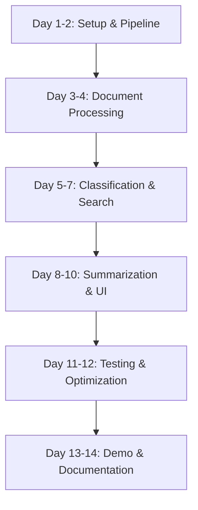
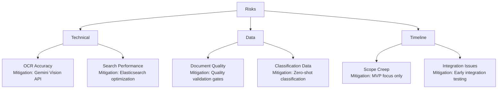

# Implementation Plan: Intelligent Document Processing & Knowledge Management System

**Version:** 1.0  
**Date:** November 19, 2025  
**Project:** G7 GovAI Grand Challenge MVP  
**Timeline:** 2 weeks (Nov 17 - Dec 1, 2025)  
**Team Size:** 4 people  

## Overview

This plan provides a step-by-step implementation roadmap for building the Intelligent Document Processing & Knowledge Management System MVP. The plan is optimized for a 4-person team with a 2-week timeline, focusing on core document processing, classification, and search capabilities.

### Team Roles
- **Developer 1:** Full-Stack (React + Python/FastAPI)
- **Developer 2:** AI/ML Engineer (NLP, Classification, Embeddings)
- **Developer 3:** DevOps/Backend Engineer (Data Pipeline, Search Infrastructure)
- **Developer 4:** Data Scientist/UX Designer (Analytics, User Interface)

### MVP Scope
- Document ingestion for PDF, DOCX, TXT, images (OCR)
- Process 500-1000 sample government documents
- Basic auto-classification (5-10 categories)
- Semantic search with natural language queries
- Extractive summarization for documents
- Simple web interface for search and upload
- Demo video showing search, classification, summarization

## Implementation Flow

## Pre-Implementation Checklist

- [ ] Development environment setup complete
- [ ] API keys obtained (OpenAI/Gemini, cloud provider)
- [ ] Sample government documents collected (500-1000 PDFs)
- [ ] GitHub repository created with CI/CD
- [ ] Docker and Docker Compose installed
- [ ] Cloud account setup (AWS/GCP/Azure)
- [ ] Elasticsearch installed locally for development
- [ ] Document classification taxonomy defined

## Implementation Steps

### Phase 1: Foundation & Pipeline (Days 1-2)

#### Step 1: Project Setup and Infrastructure
**Status:** [ ] Not Started  
**Assigned To:** Developer 1  
**Effort:** 8 hours  
**Dependencies:** None

**Actions:**
1. Initialize project structure with React frontend and FastAPI backend
2. Set up Docker Compose with PostgreSQL, Elasticsearch, Redis, Celery
3. Configure environment variables and secrets management
4. Set up GitHub Actions for CI/CD
5. Create health check endpoints for all services

**Verification:**
- [ ] `docker-compose up` runs all services successfully
- [ ] All services report healthy status
- [ ] GitHub Actions workflow passes
- [ ] Environment variables loaded correctly
- [ ] Can connect to PostgreSQL, Elasticsearch, Redis

**Files Created:**
- `docker-compose.yml`
- `.github/workflows/ci.yml`
- `frontend/package.json`
- `backend/requirements.txt`
- `backend/main.py`

---

#### Step 2: Database Schema and Models
**Status:** [ ] Not Started  
**Assigned To:** Developer 1  
**Effort:** 6 hours  
**Dependencies:** Step 1

**Actions:**
1. Create PostgreSQL schema from design document
2. Implement SQLAlchemy models for documents, classifications, summaries, entities
3. Set up Alembic migrations
4. Create database indexing for performance
5. Add database seeding with sample data

**Verification:**
- [ ] All tables created with proper relationships
- [ ] Migrations run without errors
- [ ] Indexes created for frequently queried fields
- [ ] Sample data seeds correctly
- [ ] Foreign key constraints work

**Files Created:**
- `backend/models.py`
- `backend/database.py`
- `backend/alembic/versions/*.py`

---

#### Step 3: Celery Task Queue Setup
**Status:** [ ] Not Started  
**Assigned To:** Developer 3  
**Effort:** 6 hours  
**Dependencies:** Step 1

**Actions:**
1. Configure Celery with Redis broker
2. Create base task structure for document processing
3. Implement task status tracking
4. Add retry logic and error handling
5. Set up task result storage

**Verification:**
- [ ] Celery workers start successfully
- [ ] Tasks can be queued and executed
- [ ] Task status updates in real-time
- [ ] Failed tasks retry automatically
- [ ] Task results stored in Redis

**Files Created:**
- `backend/celery_app.py`
- `backend/tasks/__init__.py`
- `backend/tasks/base.py`

---

### Phase 2: Document Processing (Days 3-4)

#### Step 4: Document Upload API
**Status:** [ ] Not Started  
**Assigned To:** Developer 1  
**Effort:** 6 hours  
**Dependencies:** Step 2

**Actions:**
1. Create file upload endpoint with validation
2. Implement file type detection (PDF, DOCX, TXT, JPG, PNG)
3. Store files in local filesystem with unique IDs
4. Create document metadata records in database
5. Queue documents for processing

**Verification:**
- [ ] Can upload multiple file types
- [ ] File validation works (size, type)
- [ ] Files stored with unique identifiers
- [ ] Metadata saved to database
- [ ] Documents queued for processing

**Files Created:**
- `backend/routes/documents.py`
- `backend/services/file_service.py`

---

#### Step 5: Text Extraction Pipeline
**Status:** [ ] Not Started  
**Assigned To:** Developer 3  
**Effort:** 10 hours  
**Dependencies:** Step 3, 4

**Actions:**
1. Implement PDF text extraction using PyPDF2
2. Add DOCX parsing with python-docx
3. Integrate Gemini API for image OCR
4. Create text cleaning and normalization utilities
5. Handle multi-page documents with chunking

**Verification:**
- [ ] PDF text extraction >90% accuracy
- [ ] DOCX files parsed correctly
- [ ] Image OCR works via Gemini API
- [ ] Text cleaned and normalized
- [ ] Large documents chunked appropriately

**Files Created:**
- `backend/tasks/text_extraction.py`
- `backend/services/ocr_service.py`
- `backend/utils/text_processing.py`

---

#### Step 6: Metadata Extraction
**Status:** [ ] Not Started  
**Assigned To:** Developer 2  
**Effort:** 6 hours  
**Dependencies:** Step 5

**Actions:**
1. Extract file properties (title, author, dates)
2. Implement NLP-based metadata extraction
3. Extract named entities (people, organizations, locations)
4. Calculate document statistics (word count, page count)
5. Store metadata in database

**Verification:**
- [ ] File properties extracted correctly
- [ ] NLP extraction identifies key information
- [ ] Named entities detected with >80% accuracy
- [ ] Statistics calculated accurately
- [ ] Metadata stored in structured format

**Files Created:**
- `backend/services/metadata_service.py`
- `backend/tasks/metadata_extraction.py`

---

### Phase 3: Classification & Search (Days 5-7)

#### Step 7: Document Classification System
**Status:** [ ] Not Started  
**Assigned To:** Developer 2  
**Effort:** 12 hours  
**Dependencies:** Step 5

**Actions:**
1. Define classification taxonomy (5-10 categories)
2. Implement zero-shot classification using Gemini API
3. Create classification confidence scoring
4. Build human review queue for low-confidence classifications
5. Store classifications in database

**Verification:**
- [ ] Classification accuracy >85% on test set
- [ ] Confidence scores calculated correctly
- [ ] Low-confidence docs flagged for review
- [ ] Multi-label classification works
- [ ] Classifications stored with metadata

**Files Created:**
- `backend/services/classification_service.py`
- `backend/tasks/classification.py`
- `backend/schemas/taxonomy.py`

---

#### Step 8: Elasticsearch Integration
**Status:** [ ] Not Started  
**Assigned To:** Developer 3  
**Effort:** 10 hours  
**Dependencies:** Step 6

**Actions:**
1. Create Elasticsearch index with mappings
2. Implement document indexing pipeline
3. Add embedding generation using OpenAI/sentence-transformers
4. Configure text analyzers for government documents
5. Set up index refresh and update mechanisms

**Verification:**
- [ ] Documents indexed successfully
- [ ] Full-text search works
- [ ] Vector embeddings generated and stored
- [ ] Index mappings optimize search performance
- [ ] Bulk indexing handles 1000+ documents

**Files Created:**
- `backend/services/search_service.py`
- `backend/config/elasticsearch_mappings.json`
- `backend/tasks/indexing.py`

---

#### Step 9: Hybrid Search Implementation
**Status:** [ ] Not Started  
**Assigned To:** Developer 2, Developer 3  
**Effort:** 10 hours  
**Dependencies:** Step 8

**Actions:**
1. Implement BM25 keyword search
2. Add vector similarity search
3. Create hybrid search with score fusion
4. Build query processor for natural language queries
5. Add filtering by date, type, category

**Verification:**
- [ ] Keyword search returns relevant results
- [ ] Semantic search works for concept queries
- [ ] Hybrid search improves relevance
- [ ] Filters apply correctly
- [ ] Search latency <500ms for 95% of queries

**Files Created:**
- `backend/services/hybrid_search.py`
- `backend/services/query_processor.py`

---

### Phase 4: Summarization & UI (Days 8-10)

#### Step 10: Summarization Engine
**Status:** [ ] Not Started  
**Assigned To:** Developer 2  
**Effort:** 10 hours  
**Dependencies:** Step 5

**Actions:**
1. Implement extractive summarization using TextRank
2. Integrate Gemini API for abstractive summarization
3. Create summary caching mechanism
4. Add key highlights extraction
5. Generate summaries of configurable length

**Verification:**
- [ ] Extractive summaries generated in <2 seconds
- [ ] Abstractive summaries quality rated >4/5
- [ ] Summaries cached for performance
- [ ] Key highlights extracted accurately
- [ ] Configurable summary lengths work

**Files Created:**
- `backend/services/summarization_service.py`
- `backend/tasks/summarization.py`

---

#### Step 11: React Frontend Development
**Status:** [ ] Not Started  
**Assigned To:** Developer 4  
**Effort:** 12 hours  
**Dependencies:** Step 4, 9

**Actions:**
1. Set up React app with TypeScript and Tailwind CSS
2. Create document upload interface with drag-and-drop
3. Build search interface with filters and facets
4. Implement document viewer with highlights
5. Add classification and summary display

**Verification:**
- [ ] Upload interface works smoothly
- [ ] Search UI is intuitive and responsive
- [ ] Results display with relevant information
- [ ] Document viewer shows content clearly
- [ ] Mobile responsive design

**Files Created:**
- `frontend/src/App.tsx`
- `frontend/src/components/DocumentUploader.tsx`
- `frontend/src/components/SearchInterface.tsx`
- `frontend/src/components/DocumentViewer.tsx`

---

#### Step 12: Search Results and Analytics Dashboard
**Status:** [ ] Not Started  
**Assigned To:** Developer 4  
**Effort:** 8 hours  
**Dependencies:** Step 11

**Actions:**
1. Create search results component with pagination
2. Add relevance score display
3. Build analytics dashboard with charts
4. Show document statistics and trends
5. Display top categories and entities

**Verification:**
- [ ] Search results paginate correctly
- [ ] Relevance scores displayed clearly
- [ ] Dashboard shows meaningful metrics
- [ ] Charts render properly
- [ ] Real-time statistics update

**Files Created:**
- `frontend/src/components/SearchResults.tsx`
- `frontend/src/components/Dashboard.tsx`
- `frontend/src/hooks/useAnalytics.ts`

---

### Phase 5: Testing & Optimization (Days 11-12)

#### Step 13: Processing Pipeline Testing
**Status:** [ ] Not Started  
**Assigned To:** Developer 3  
**Effort:** 10 hours  
**Dependencies:** All previous processing steps

**Actions:**
1. Test document processing with 500+ real documents
2. Measure and optimize processing throughput
3. Test error handling and retry logic
4. Monitor memory usage and optimize
5. Set up logging and monitoring

**Verification:**
- [ ] Processes 100+ docs/hour
- [ ] Error rate <5%
- [ ] Failed documents retry successfully
- [ ] Memory usage remains stable
- [ ] Logs capture important events

**Files Created:**
- `backend/tests/test_pipeline.py`
- `backend/monitoring/metrics.py`

---

#### Step 14: Search Quality Evaluation
**Status:** [ ] Not Started  
**Assigned To:** Developer 2, Developer 4  
**Effort:** 8 hours  
**Dependencies:** Step 9

**Actions:**
1. Create test query set with expected results
2. Measure search precision and recall
3. Tune search weights for better relevance
4. Conduct user testing with 3-5 users
5. Iterate based on feedback

**Verification:**
- [ ] Precision@10 >80%
- [ ] Recall@10 >70%
- [ ] User satisfaction >4/5
- [ ] Search results feel relevant
- [ ] Fast response times maintained

**Files Created:**
- `backend/tests/test_search_quality.py`
- `evaluation/test_queries.json`

---

#### Step 15: Integration Testing and Bug Fixes
**Status:** [ ] Not Started  
**Assigned To:** All Team Members  
**Effort:** 8 hours  
**Dependencies:** Step 13, 14

**Actions:**
1. Write integration tests for API endpoints
2. Create E2E tests for upload → search workflow
3. Test cross-browser compatibility
4. Conduct load testing with 50+ concurrent users
5. Fix identified bugs

**Verification:**
- [ ] All integration tests pass
- [ ] E2E workflow completes successfully
- [ ] Works in Chrome, Firefox, Safari, Edge
- [ ] Handles 50+ concurrent users
- [ ] No critical bugs remaining

**Files Created:**
- `backend/tests/test_integration.py`
- `frontend/tests/e2e/*.spec.ts`
- `TESTING.md`

---

### Phase 6: Demo & Documentation (Days 13-14)

#### Step 16: Sample Document Collection
**Status:** [ ] Not Started  
**Assigned To:** Developer 4  
**Effort:** 4 hours  
**Dependencies:** Step 13

**Actions:**
1. Collect diverse government document samples
2. Process documents through pipeline
3. Verify all documents indexed correctly
4. Create document taxonomy examples
5. Prepare search demo scenarios

**Verification:**
- [ ] 500-1000 documents processed
- [ ] Documents span multiple categories
- [ ] All documents searchable
- [ ] Classification quality validated
- [ ] Demo scenarios prepared

**Deliverables:**
- `data/sample_documents/` (metadata only)
- `demo_scenarios.md`

---

#### Step 17: Demo Video Production
**Status:** [ ] Not Started  
**Assigned To:** Developer 4  
**Effort:** 8 hours  
**Dependencies:** Step 16

**Actions:**
1. Write demo script showing key features
2. Record video of document upload workflow
3. Demonstrate search with natural language queries
4. Show classification and summarization
5. Edit video with narration and captions

**Verification:**
- [ ] Video demonstrates core features clearly
- [ ] Upload, classify, search, summarize shown
- [ ] Video length 3-5 minutes
- [ ] Professional quality audio and video
- [ ] Captions included

**Deliverables:**
- `demo-video.mp4`
- `demo-script.md`

---

#### Step 18: Documentation and Deployment
**Status:** [ ] Not Started  
**Assigned To:** Developer 1, Developer 3  
**Effort:** 8 hours  
**Dependencies:** Step 17

**Actions:**
1. Write comprehensive README with setup instructions
2. Document API endpoints with examples
3. Create deployment guide for cloud platforms
4. Document architecture and data flows
5. Deploy to cloud instance
6. Set up monitoring and alerting

**Verification:**
- [ ] README complete with clear instructions
- [ ] API documentation includes examples
- [ ] Deployment successful on cloud
- [ ] Architecture diagrams included
- [ ] Monitoring dashboard functional

**Deliverables:**
- `README.md`
- `API_DOCS.md`
- `DEPLOYMENT.md`
- `ARCHITECTURE.md`

---

## Quality Gates

### Document Processing
- [ ] PDF extraction accuracy >90%
- [ ] OCR accuracy >85%
- [ ] Processing throughput >100 docs/hour
- [ ] Error rate <5%
- [ ] Memory usage stable under load

### Classification
- [ ] Classification accuracy >85%
- [ ] Confidence scoring reliable
- [ ] Multi-label classification works
- [ ] Low-confidence flagging accurate
- [ ] Processing time <2 seconds per doc

### Search
- [ ] Keyword search Precision@10 >80%
- [ ] Semantic search works for concepts
- [ ] Hybrid search improves relevance
- [ ] Search latency <500ms (p95)
- [ ] Filters apply correctly

### Summarization
- [ ] Extractive summary generation <2 seconds
- [ ] Abstractive summary quality >4/5
- [ ] Key highlights accurate
- [ ] Summary lengths configurable
- [ ] Caching reduces latency

### Code Quality
- [ ] Test coverage >70%
- [ ] No critical security vulnerabilities
- [ ] Code follows style guidelines
- [ ] All TypeScript types defined
- [ ] Documentation complete

## Risk Management

## Post-Implementation

### Submission Checklist
- [ ] Demo video uploaded
- [ ] Source code repository shared
- [ ] Live demo URL provided
- [ ] Architecture documentation complete
- [ ] Sample search queries demonstrated

### Success Metrics
- [ ] 500-1000 documents processed successfully
- [ ] Classification accuracy >85%
- [ ] Search precision >80%
- [ ] User satisfaction >4/5
- [ ] Processing throughput met targets

---

**Plan Status:** Ready for Implementation  
**Last Updated:** November 19, 2025  
**Next Review:** End of Week 1 (Nov 24, 2025)
