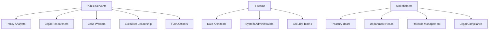
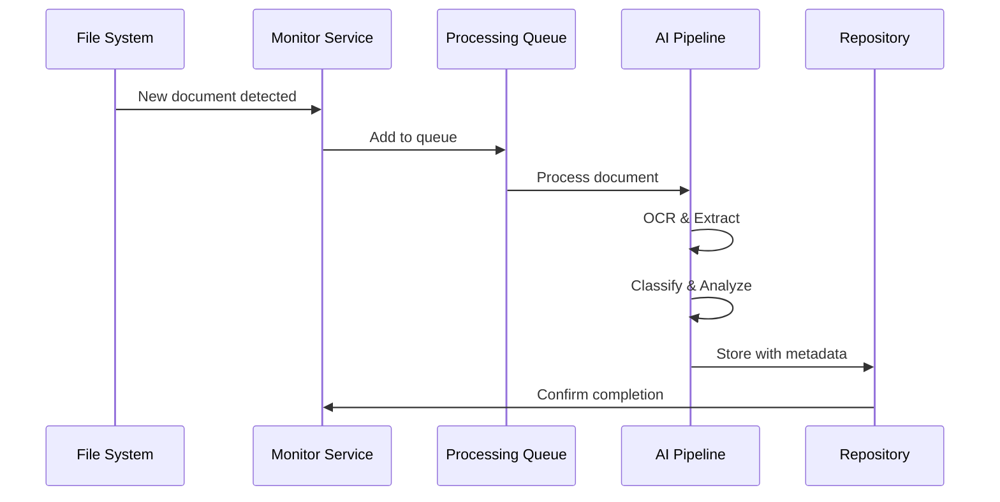
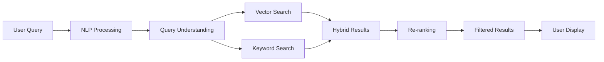
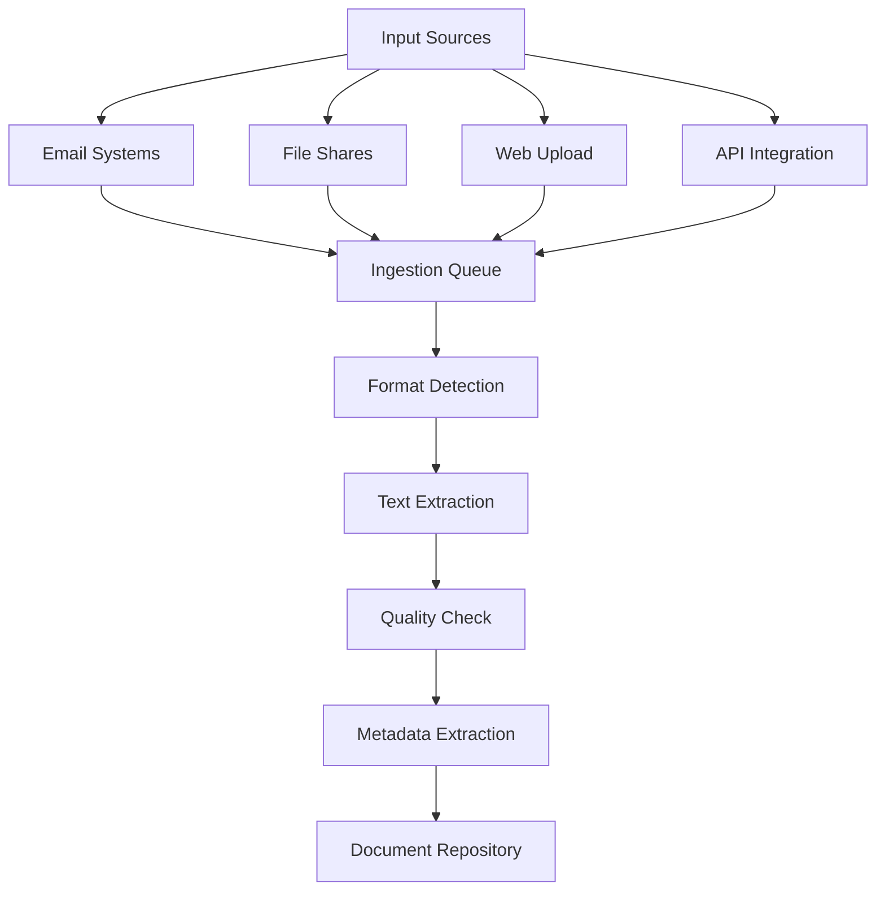
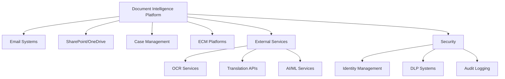
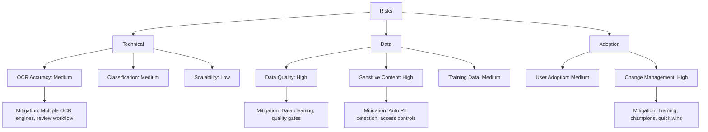

# Product Requirements Document: Intelligent Document Processing & Knowledge Management System

## Executive Summary

**Product Name:** Intelligent Document Processing & Knowledge Management System  
**Version:** 1.0  
**Date:** November 18, 2025  
**Project Context:** G7 GovAI Grand Challenge - Statement 1 (Managing High Volumes of Information)  
**Priority:** High  
**Project Impact:** High - Critical for improving public servant efficiency and decision-making quality

### Vision
Transform government information management by creating an AI-powered platform that automatically ingests, categorizes, analyzes, and surfaces critical information from vast document repositories—enabling public servants to focus on high-value work rather than information retrieval.

### Success Criteria
- 50-70% reduction in information search time
- 40-60% reduction in document processing time
- 95% accuracy in document classification
- 90% user satisfaction with search relevance
- Process 10,000+ documents per hour

## Project Context

### G7 GovAI Challenge Context
- **Competition Period:** November 17 - December 1, 2025
- **Host:** Government of Canada (Treasury Board Secretariat)
- **Objective:** Improve speed of processing and accessing information through AI-powered ingestion, categorization, theme identification, semantic search, and summarization
- **Funding:** Up to $10,000 CAD for selected solutions
- **Scope:** Two-week rapid solution design, followed by potential partnership with G7 governments

### Target Users & Stakeholders

## User Stories

### Epic 1: Document Ingestion & Processing

#### US-1.1: Multi-Format Document Upload
**As a** policy analyst  
**I want to** upload documents in various formats (PDF, Word, Excel, images)  
**So that** all my research materials are processed and searchable in one place

**Acceptance Criteria:**
- System accepts PDF, DOCX, XLSX, PPTX, JPG, PNG, HTML, TXT
- OCR accuracy >90% for scanned documents
- Batch upload supports 1000+ documents simultaneously
- Processing status visible in real-time
- Failed uploads provide clear error messages
- Metadata automatically extracted (author, date, title)

#### US-1.2: Automated Folder Monitoring
**As a** department administrator  
**I want** the system to automatically ingest documents from shared network folders  
**So that** new documents are processed without manual intervention

**Acceptance Criteria:**
- Monitor multiple folder locations simultaneously
- Real-time detection of new documents (<1 minute)
- Automatic retry for failed ingestion attempts
- Email notifications for ingestion errors
- Configurable file filters and exclusions
- Audit log of all ingestion activities

### Epic 2: Classification & Categorization

#### US-2.1: Automatic Document Classification
**As a** records manager  
**I want** documents automatically classified by type and department  
**So that** information is organized consistently across the organization

**Acceptance Criteria:**
- Classification accuracy >85%
- Multi-label classification supported
- Confidence scores provided for each classification
- Uncertain classifications flagged for review
- Custom taxonomy creation capability
- Classification explanation provided (explainable AI)

#### US-2.2: Sensitivity Detection
**As a** security officer  
**I want** the system to automatically identify sensitive information  
**So that** classified documents are properly protected

**Acceptance Criteria:**
- Detect PII (names, addresses, SSN, etc.)
- Identify security classifications (Public, Internal, Confidential, Secret)
- Flag documents requiring review
- Apply appropriate access controls automatically
- Generate security reports
- Integrate with DLP systems

### Epic 3: Semantic Search & Discovery

#### US-3.1: Natural Language Search
**As a** legal researcher  
**I want to** search using natural language questions  
**So that** I can find relevant documents without knowing exact keywords

**Acceptance Criteria:**
- Natural language query processing
- Semantic matching beyond keywords
- Search results ranked by relevance
- Response time <500ms for 95% of queries
- Query suggestions and autocomplete
- Search history and saved searches

#### US-3.2: Advanced Filtering & Faceting
**As a** policy analyst  
**I want to** filter search results by date, department, type, and author  
**So that** I can narrow down to the most relevant documents

**Acceptance Criteria:**
- Filter by date range, document type, department, author, sensitivity
- Multi-select filters supported
- Dynamic facet counts update in real-time
- Save filter combinations as presets
- Export filtered results
- Filters preserved across sessions

### Epic 4: Summarization & Insights

#### US-4.1: Document Summarization
**As an** executive  
**I want** AI-generated summaries of lengthy documents  
**So that** I can quickly understand key points without reading entire documents

**Acceptance Criteria:**
- Extractive summaries (key sentences)
- Abstractive summaries (generated text)
- Configurable length (bullets, paragraph, page)
- Key highlights extraction
- Summary generation <10 seconds
- Citation links to source content

#### US-4.2: Theme Identification
**As a** policy researcher  
**I want** to identify emerging themes across document collections  
**So that** I can spot trends and patterns in government communications

**Acceptance Criteria:**
- Topic modeling across document corpus
- Trend detection over time
- Entity extraction (people, organizations, locations)
- Relationship mapping between entities
- Visual dashboards for insights
- Anomaly detection for unusual patterns

## Functional Requirements

### FR-1: Document Ingestion System

**Requirements:**
- FR-1.1: System shall support PDF, DOCX, XLSX, PPTX, JPG, PNG, HTML, TXT formats
- FR-1.2: System shall perform OCR with >90% accuracy
- FR-1.3: System shall preserve document structure (tables, headers, footers)
- FR-1.4: System shall handle batch uploads of 1000+ documents
- FR-1.5: System shall provide real-time processing status
- FR-1.6: System shall detect and merge duplicate documents
- FR-1.7: System shall maintain version history for all documents

### FR-2: Classification Engine
- FR-2.1: System shall classify documents with >85% accuracy
- FR-2.2: System shall support multi-label classification
- FR-2.3: System shall provide confidence scores for classifications
- FR-2.4: System shall flag low-confidence classifications for review
- FR-2.5: System shall support custom taxonomy creation
- FR-2.6: System shall continuously improve through active learning

### FR-3: Search & Discovery
- FR-3.1: System shall process natural language queries
- FR-3.2: System shall return search results in <500ms for 95% of queries
- FR-3.3: System shall support hybrid search (keyword + semantic)
- FR-3.4: System shall provide faceted filtering
- FR-3.5: System shall rank results by relevance using ML
- FR-3.6: System shall support question answering (direct answers from docs)
- FR-3.7: System shall enable similar document discovery

### FR-4: Summarization & Analysis
- FR-4.1: System shall generate extractive summaries
- FR-4.2: System shall generate abstractive summaries
- FR-4.3: System shall produce summaries in 5-10 seconds
- FR-4.4: System shall extract key highlights and action items
- FR-4.5: System shall identify themes across document collections
- FR-4.6: System shall extract named entities (people, orgs, locations)
- FR-4.7: System shall map relationships between entities

### FR-5: Knowledge Management
- FR-5.1: System shall maintain document relationships and dependencies
- FR-5.2: System shall construct knowledge graph automatically
- FR-5.3: System shall enable document annotations and comments
- FR-5.4: System shall support shared collections and workspaces
- FR-5.5: System shall recommend related documents
- FR-5.6: System shall generate FAQs from document patterns

## Non-Functional Requirements

### NFR-1: Performance
- NFR-1.1: Document ingestion: >10,000 documents/hour
- NFR-1.2: Search response time: <500ms for 95% of queries
- NFR-1.3: Summarization: <10 seconds per document
- NFR-1.4: Classification: Real-time during upload
- NFR-1.5: System uptime: >99.9%
- NFR-1.6: Concurrent users: Support 10,000+

### NFR-2: Security & Compliance
- NFR-2.1: End-to-end encryption for documents at rest and in transit
- NFR-2.2: Role-based access control (RBAC) with fine-grained permissions
- NFR-2.3: Automatic PII detection and redaction
- NFR-2.4: FOIA/Access to Information Act compliance tracking
- NFR-2.5: Audit trails for all document access
- NFR-2.6: Compliance with NIST, FedRAMP standards
- NFR-2.7: Government security classifications support (Protected A/B/C)

### NFR-3: Usability
- NFR-3.1: User satisfaction: >4/5 rating
- NFR-3.2: Search relevance: >80% precision@10
- NFR-3.3: Weekly active users: >70% of pilot users
- NFR-3.4: Time to complete search: <2 minutes average
- NFR-3.5: First-time user success: >80% without training

### NFR-4: Scalability
- NFR-4.1: Horizontal scaling for all services
- NFR-4.2: Distributed storage supporting petabytes
- NFR-4.3: Support 1M+ documents in repository
- NFR-4.4: Multi-tenant architecture for 50+ departments
- NFR-4.5: Auto-scaling based on load

### NFR-5: Reliability
- NFR-5.1: Automated failover and recovery
- NFR-5.2: Data replication across regions
- NFR-5.3: Backup and disaster recovery (RPO: 1 hour, RTO: 4 hours)
- NFR-5.4: Error rate: <1% for document processing
- NFR-5.5: Zero data loss guarantee

## System Integration

### Integration Architecture

### Integration Points
1. **Email Systems:** Exchange, Gmail, Outlook - automatic ingestion
2. **File Storage:** SharePoint, OneDrive, Google Drive, network shares
3. **Case Management:** Document associations with cases
4. **ECM Platforms:** Enterprise content management integration
5. **Records Management:** Retention policy enforcement
6. **Identity Management:** SSO, LDAP/Active Directory
7. **DLP Systems:** Data loss prevention integration
8. **OCR Services:** AWS Textract, Google Document AI
9. **AI/ML Services:** OpenAI, Anthropic, Gemini API
10. **Search Infrastructure:** Elasticsearch, vector databases

## Dependencies

### Technology Dependencies
- **Frontend:** React/Next.js, browser extensions
- **Backend:** Python (FastAPI), Node.js
- **AI/ML:** GPT-4, Claude, Gemini API, Hugging Face, PyTorch
- **Search:** Elasticsearch, Pinecone/Weaviate (vector DB)
- **Databases:** PostgreSQL, MongoDB, Neo4j, Redis
- **Processing:** Apache Airflow, Celery
- **Storage:** S3/Azure Blob Storage
- **Cloud:** AWS/Azure/GCP

### External Service Dependencies
- OCR services (AWS Textract, Google Document AI)
- AI/ML APIs (OpenAI, Anthropic, Gemini)
- Translation services (for multi-language support in Phase 2)
- Email service providers
- Cloud storage providers

### Government System Dependencies
- Email systems and servers
- File share infrastructure
- Case management platforms
- Records management systems
- Identity and access management

## Success Metrics

### Efficiency Metrics
- Time spent searching: -50-70% reduction
- Document processing time: -40-60% reduction
- Documents per employee: 3-4x increase
- Time saved per day: 2-3 hours per employee
- Backlog reduction: -60-80%

### Quality Metrics
- Classification accuracy: >85%
- Search precision@10: >80%
- Summarization quality: >4/5 user rating
- User satisfaction: >4/5 rating
- Information completeness: >95%

### Adoption Metrics
- Weekly active users: >70%
- Search volume: >1000 searches/week
- Documents processed: >100K
- Feature adoption: >60% use advanced features
- Repeat usage: >75%

### Business Impact Metrics
- Cost savings: $3-8M annually per large department
- ROI: $300K+ demonstrated in pilot
- FOIA response time: Weeks to days
- Productivity gain: 30-40% staff time freed
- Knowledge retention: 50% reduction in onboarding time

## Timeline & Milestones

### 2-Week MVP Sprint (Nov 17 - Dec 1, 2025)

**Team Composition (4 people):**
- 1 Full-Stack Developer (React + Python/FastAPI)
- 1 AI/ML Engineer (NLP, Search, Classification)
- 1 DevOps/Backend Engineer (Data Pipeline, Infrastructure)
- 1 Data Scientist/UX Designer (Analytics, User Interface)

**Week 1: Foundation & Core Processing**
- Days 1-2: Architecture design, project setup, vector DB setup
- Days 3-4: Document ingestion pipeline (PDF, DOCX, OCR)
- Days 5-7: Classification model training, semantic search prototype

**Week 2: Search & Demo**
- Days 8-10: Summarization integration, theme identification prototype
- Days 11-12: Search UI, user testing with sample documents
- Days 13-14: Demo preparation, documentation, video submission

**MVP Deliverables (2-Week Scope):**
- Document ingestion for PDF, DOCX, TXT, images (OCR)
- Process 500-1000 sample government documents
- Basic auto-classification (5-10 categories)
- Semantic search with natural language queries
- Extractive summarization for documents
- Simple web interface for search and upload
- Demo video showing search, classification, summarization
- Architecture documentation for scaling

**Post-Challenge Roadmap (If Selected):**
- Months 1-3: Scale to 10K+ docs, government system integrations
- Months 4-6: Deploy to 1-2 departments, 200-500 users
- Months 7-12: Enterprise features, knowledge graph, multi-department

## Risk Assessment

### Risk Mitigation Strategies

**Technical Risks:**
- OCR Accuracy: Use multiple OCR engines, implement human review workflow
- Classification Performance: Active learning, continuous model improvement
- Integration Complexity: Phased approach, prioritize core integrations

**Data Risks:**
- Data Quality: Automated cleaning pipelines, quality validation gates
- Sensitive Content: Automated PII detection, strict access controls, DLP integration
- Training Data: Partner with departments for labeled datasets, active learning

**Adoption Risks:**
- User Adoption: Champions network, quick wins, comprehensive training
- Change Management: Executive sponsorship, communication plan, gradual rollout
- Resistance: Demonstrate value early, involve users in design, transparent benefits

---

**Document Version:** 1.0  
**Last Updated:** November 18, 2025  
**Status:** Draft - G7 Challenge Submission
