# Technical Design Document: Predictive Government Resource Allocation Platform

**Version:** 1.0  
**Date:** November 19, 2025  
**Project:** G7 GovAI Grand Challenge - Statement 3 (Future Needs and Resource Allocation)  
**Status:** Draft - Challenge Submission

## 1. Architecture Overview

### 1.1 High-Level System Architecture

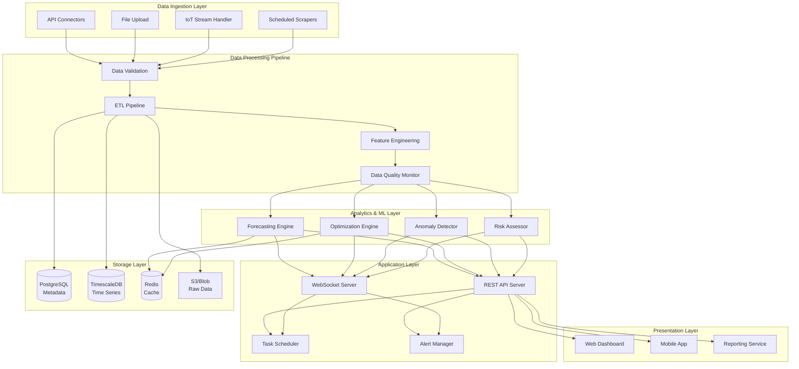

### 1.2 2-Week MVP Architecture Decisions

**Simplified Stack for Rapid Development:**
- **Frontend:** React SPA with Leaflet for mapping
- **Backend:** FastAPI (Python) monolith with modular structure
- **Forecasting:** Prophet + scikit-learn for quick predictions
- **Optimization:** Basic linear programming (scipy.optimize)
- **Database:** PostgreSQL with time-series extension
- **Deployment:** Docker containers on single cloud instance

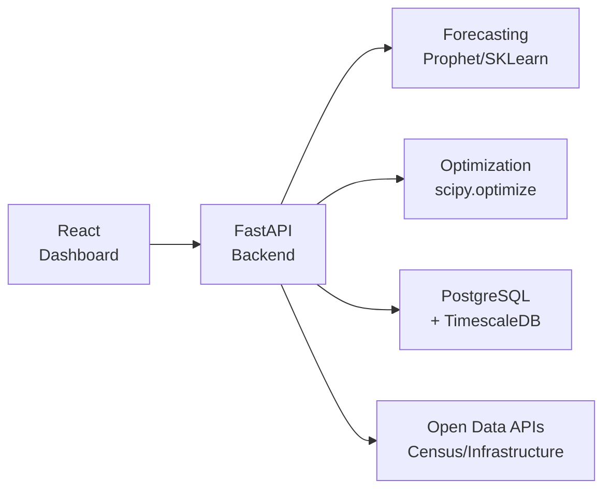

## 2. Component Design

### 2.1 Data Integration Hub

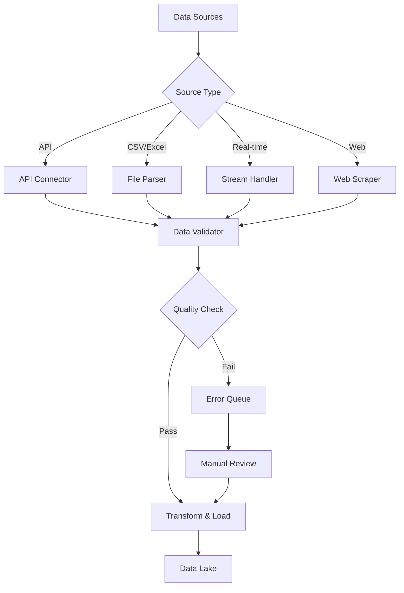

**Key Components:**

1. **APIConnector**
   - Purpose: Connect to government open data APIs
   - Features: Rate limiting, retry logic, authentication
   - Supported: Census, infrastructure, weather, traffic APIs

2. **FileParser**
   - Purpose: Parse uploaded CSV/Excel files
   - Features: Schema validation, data type inference
   - Formats: CSV, XLSX, JSON, GeoJSON

3. **DataValidator**
   - Purpose: Validate data quality and completeness
   - Rules: Range checks, format validation, consistency checks
   - Output: Quality scores and issue reports

4. **ETLPipeline**
   - Purpose: Extract, transform, and load data
   - Technology: Apache Airflow (simplified for MVP)
   - Schedule: Daily batch processing + real-time streams

### 2.2 Forecasting Engine

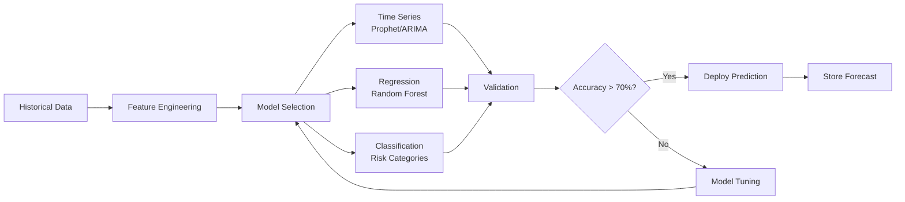

**Forecasting Models:**

1. **Infrastructure Deterioration Model**
   - Algorithm: Prophet for time series + Random Forest for features
   - Inputs: Age, material type, usage, weather exposure, maintenance history
   - Output: Predicted condition score (0-100) over 1-5 year horizon
   - Update frequency: Monthly

2. **Population Growth Model**
   - Algorithm: ARIMA + demographic cohort analysis
   - Inputs: Historical census, births/deaths, migration, economic indicators
   - Output: Population projections by age group for 1, 3, 5, 10 years
   - Update frequency: Quarterly

3. **Demand Forecasting Model**
   - Algorithm: Prophet with seasonality and holidays
   - Inputs: Service utilization history, population trends, events
   - Output: Expected demand by service type and location
   - Update frequency: Weekly

**Model Pipeline:**

```python
class ForecastingEngine:
    def __init__(self):
        self.models = {
            'infrastructure': InfrastructureModel(),
            'population': PopulationModel(),
            'demand': DemandModel()
        }
    
    async def generate_forecast(self, model_type: str, 
                                entity_id: str, 
                                horizon_months: int) -> dict:
        model = self.models[model_type]
        historical_data = await self.fetch_data(entity_id)
        
        # Train or load model
        if not model.is_trained():
            model.train(historical_data)
        
        # Generate predictions
        forecast = model.predict(horizon_months)
        confidence_intervals = model.get_confidence_intervals()
        
        return {
            'predictions': forecast,
            'confidence': confidence_intervals,
            'factors': model.explain_prediction()
        }
```

### 2.3 Optimization Engine

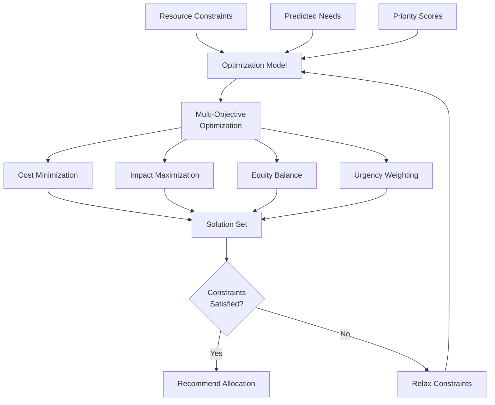

**Optimization Approach:**

1. **Problem Formulation:**
   - Objective: Maximize overall benefit within budget constraints
   - Variables: Resource amounts allocated to each need
   - Constraints: Total budget, minimum allocations, capacity limits

2. **Multi-Objective Function:**
   ```
   Maximize: α×Cost_Efficiency + β×Impact_Score + γ×Equity_Index + δ×Urgency_Factor
   
   Subject to:
   - Sum(allocations) ≤ Total_Budget
   - allocation[i] ≥ Minimum_Required[i]
   - allocation[i] ≤ Capacity_Limit[i]
   ```

3. **Solution Algorithm:**
   - Linear Programming for continuous allocations
   - Integer Programming for discrete resources
   - Pareto frontier analysis for trade-offs

**Implementation:**

```python
from scipy.optimize import linprog
import numpy as np

class OptimizationEngine:
    def allocate_budget(self, needs: list, budget: float, 
                       constraints: dict) -> dict:
        """
        Allocate budget optimally across predicted needs
        """
        n = len(needs)
        
        # Objective: maximize weighted benefit
        c = -np.array([need.benefit_score for need in needs])
        
        # Constraints
        A_ub = [[1] * n]  # Sum constraint
        b_ub = [budget]
        
        bounds = [(need.min_allocation, need.max_allocation) 
                  for need in needs]
        
        result = linprog(c, A_ub=A_ub, b_ub=b_ub, 
                        bounds=bounds, method='highs')
        
        return {
            'allocations': result.x.tolist(),
            'total_benefit': -result.fun,
            'optimization_status': result.status
        }
```

### 2.4 Dashboard & Visualization

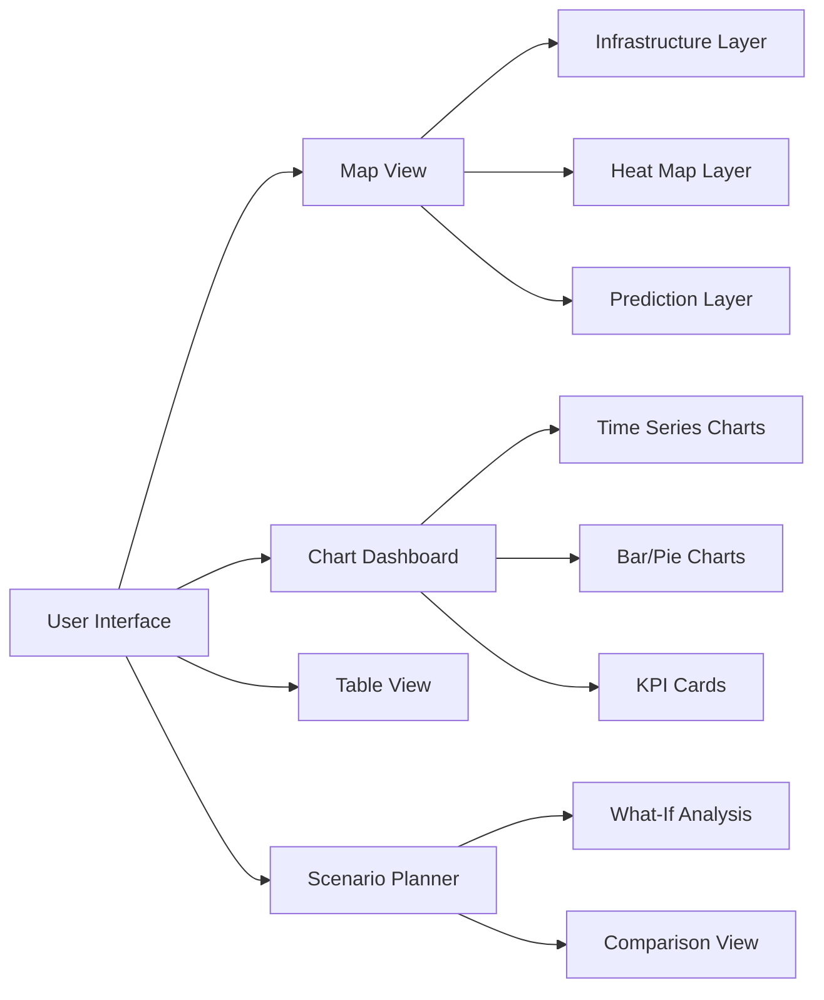

**Dashboard Components:**

1. **InteractiveMap**
   - Library: Leaflet.js with React-Leaflet
   - Features: Infrastructure markers, heat maps, zoom/pan
   - Layers: Current conditions, predictions, allocations

2. **ForecastCharts**
   - Library: Recharts or Chart.js
   - Types: Line charts (trends), bar charts (comparisons)
   - Interactivity: Hover tooltips, drill-down, export

3. **ScenarioPlanner**
   - Purpose: Compare allocation scenarios
   - Features: Parameter adjustment, side-by-side comparison
   - Output: Recommended scenario with rationale

## 3. Data Model

### 3.1 Entity-Relationship Diagram

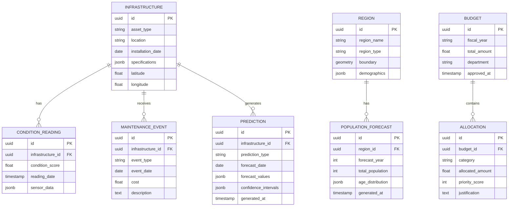

### 3.2 Database Schema

**PostgreSQL + TimescaleDB Tables:**

```sql
-- Infrastructure assets
CREATE TABLE infrastructure (
    id UUID PRIMARY KEY DEFAULT gen_random_uuid(),
    asset_type VARCHAR(50) NOT NULL,
    asset_name VARCHAR(255),
    location TEXT,
    installation_date DATE,
    specifications JSONB DEFAULT '{}',
    latitude DECIMAL(10, 8),
    longitude DECIMAL(11, 8),
    created_at TIMESTAMP DEFAULT CURRENT_TIMESTAMP,
    INDEX idx_asset_type (asset_type),
    INDEX idx_location (latitude, longitude)
);

-- Time-series condition readings (TimescaleDB hypertable)
CREATE TABLE condition_readings (
    id UUID DEFAULT gen_random_uuid(),
    infrastructure_id UUID REFERENCES infrastructure(id),
    condition_score FLOAT NOT NULL CHECK (condition_score >= 0 AND condition_score <= 100),
    reading_date TIMESTAMP NOT NULL,
    sensor_data JSONB,
    PRIMARY KEY (id, reading_date)
);

SELECT create_hypertable('condition_readings', 'reading_date');

-- Maintenance events
CREATE TABLE maintenance_events (
    id UUID PRIMARY KEY DEFAULT gen_random_uuid(),
    infrastructure_id UUID REFERENCES infrastructure(id),
    event_type VARCHAR(50) NOT NULL,
    event_date DATE NOT NULL,
    cost DECIMAL(15, 2),
    description TEXT,
    INDEX idx_event_date (event_date DESC),
    INDEX idx_infrastructure (infrastructure_id)
);

-- Predictions
CREATE TABLE predictions (
    id UUID PRIMARY KEY DEFAULT gen_random_uuid(),
    entity_id UUID NOT NULL,
    entity_type VARCHAR(50) NOT NULL,
    prediction_type VARCHAR(50) NOT NULL,
    forecast_date DATE NOT NULL,
    forecast_values JSONB NOT NULL,
    confidence_intervals JSONB,
    model_version VARCHAR(50),
    generated_at TIMESTAMP DEFAULT CURRENT_TIMESTAMP,
    INDEX idx_entity (entity_id, prediction_type),
    INDEX idx_forecast_date (forecast_date)
);

-- Regions
CREATE TABLE regions (
    id UUID PRIMARY KEY DEFAULT gen_random_uuid(),
    region_name VARCHAR(255) NOT NULL,
    region_type VARCHAR(50) NOT NULL,
    boundary GEOGRAPHY(POLYGON),
    demographics JSONB,
    INDEX idx_region_type (region_type)
);

-- Population forecasts
CREATE TABLE population_forecasts (
    id UUID PRIMARY KEY DEFAULT gen_random_uuid(),
    region_id UUID REFERENCES regions(id),
    forecast_year INT NOT NULL,
    total_population INT NOT NULL,
    age_distribution JSONB,
    generated_at TIMESTAMP DEFAULT CURRENT_TIMESTAMP,
    INDEX idx_region_year (region_id, forecast_year)
);

-- Budgets
CREATE TABLE budgets (
    id UUID PRIMARY KEY DEFAULT gen_random_uuid(),
    fiscal_year VARCHAR(10) NOT NULL,
    total_amount DECIMAL(15, 2) NOT NULL,
    department VARCHAR(100),
    approved_at TIMESTAMP,
    INDEX idx_fiscal_year (fiscal_year)
);

-- Allocations
CREATE TABLE allocations (
    id UUID PRIMARY KEY DEFAULT gen_random_uuid(),
    budget_id UUID REFERENCES budgets(id),
    category VARCHAR(100) NOT NULL,
    allocated_amount DECIMAL(15, 2) NOT NULL,
    priority_score INT CHECK (priority_score >= 0 AND priority_score <= 100),
    justification TEXT,
    INDEX idx_budget (budget_id),
    INDEX idx_priority (priority_score DESC)
);
```

## 4. API Design

### 4.1 RESTful API Endpoints

**Data Management:**
```
POST   /api/v1/data/upload            - Upload data file
GET    /api/v1/data/sources           - List data sources
POST   /api/v1/data/sources/{id}/sync - Sync data source
GET    /api/v1/data/quality           - Get data quality metrics
```

**Infrastructure:**
```
GET    /api/v1/infrastructure         - List infrastructure assets
GET    /api/v1/infrastructure/{id}    - Get asset details
GET    /api/v1/infrastructure/{id}/history - Get condition history
POST   /api/v1/infrastructure/{id}/maintenance - Log maintenance
```

**Predictions:**
```
POST   /api/v1/predictions/generate   - Generate new predictions
GET    /api/v1/predictions            - List predictions
GET    /api/v1/predictions/{id}       - Get prediction details
GET    /api/v1/predictions/accuracy   - Get model accuracy metrics
```

**Optimization:**
```
POST   /api/v1/optimize/budget        - Optimize budget allocation
POST   /api/v1/optimize/scenario      - Create scenario
GET    /api/v1/optimize/scenarios     - List scenarios
POST   /api/v1/optimize/compare       - Compare scenarios
```

**Analytics:**
```
GET    /api/v1/analytics/dashboard    - Get dashboard data
GET    /api/v1/analytics/trends       - Get trend analysis
GET    /api/v1/analytics/risks        - Get risk assessment
GET    /api/v1/analytics/roi          - Get ROI analysis
```

### 4.2 API Request/Response Examples

**Generate Infrastructure Predictions:**

```json
POST /api/v1/predictions/generate
{
  "entity_type": "infrastructure",
  "entity_ids": ["asset-123", "asset-456"],
  "prediction_type": "condition_deterioration",
  "horizon_months": 12
}

Response (202 Accepted):
{
  "job_id": "pred-job-789",
  "status": "processing",
  "estimated_completion": "2025-11-19T10:05:00Z"
}

GET /api/v1/predictions/pred-job-789
Response (200 OK):
{
  "job_id": "pred-job-789",
  "status": "completed",
  "predictions": [
    {
      "entity_id": "asset-123",
      "entity_name": "Bridge 5th Ave",
      "current_condition": 75,
      "forecasts": [
        {"month": 1, "condition": 73, "ci_lower": 70, "ci_upper": 76},
        {"month": 6, "condition": 68, "ci_lower": 62, "ci_upper": 74},
        {"month": 12, "condition": 62, "ci_lower": 54, "ci_upper": 70}
      ],
      "risk_level": "medium",
      "recommended_action": "Schedule inspection in 6 months"
    }
  ]
}
```

**Optimize Budget Allocation:**

```json
POST /api/v1/optimize/budget
{
  "fiscal_year": "2025-2026",
  "total_budget": 5000000,
  "categories": [
    {"name": "Roads", "min": 1000000, "max": 3000000, "priority": 90},
    {"name": "Bridges", "min": 500000, "max": 2000000, "priority": 85},
    {"name": "Buildings", "min": 500000, "max": 1500000, "priority": 70}
  ],
  "objectives": {
    "cost_efficiency": 0.3,
    "impact": 0.4,
    "equity": 0.2,
    "urgency": 0.1
  }
}

Response (200 OK):
{
  "optimization_id": "opt-456",
  "total_allocated": 5000000,
  "allocations": [
    {
      "category": "Roads",
      "amount": 2200000,
      "percent": 44,
      "expected_benefit": 8500,
      "justification": "High urgency needs with significant public impact"
    },
    {
      "category": "Bridges",
      "amount": 1800000,
      "percent": 36,
      "expected_benefit": 7200,
      "justification": "Critical safety infrastructure requiring immediate attention"
    },
    {
      "category": "Buildings",
      "amount": 1000000,
      "percent": 20,
      "expected_benefit": 3800,
      "justification": "Preventive maintenance to avoid future deterioration"
    }
  ],
  "total_benefit_score": 19500,
  "scenario_analysis": {
    "best_case": 21000,
    "expected": 19500,
    "worst_case": 17000
  }
}
```

## 5. Machine Learning Pipeline

### 5.1 Model Training Pipeline

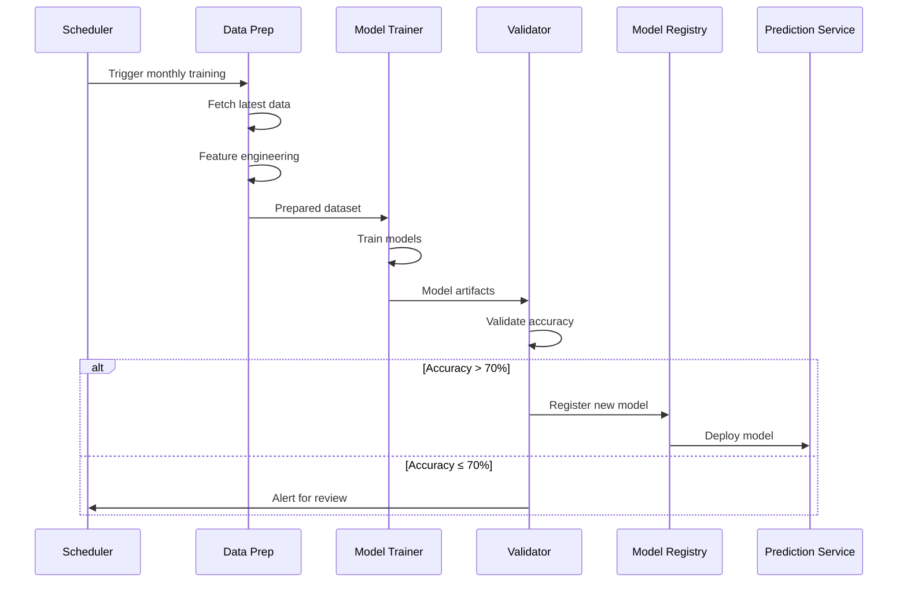

**Training Configuration:**

```python
class ModelTrainer:
    def __init__(self, model_type: str):
        self.model_type = model_type
        self.min_accuracy = 0.70
    
    def train_infrastructure_model(self, data: pd.DataFrame):
        """Train infrastructure deterioration model"""
        from prophet import Prophet
        
        # Prepare data for Prophet
        df = data[['date', 'condition_score']].rename(
            columns={'date': 'ds', 'condition_score': 'y'}
        )
        
        # Add regressors
        for col in ['age', 'usage', 'weather_exposure']:
            df[col] = data[col]
        
        # Train model
        model = Prophet(yearly_seasonality=True)
        for col in ['age', 'usage', 'weather_exposure']:
            model.add_regressor(col)
        
        model.fit(df)
        
        # Validate
        accuracy = self.cross_validate(model, df)
        
        if accuracy >= self.min_accuracy:
            self.save_model(model)
            return {'status': 'success', 'accuracy': accuracy}
        else:
            return {'status': 'failed', 'accuracy': accuracy}
```

### 5.2 Gemini API Integration for Historical Analysis

**Using Gemini for Document Intelligence:**

```python
async def analyze_historical_reports(report_files: list) -> dict:
    """Analyze historical infrastructure reports using Gemini API"""
    import google.generativeai as genai
    
    # Upload reports to Gemini
    uploaded_files = []
    for file_path in report_files:
        file = genai.upload_file(file_path)
        uploaded_files.append(file)
    
    # Extract insights
    prompt = """
    Analyze these infrastructure inspection reports and extract:
    1. Common failure patterns
    2. Maintenance effectiveness
    3. Cost trends over time
    4. Recommendations for predictive models
    
    Provide structured JSON output.
    """
    
    model = genai.GenerativeModel('gemini-1.5-pro')
    response = model.generate_content([prompt, *uploaded_files])
    
    return json.loads(response.text)
```

## 6. Geospatial Features

### 6.1 GIS Integration

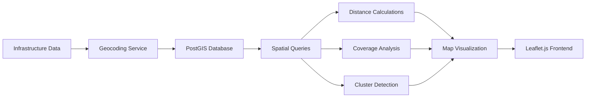

**Spatial Operations:**

1. **Proximity Analysis:**
   - Find infrastructure within radius
   - Calculate service coverage areas
   - Identify underserved regions

2. **Heat Maps:**
   - Deterioration hotspots
   - Demand concentration
   - Risk visualization

3. **Route Optimization:**
   - Inspection route planning
   - Emergency response routing
   - Maintenance crew deployment

**PostGIS Queries:**

```sql
-- Find assets within 5km of a point requiring attention
SELECT i.*, c.condition_score,
       ST_Distance(i.location::geography, 
                   ST_MakePoint(-79.3832, 43.6532)::geography) as distance
FROM infrastructure i
JOIN condition_readings c ON i.id = c.infrastructure_id
WHERE ST_DWithin(i.location::geography, 
                 ST_MakePoint(-79.3832, 43.6532)::geography, 
                 5000)
AND c.condition_score < 60
ORDER BY distance;

-- Calculate coverage area for service facilities
SELECT region_name, 
       COUNT(i.id) as num_facilities,
       AVG(ST_Distance(r.boundary, i.location::geography)) as avg_distance
FROM regions r
LEFT JOIN infrastructure i ON ST_Contains(r.boundary, i.location::geography)
GROUP BY r.id, r.region_name;
```

## 7. Real-Time Monitoring

### 7.1 Anomaly Detection

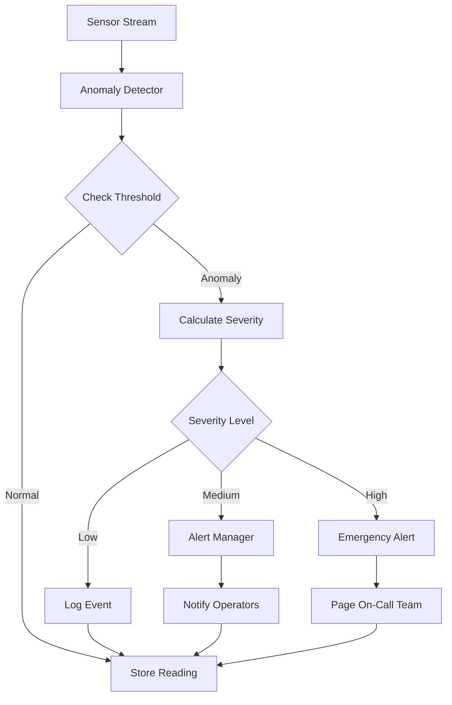

**Anomaly Detection Algorithm:**

```python
class AnomalyDetector:
    def __init__(self, window_size: int = 100):
        self.window_size = window_size
        self.baseline = {}
    
    def detect_anomaly(self, asset_id: str, 
                      reading: float, 
                      timestamp: datetime) -> dict:
        """Detect anomalies using statistical methods"""
        
        # Get historical baseline
        history = self.get_history(asset_id, self.window_size)
        
        if len(history) < 10:
            return {'is_anomaly': False, 'reason': 'insufficient_data'}
        
        # Calculate statistics
        mean = np.mean(history)
        std = np.std(history)
        z_score = (reading - mean) / std if std > 0 else 0
        
        # Check for anomaly (3-sigma rule)
        is_anomaly = abs(z_score) > 3
        
        if is_anomaly:
            severity = self.calculate_severity(z_score, reading)
            return {
                'is_anomaly': True,
                'severity': severity,
                'z_score': z_score,
                'expected_range': (mean - 2*std, mean + 2*std),
                'actual_value': reading
            }
        
        return {'is_anomaly': False}
```

## 8. Security & Access Control

### 8.1 Security Architecture

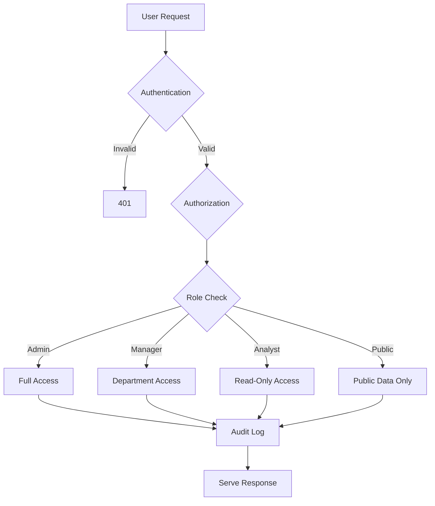

**Security Features:**

1. **Authentication:**
   - JWT tokens with refresh
   - SSO integration (SAML, OAuth)
   - MFA for administrative access

2. **Authorization:**
   - RBAC with hierarchical roles
   - Department-based data isolation
   - Row-level security for sensitive data

3. **Data Protection:**
   - Encryption at rest (AES-256)
   - TLS 1.3 for transit
   - Sensitive field masking in logs

4. **Audit Trail:**
   - Log all data access
   - Track prediction usage
   - Monitor allocation decisions

## 9. Deployment & Scaling

### 9.1 MVP Deployment Architecture

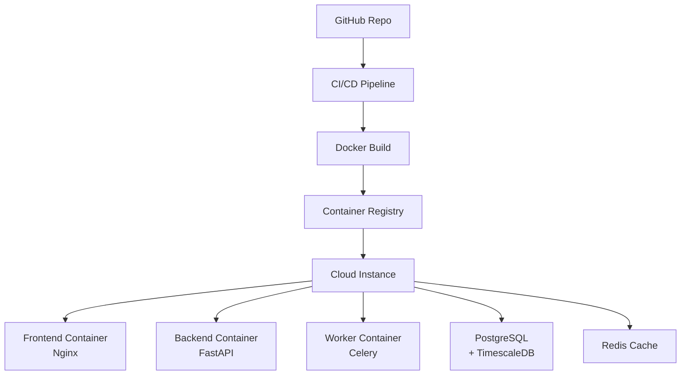

**Docker Compose (MVP):**

```yaml
version: '3.8'
services:
  frontend:
    build: ./frontend
    ports: ["3000:80"]
    depends_on: [backend]
  
  backend:
    build: ./backend
    ports: ["8000:8000"]
    environment:
      - DATABASE_URL=postgresql://db:5432/resource_allocation
      - REDIS_URL=redis://redis:6379
    depends_on: [db, redis]
  
  worker:
    build: ./backend
    command: celery -A app.celery worker -l info
    depends_on: [db, redis]
  
  db:
    image: timescale/timescaledb:latest-pg15
    environment:
      - POSTGRES_DB=resource_allocation
      - POSTGRES_PASSWORD=secure_password
    volumes:
      - postgres_data:/var/lib/postgresql/data
    ports: ["5432:5432"]
  
  redis:
    image: redis:7-alpine
    ports: ["6379:6379"]

volumes:
  postgres_data:
```

## 10. Testing & Validation

### 10.1 Testing Strategy

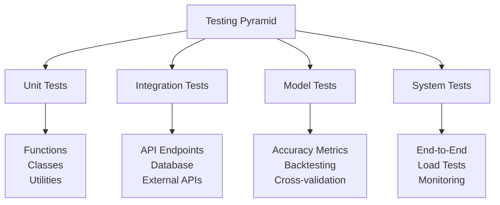

**Testing Approach (2-Week MVP):**

1. **Unit Tests (pytest):**
   - Data validation functions
   - Feature engineering utilities
   - Optimization algorithms
   - Statistical calculations

2. **Integration Tests:**
   - API endpoint functionality
   - Database CRUD operations
   - External API connectors
   - Celery task execution

3. **Model Validation:**
   - Backtesting on historical data
   - Cross-validation accuracy (target >70%)
   - Prediction interval coverage
   - Feature importance analysis

4. **Load Tests:**
   - 50 concurrent users
   - 1000+ data points ingestion per hour
   - Dashboard response time (<3s)

5. **Manual Tests:**
   - Upload various data formats
   - Verify forecasting accuracy
   - Test optimization results
   - Review dashboard visualizations

---

**Document Status:** Complete - MVP Design
