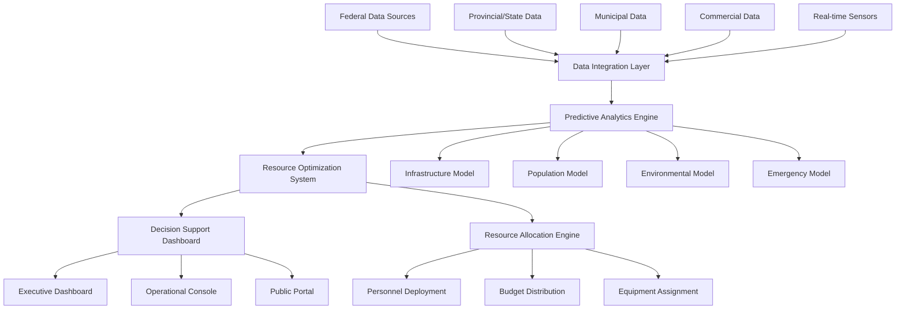
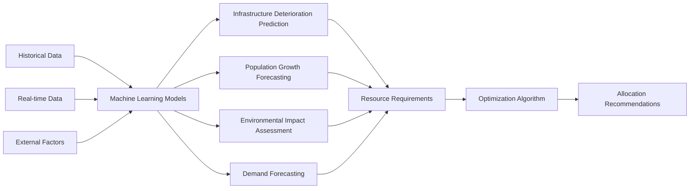
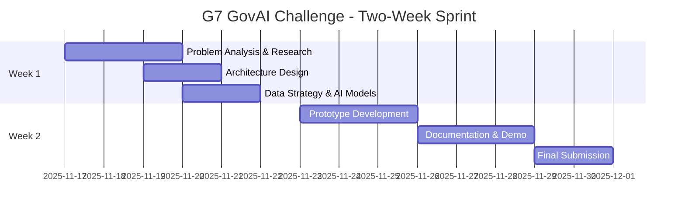
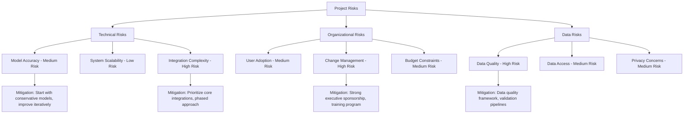

# Feature Idea: Predictive Government Resource Allocation Platform

## G7 GovAI Grand Challenge Submission

**Challenge:** Statement 3 - Future Needs and Resource Allocation  
**Competition Period:** November 17 to December 1, 2025  
**Challenge Host:** Government of Canada (Treasury Board Secretariat)  
**Objective:** Design a responsible AI solution to help governments accurately predict future needs and efficiently allocate resources

## Overview

A comprehensive AI-powered platform that enables governments to anticipate future needs and optimize resource allocation by analyzing multi-source data streams including infrastructure condition, population dynamics, environmental factors, and real-time operational data. The system provides predictive insights and automated recommendations to ensure critical resources (personnel, funding, equipment) are deployed efficiently where and when they are needed most.

This proposal responds to the G7 GovAI Grand Challenge by presenting a practical, scalable, and responsible AI solution that can be adopted across G7 countries to improve public services and reduce waste through better resource planning.

## Problem Statement (Government Context)

Governments face significant challenges in resource planning and allocation:

1. **Reactive vs. Proactive**: Current resource allocation is often reactive, responding to crises rather than preventing them
2. **Data Silos**: Critical data exists across multiple departments and jurisdictions (federal, provincial, state, municipal, commercial) but isn't integrated for holistic decision-making
3. **Resource Waste**: Poor prediction leads to over-allocation in some areas and under-allocation in others, resulting in waste and service gaps
4. **Complex Dependencies**: Infrastructure deterioration, population growth, environmental impacts, and emergency events create interconnected challenges that are difficult to model manually
5. **Budget Constraints**: Limited funding requires optimal prioritization but current tools lack sophisticated predictive capabilities
6. **Emergency Preparedness**: Disaster response and supply chain resilience suffer from lack of real-time adaptive planning

## Proposed Solution

### Core System Architecture

### Key Components

#### 1. **Multi-Source Data Integration Hub**
- Aggregates federal, provincial/state, municipal, and commercial datasets
- Integrates real-time data: weather, traffic, shipping, scheduling
- Standardizes data formats across jurisdictions
- Maintains historical data for trend analysis
- APIs for continuous data ingestion

#### 2. **Predictive Analytics Engine**

**Prediction Models:**
- **Infrastructure Deterioration**: ML models analyzing material age, usage patterns, maintenance history, weather exposure
- **Population Dynamics**: Growth forecasting based on demographics, migration patterns, economic indicators
- **Environmental Impacts**: Climate change effects, natural disaster probability, air/water quality trends
- **Resource Demand**: Service utilization patterns, seasonal variations, emerging needs

#### 3. **Resource Optimization System**
- Multi-objective optimization considering cost, urgency, impact, and constraints
- Scenario planning and what-if analysis
- Risk assessment and mitigation strategies
- Dynamic reallocation based on changing conditions
- Priority scoring algorithms

#### 4. **Decision Support Dashboard**
- Executive-level strategic planning interface
- Operational consoles for department managers
- Field-level mobile applications for resource coordinators
- Public transparency portal showing allocation decisions
- Alert system for critical situations requiring immediate attention

#### 5. **Emergency Response Module**
- Real-time disaster monitoring and prediction
- Supply chain resilience tracking
- Automated emergency resource mobilization
- Coordination across agencies and jurisdictions
- Adaptive routing and logistics optimization

## Expected Benefits (Government Impact)

### Immediate Benefits (Year 1)
- **15-25% Reduction in Resource Waste**: Better prediction eliminates over-allocation
- **Improved Response Times**: Proactive positioning reduces emergency response time by 30-40%
- **Enhanced Transparency**: Public can see how resources are allocated and why
- **Data-Driven Decisions**: Replace gut instinct with evidence-based planning

### Medium-Term Benefits (Years 2-3)
- **Cost Savings**: $5-10M annually per major municipality through optimized allocation
- **Service Improvement**: 20-30% improvement in service delivery metrics
- **Risk Mitigation**: Early detection prevents 40-60% of potential infrastructure failures
- **Cross-Jurisdiction Coordination**: Better collaboration through shared data and insights

### Long-Term Benefits (Years 4+)
- **Strategic Planning**: Multi-year planning with confidence based on proven predictions
- **Budget Optimization**: Evidence for budget requests with projected ROI
- **Climate Resilience**: Proactive adaptation to environmental changes
- **Economic Development**: Attract investment through demonstrated efficient governance

## Technical Considerations (System Integration)

### Technology Stack

```mermaid
flowchart TD
    A[Frontend Layer] --> B[React/Next.js Dashboard]
    A --> C[Mobile Apps - React Native]
    
    D[API Layer] --> E[REST APIs]
    D --> F[GraphQL]
    D --> G[Real-time WebSocket]
    
    H[Backend Services] --> I[Node.js/Python Microservices]
    H --> J[ML Model Servers - TensorFlow/PyTorch]
    H --> K[Optimization Engine - Python/Julia]
    
    L[Data Layer] --> M[PostgreSQL - Structured Data]
    L --> N[TimescaleDB - Time Series]
    L --> O[MongoDB - Unstructured Data]
    L --> P[Redis - Caching/Real-time]
    
    Q[Infrastructure] --> R[Kubernetes Orchestration]
    Q --> S[Cloud Services - AWS/Azure/GCP]
    Q --> T[Edge Computing for Real-time Sensors]
```

### Data Architecture
- **Data Lake**: Raw data storage for all ingested information
- **Data Warehouse**: Processed, structured data for analytics
- **Real-time Stream Processing**: Apache Kafka/Kinesis for live data
- **Feature Store**: ML feature management and versioning
- **Data Governance**: Lineage tracking, quality monitoring, access controls

### AI/ML Components
- **Time Series Forecasting**: ARIMA, Prophet, LSTM networks for trend prediction
- **Regression Models**: Infrastructure deterioration modeling
- **Classification**: Risk categorization and priority assessment
- **Clustering**: Identifying patterns and anomalies in resource usage
- **Reinforcement Learning**: Continuous optimization of allocation strategies
- **Natural Language Processing**: Processing reports, documents, citizen feedback

**RAG & Document Management Options:**
- **Gemini API File Search**: Google's managed RAG solution for policy documents and historical data
  - Integrated file upload and management capabilities
  - Automatic chunking, embedding generation, and semantic search
  - Supports PDF, TXT, HTML, and other common document formats
  - Built-in caching for improved performance and reduced costs
  - Seamless integration with Gemini models for analyzing historical reports and trends
  - Documentation: https://ai.google.dev/gemini-api/docs/file-search
- **Custom RAG Implementation**: Vector databases (Pinecone, Weaviate) for large-scale historical data analysis
- **Hybrid Approach**: Combine Gemini API for document intelligence with custom time-series databases for sensor data

### Integration Requirements
- **Government Systems**: Integration with existing ERP, GIS, asset management systems
- **Open Data Portals**: Automated ingestion from federal, state, municipal open data
- **Weather Services**: NOAA, Environment Canada, commercial weather APIs
- **Traffic Systems**: Real-time traffic and transportation data
- **IoT Sensors**: Infrastructure sensors, environmental monitors, smart city devices
- **Financial Systems**: Budget tracking and expenditure monitoring

### Security & Compliance
- **Data Privacy**: GDPR, PIPEDA compliance for personal information
- **Access Controls**: Role-based access (RBAC) with multi-factor authentication
- **Audit Logging**: Complete audit trail of all decisions and data access
- **Encryption**: At-rest and in-transit encryption for sensitive data
- **Disaster Recovery**: Multi-region backup and failover capabilities
- **Cybersecurity**: SOC 2, ISO 27001 compliance

### Performance Requirements
- **Scalability**: Handle data from 100+ municipalities, millions of data points daily
- **Real-time Processing**: Sub-second latency for critical alerts
- **Prediction Latency**: Generate forecasts within minutes for ad-hoc queries
- **Availability**: 99.9% uptime for critical systems
- **Concurrent Users**: Support 1000+ simultaneous users

## G7 Challenge Proposal: Two-Week Rapid Solution Design

### Challenge Timeline (Nov 17 - Dec 1, 2025)

**Challenge Deliverables (by December 1, 2025):**
1. Comprehensive solution architecture and technical design
2. Working prototype or proof-of-concept demonstrating key capabilities
3. Implementation roadmap for G7 government adoption
4. Responsible AI framework addressing ethics, bias, and transparency
5. Cost-benefit analysis and scalability assessment
6. Presentation materials for judging panel

### Post-Challenge Pathway (if selected)

**Early 2026: Showcase & Funding**
- Present solution to G7 GovAI network and judging panel
- Potential award of up to $10,000 CAD for further development
- Selected for research partnership with G7 government(s)

**Months 1-3 (if funded):**
- Real-time sensor integration
- Expand to 5+ data sources
- Enhanced forecasting models
- Basic emergency response features

**Months 4-6:**
- Deploy to 1-2 municipalities
- 50+ active users
- Multi-department integration
- Advanced dashboard features

**Months 7-12:**
- Emergency response module
- Multi-jurisdiction coordination
- Public transparency portal
- Share with G7 AI Network (GAIN)

## Initial Scope

### In Scope for G7 Challenge Submission (Nov 17 - Dec 1, 2025)

**What We'll Deliver in Two Weeks:**
1. **Comprehensive Solution Design**
   - Detailed system architecture and component specifications
   - AI/ML model design for predictive analytics
   - Data integration and processing pipelines
   - User interface mockups and workflows

2. **Proof-of-Concept Prototype**
   - Demonstration using publicly available open data
   - Sample predictions for infrastructure deterioration
   - Basic dashboard showing resource allocation recommendations
   - Interactive demo for judging panel

3. **Responsible AI Framework**
   - Ethics and bias mitigation strategies
   - Transparency and explainability approaches
   - Privacy and security considerations
   - Governance and human oversight mechanisms

4. **Implementation Roadmap**
   - Phased deployment plan for G7 adoption
   - Cost estimates and resource requirements
   - Risk assessment and mitigation strategies
   - Success metrics and evaluation framework

5. **Documentation Package**
   - Technical specifications
   - User stories and use cases
   - Research findings and references
   - Video demonstration or presentation

### In Scope for MVP (if selected for funding)

#### Core Features
1. **Data Integration**
   - Connect to 3-5 government open data sources
   - Real-time weather data integration
   - Historical infrastructure maintenance records
   - Population census and projection data

2. **Predictive Models**
   - Infrastructure deterioration prediction (roads, bridges, buildings)
   - Basic population growth forecasting
   - Seasonal demand patterns

3. **Resource Allocation**
   - Budget allocation recommendations
   - Priority scoring for infrastructure maintenance
   - Resource gap identification

4. **Dashboard**
   - Executive summary view
   - Interactive maps with predictions
   - Allocation recommendations
   - Basic reporting

5. **Pilot Deployment**
   - Deploy with 1-2 partner municipalities
   - Focus on public works/infrastructure domain
   - 6-month pilot period with feedback loop

### Out of Scope for MVP
- Real-time emergency response system (Phase 2)
- Supply chain tracking (Phase 2)
- Multi-jurisdiction coordination (Phase 3)
- Public transparency portal (Phase 3)
- Mobile field applications (Phase 2)
- Advanced AI models (reinforcement learning) (Phase 3+)

### Success Criteria for MVP

#### Technical Metrics
- Successfully ingest data from 5+ diverse sources
- Generate predictions with >70% accuracy (validated against historical data)
- Process daily data updates within 2 hours
- Dashboard loads within 3 seconds for standard queries
- System uptime >99.5%

#### Business Metrics
- Identify $500K+ in potential cost savings through better allocation
- Reduce emergency infrastructure failures by 20% in pilot municipalities
- User satisfaction score >4/5 from pilot participants
- Adoption by at least 3 department heads in each pilot municipality

#### Operational Metrics
- 50+ active users during pilot
- Generate 100+ allocation recommendations in 6 months
- Process 1M+ data points from multiple sources
- Train 2 models per prediction category with continuous improvement

### Risk Assessment

## Implementation Approach

### Development Methodology
- **Agile/Scrum**: 2-week sprints with continuous delivery
- **AI-TDD**: Test-driven development for ML models and core algorithms
- **DevOps**: CI/CD pipeline for automated testing and deployment
- **User-Centered Design**: Regular feedback from government stakeholders

### Team Structure (2-Week MVP / 4-Person Team)
- **Full-Stack Developer**: 1 (React + Python/FastAPI)
- **Data Scientist/ML Engineer**: 1 (Forecasting, Optimization)
- **Data Engineer**: 1 (Data Pipeline, Integration)
- **GIS/Visualization Specialist**: 1 (Maps, Dashboards)

### Timeline & Budget Estimate

**G7 Challenge Phase (Nov 17 - Dec 1, 2025):**
- **Duration**: 2 weeks to MVP
- **Team**: 4 people (Full-Stack Dev, Data Scientist, Data Engineer, GIS/Visualization Specialist)
- **Competition Effort**: Intensive 2-week sprint
- **Potential Award**: Up to $10,000 CAD (if selected)

**Post-Challenge Development (if funded):**
- **Months 1-3**: Real-time sensor integration, 5+ data sources, $50-150K
- **Months 4-6**: Deploy to 1-2 municipalities, 50+ users, $200-400K
- **Months 7-12**: Emergency response, multi-jurisdiction coordination, $500K-1M

### Next Steps for G7 Challenge Submission

**Week 1 (Nov 17-23, 2025):**
1. **Research & Analysis** (Days 1-2)
   - Study government open data sources across G7 countries
   - Research existing solutions and best practices
   - Analyze Statement 3 challenge requirements in depth

2. **Solution Design** (Days 3-5)
   - Finalize system architecture
   - Design AI/ML models and algorithms
   - Create user interface mockups
   - Develop responsible AI framework

**Week 2 (Nov 24-Dec 1, 2025):**
3. **Prototype Development** (Days 6-8)
   - Build proof-of-concept with sample data
   - Implement core prediction algorithm
   - Create interactive dashboard demo

4. **Documentation & Submission** (Days 9-14)
   - Write comprehensive technical documentation
   - Prepare presentation and video demo
   - Complete impact and cost-benefit analysis
   - Submit to Impact Canada platform by December 1, 2025

**Post-Submission:**
- Await judging results (December 2025 - January 2026)
- Prepare for potential showcase presentation
- If selected: Begin partnership discussions with G7 governments

---

*This proposal is submitted for the G7 GovAI Grand Challenge (Nov 17 - Dec 1, 2025), a competition to advance responsible AI adoption in G7 public services. The solution prioritizes practical applicability, scalability across governments, and measurable citizen benefits.*
