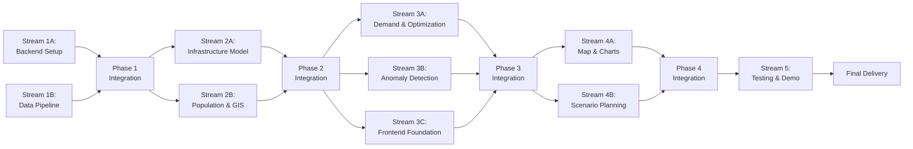

# Parallel Execution Plan: Predictive Resource Allocator

**Version:** 1.0  
**Date:** November 19, 2025  
**Project:** G7 GovAI Grand Challenge MVP  
**Timeline:** 2 weeks (Nov 17 - Dec 1, 2025)  
**Team Size:** 4 people  
**Original Plan:** [plan.md](./plan.md)

## Overview

This parallel execution plan reorganizes the sequential implementation plan into independent work streams that can run simultaneously without conflicts. The plan organizes work by technical domains: backend infrastructure, ML models, GIS services, and frontend visualization.

### Parallelization Strategy

The work is organized by functional areas and dependencies:
- **Backend infrastructure** established first, then parallel development begins
- **Forecasting models** can be developed independently once data pipeline exists
- **GIS services** and **Anomaly detection** can progress in parallel with models
- **Frontend development** happens alongside backend services
- **Testing and demo** integrate all components

### Time Savings
- **Sequential execution**: ~14 days
- **Parallel execution**: ~9-10 days
- **Time saved**: 30-40%

## Parallel Work Streams

## Phase 1: Foundation (Days 1-2)

**Goal:** Establish backend infrastructure and data ingestion pipeline

### Stream 1A: Backend Setup & Database

**Independence:** No dependencies on other streams; works with backend files only  
**Assigned To:** Developer 1  
**Duration:** 16 hours (Days 1-2)

**Tasks:**
- [ ] **Step 1:** Project Setup and Infrastructure (8 hours)
  - Initialize project with React frontend and FastAPI backend
  - Set up Docker Compose with PostgreSQL + TimescaleDB, Redis
  - Configure environment variables and CI/CD
  - Create health check endpoints for all services
  - **Files:** `docker-compose.yml`, `.github/workflows/ci.yml`, `backend/main.py`

- [ ] **Step 2:** Database Schema and Models (8 hours)
  - Create PostgreSQL schema for infrastructure, regions, forecasts, allocations
  - Implement SQLAlchemy models with relationships
  - Convert condition_readings to TimescaleDB hypertable
  - Set up Alembic migrations and add PostGIS extension
  - **Files:** `backend/models.py`, `backend/database.py`, `backend/alembic/versions/*.py`

**Verification:**
- [ ] All services run with `docker-compose up`
- [ ] TimescaleDB extension enabled
- [ ] PostGIS extension enabled
- [ ] Database migrations complete successfully
- [ ] Geospatial queries work

---

### Stream 1B: Data Ingestion Pipeline

**Independence:** Depends on database from Step 2; then works independently  
**Assigned To:** Developer 3  
**Duration:** 10 hours (Day 1 afternoon - Day 2)

**Tasks:**
- [ ] **Step 3:** Data Ingestion Pipeline (10 hours)
  - Create CSV file upload and parsing service
  - Implement data validation and quality checks
  - Build ETL pipeline for infrastructure data
  - Add API connector for external data sources
  - Create data seeding scripts with sample datasets
  - **Files:** `backend/services/ingestion_service.py`, `backend/routes/data.py`, `backend/scripts/seed_data.py`

**Verification:**
- [ ] Can upload and parse CSV files
- [ ] Data validation catches errors
- [ ] Infrastructure data loaded correctly
- [ ] API connectors fetch external data
- [ ] Sample data seeds successfully

---

### Integration Point 1 (Day 2 afternoon)

**Actions:**
- Verify all infrastructure components work together
- Test data flow from ingestion to database
- Validate time-series and geospatial queries
- Run smoke tests

**Duration:** 1-2 hours

---

## Phase 2: Forecasting Models (Days 3-5)

**Goal:** Build forecasting models and GIS services in parallel

### Stream 2A: Infrastructure Deterioration Model

**Independence:** Works with ML services; no conflicts with other models  
**Assigned To:** Developer 2  
**Duration:** 12 hours (Days 3-4)

**Tasks:**
- [ ] **Step 4:** Infrastructure Deterioration Model (12 hours)
  - Install and configure Prophet library
  - Prepare training data with features (age, usage, weather)
  - Train Prophet model with regressors
  - Implement prediction API endpoint
  - Store forecasts in database
  - **Files:** `backend/services/forecasting/infrastructure_model.py`, `backend/routes/predictions.py`

**Verification:**
- [ ] Model trains successfully on sample data
- [ ] Predictions generated for 1-5 year horizon
- [ ] Confidence intervals calculated
- [ ] Model accuracy >70% on validation set
- [ ] Forecasts stored with metadata

---

### Stream 2B: Population Model & GIS Services

**Independence:** Works with ML and GIS services; no conflicts with infrastructure model  
**Assigned To:** Developer 2 (population) + Developer 3 (GIS)  
**Duration:** 18 hours (Days 3-5)

**Tasks:**
- [ ] **Step 5:** Population Growth Model (8 hours - Developer 2)
  - Implement ARIMA model for population forecasting
  - Add demographic cohort analysis
  - Create population prediction API endpoint
  - Handle multiple regions simultaneously
  - Store forecasts by region and year
  - **Files:** `backend/services/forecasting/population_model.py`

- [ ] **Step 8:** GIS Integration with PostGIS (10 hours - Developer 3)
  - Add latitude/longitude to infrastructure records
  - Implement spatial queries (proximity, coverage)
  - Create geospatial aggregation functions
  - Build service area calculation
  - Add geocoding for address-based queries
  - **Files:** `backend/services/gis_service.py`, `backend/utils/spatial_queries.py`

**Verification:**
- [ ] ARIMA model fits historical data
- [ ] Population forecasts for 1, 3, 5, 10 years generated
- [ ] Spatial queries execute correctly
- [ ] Proximity analysis and service coverage work
- [ ] Geospatial indexes improve performance

---

### Integration Point 2 (Day 5 afternoon)

**Actions:**
- Test all forecasting models
- Verify GIS services work with infrastructure data
- Check model outputs stored correctly
- Performance testing of spatial queries

**Duration:** 2 hours

---

## Phase 3: Optimization & Frontend (Days 6-8)

**Goal:** Build optimization engine, anomaly detection, and frontend foundation

### Stream 3A: Demand Forecasting & Optimization

**Independence:** Works with ML and optimization services; no frontend conflicts  
**Assigned To:** Developer 2  
**Duration:** 20 hours (Days 6-8)

**Tasks:**
- [ ] **Step 6:** Demand Forecasting Model (8 hours)
  - Build Prophet model with seasonality
  - Add holiday effects and special events
  - Implement demand prediction by service type
  - Create model retraining workflow
  - Add forecast accuracy monitoring
  - **Files:** `backend/services/forecasting/demand_model.py`, `backend/services/model_trainer.py`

- [ ] **Step 7:** Budget Optimization Engine (12 hours)
  - Install scipy.optimize for linear programming
  - Implement multi-objective optimization function
  - Create constraint handling (budget, minimums, maximums)
  - Build scenario comparison functionality
  - Add allocation recommendation API
  - **Files:** `backend/services/optimization_engine.py`, `backend/routes/optimize.py`

**Verification:**
- [ ] Demand model captures seasonal patterns
- [ ] Optimization converges to valid solution
- [ ] All constraints satisfied
- [ ] Multiple objectives balanced
- [ ] Scenario comparison works

---

### Stream 3B: Anomaly Detection

**Independence:** Works with anomaly detection services; no conflicts with optimization  
**Assigned To:** Developer 3  
**Duration:** 6 hours (Day 6)

**Tasks:**
- [ ] **Step 9:** Anomaly Detection System (6 hours)
  - Implement statistical anomaly detection (z-score)
  - Create alert thresholds and severity levels
  - Build alerting service with notifications
  - Add historical baseline calculations
  - Store anomalies for review
  - **Files:** `backend/services/anomaly_detector.py`, `backend/routes/alerts.py`

**Verification:**
- [ ] Anomalies detected accurately
- [ ] Severity levels calculated correctly
- [ ] Alerts triggered appropriately
- [ ] False positive rate acceptable
- [ ] Anomaly history maintained

---

### Stream 3C: Frontend Foundation

**Independence:** Works with frontend files; no conflicts with backend services  
**Assigned To:** Developer 4  
**Duration:** 8 hours (Days 6-7)

**Tasks:**
- [ ] **Step 10:** React Frontend Foundation (8 hours)
  - Set up React with TypeScript and Tailwind CSS
  - Create layout with navigation and routing
  - Implement authentication UI
  - Add state management (React Context/Redux)
  - Create API client with axios
  - **Files:** `frontend/src/App.tsx`, `frontend/src/components/Layout.tsx`, `frontend/src/services/api.ts`

**Verification:**
- [ ] Application loads without errors
- [ ] Navigation works smoothly
- [ ] Authentication flows complete
- [ ] State management functional
- [ ] API calls work correctly

---

### Integration Point 3 (Day 8 afternoon)

**Actions:**
- Connect frontend to all backend APIs
- Test optimization with real forecasts
- Verify anomaly detection triggers correctly
- End-to-end smoke tests

**Duration:** 2-3 hours

---

## Phase 4: Visualization (Days 9-10)

**Goal:** Build interactive map and dashboard components

### Stream 4A: Map & Charts

**Independence:** Works with visualization components; can develop independently  
**Assigned To:** Developer 4  
**Duration:** 22 hours (Days 7-10)

**Tasks:**
- [ ] **Step 11:** Interactive Map Component (12 hours)
  - Integrate Leaflet.js with React-Leaflet
  - Create infrastructure marker layer
  - Add heat map visualization for conditions
  - Implement predictions overlay layer
  - Add map controls (zoom, layers, filters)
  - **Files:** `frontend/src/components/Map/InteractiveMap.tsx`, `frontend/src/components/Map/InfrastructureLayer.tsx`

- [ ] **Step 12:** Forecasting Dashboard (10 hours)
  - Create chart components using Recharts
  - Build time-series visualization for forecasts
  - Add confidence interval display
  - Implement KPI cards for key metrics
  - Create forecast comparison views
  - **Files:** `frontend/src/components/Dashboard/ForecastDashboard.tsx`, `frontend/src/components/Charts/TimeSeriesChart.tsx`

**Verification:**
- [ ] Map renders with infrastructure markers
- [ ] Heat maps show condition gradients
- [ ] Charts render forecasts correctly
- [ ] Confidence intervals displayed
- [ ] Performance good with 100+ markers

---

### Stream 4B: Scenario Planning Interface

**Independence:** Works with scenario planning components; can develop independently  
**Assigned To:** Developer 4  
**Duration:** 8 hours (Days 9-10)

**Tasks:**
- [ ] **Step 13:** Scenario Planning Interface (8 hours)
  - Create scenario creation form
  - Build allocation adjustment sliders
  - Implement side-by-side scenario comparison
  - Add what-if analysis tools
  - Display optimization results visually
  - **Files:** `frontend/src/components/ScenarioPlanner/ScenarioBuilder.tsx`, `frontend/src/components/ScenarioPlanner/ComparisonView.tsx`

**Verification:**
- [ ] Scenarios can be created and compared
- [ ] Sliders adjust allocations smoothly
- [ ] Comparison view shows differences
- [ ] What-if analysis works
- [ ] Results display clearly

---

### Integration Point 4 (Day 10 afternoon)

**Actions:**
- Integrate map with dashboard
- Test all visualizations with real data
- Verify scenario planning works end-to-end
- Cross-browser compatibility testing

**Duration:** 2-3 hours

---

## Phase 5: Testing & Demo (Days 11-14)

**Goal:** Comprehensive testing, validation, and demo preparation

### Stream 5: Integrated Testing & Demo

**Independence:** Integration phase after all features complete  
**Assigned To:** All team members  
**Duration:** 42 hours (Days 11-14)

**Tasks:**
- [ ] **Step 14:** Model Validation and Testing (10 hours - Developer 2)
  - Perform backtesting on historical data
  - Calculate accuracy metrics (MAE, RMSE, MAPE)
  - Cross-validate models with different time periods
  - Test optimization with various constraints
  - Document model performance
  - **Files:** `backend/tests/test_models.py`, `evaluation/model_metrics.json`

- [ ] **Step 15:** Integration Testing (10 hours - Developer 1 + 3)
  - Write integration tests for all API endpoints
  - Test data pipeline end-to-end
  - Verify forecasting workflow
  - Test optimization with real scenarios
  - Conduct load testing
  - **Files:** `backend/tests/test_integration.py`, `backend/tests/test_api.py`

- [ ] **Step 16:** User Testing and Refinement (8 hours - Developer 4)
  - Conduct user testing with 3-5 participants
  - Test dashboard usability and intuitiveness
  - Gather feedback on visualizations
  - Iterate on UI/UX based on feedback
  - Fix identified usability issues
  - **Deliverables:** `user-testing-report.md`

- [ ] **Step 17:** Sample Scenarios Creation (6 hours - Developer 2 + 4)
  - Create realistic infrastructure dataset
  - Generate population and demand forecasts
  - Build 3-5 budget allocation scenarios
  - Prepare comparison narratives
  - Validate scenario results
  - **Deliverables:** `demo_scenarios/`, `scenario-narratives.md`

- [ ] **Step 18:** Demo Video Production (8 hours - Developer 4)
  - Write demo script highlighting key features
  - Record walkthrough of forecasting workflow
  - Demonstrate optimization and allocation
  - Show map visualization and scenario comparison
  - Edit video with narration and annotations
  - **Deliverables:** `demo-video.mp4`, `demo-script.md`

- [ ] **Step 19:** Documentation and Deployment (8 hours - Developer 1 + 3)
  - Write comprehensive README with setup guide
  - Document API endpoints with examples
  - Create deployment guide for cloud
  - Document data requirements and sources
  - Deploy to cloud instance
  - Set up monitoring and logging
  - **Deliverables:** `README.md`, `API_DOCS.md`, `DEPLOYMENT.md`, `DATA_GUIDE.md`

**Verification:**
- [ ] Infrastructure model accuracy >70%
- [ ] All API endpoints tested
- [ ] User satisfaction >4/5
- [ ] Demo video compelling (3-5 minutes)
- [ ] Application deployed successfully
- [ ] All documentation complete

---

## Quality Gates (All Phases)

### Forecasting Models
- [ ] Infrastructure model accuracy >70%
- [ ] Population model projections reasonable
- [ ] Demand forecasts capture patterns
- [ ] Confidence intervals calculated
- [ ] Models retrain with new data

### Optimization
- [ ] Optimization converges reliably
- [ ] Constraints satisfied in all cases
- [ ] Multiple objectives balanced
- [ ] Execution time <5 seconds
- [ ] Solutions economically sensible

### Visualization
- [ ] Map renders smoothly with 100+ markers
- [ ] Charts update in real-time
- [ ] Dashboard responsive on mobile
- [ ] Scenario comparison intuitive
- [ ] Color schemes accessible

### Performance
- [ ] Page load time <3 seconds
- [ ] API response time <1 second (p95)
- [ ] Forecast generation <10 seconds
- [ ] Optimization runtime <5 seconds
- [ ] Handles 50+ concurrent users

### Code Quality
- [ ] Test coverage >70%
- [ ] No critical security issues
- [ ] Code follows style guide
- [ ] All types properly defined
- [ ] Documentation complete

---

## Risk Management

### Potential Conflicts
- **Model Accuracy:** Mitigated by multiple models and validation
- **Optimization Complexity:** Simplified constraints for MVP
- **Data Quality:** Synthetic data generation as fallback
- **Timeline Pressure:** Parallel execution and clear MVP scope

### Communication Protocol
- **Daily Standups:** 15 minutes to sync progress across streams
- **Integration Checkpoints:** End of each phase for synchronization
- **Blocker Escalation:** Immediate notification if stream blocked
- **Code Reviews:** Required before merging each stream's work

---

## Execution Timeline

**Phase 1:** Days 1-2 (Foundation)  
**Integration 1:** Day 2 afternoon  
**Phase 2:** Days 3-5 (Forecasting Models)  
**Integration 2:** Day 5 afternoon  
**Phase 3:** Days 6-8 (Optimization & Frontend)  
**Integration 3:** Day 8 afternoon  
**Phase 4:** Days 9-10 (Visualization)  
**Integration 4:** Day 10 afternoon  
**Phase 5:** Days 11-14 (Testing & Demo)  
**Final Delivery:** End of Day 14

---

## Success Criteria

- [ ] All parallel streams complete independently
- [ ] Integration points successful with minimal conflicts
- [ ] 30-40% time saved compared to sequential execution
- [ ] Forecasting models deployed successfully
- [ ] Optimization provides valid allocations
- [ ] Dashboard intuitive and functional
- [ ] Demo video compelling and clear
- [ ] Application deployed and accessible

---

**Plan Status:** Ready for Parallel Execution
