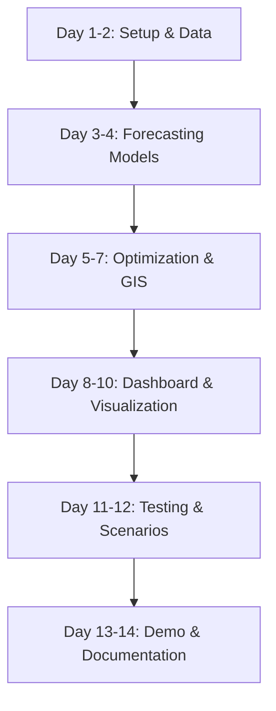
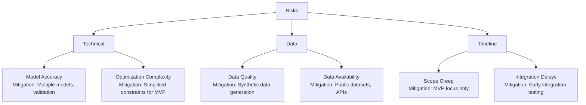

# Implementation Plan: Predictive Government Resource Allocation Platform

**Version:** 1.0  
**Date:** November 19, 2025  
**Project:** G7 GovAI Grand Challenge MVP  
**Timeline:** 2 weeks (Nov 17 - Dec 1, 2025)  
**Team Size:** 4 people  

## Overview

This plan provides a step-by-step implementation roadmap for building the Predictive Government Resource Allocation Platform MVP. The plan is optimized for a 4-person team with a 2-week timeline, focusing on forecasting models, optimization algorithms, and visualization dashboards.

### Team Roles
- **Developer 1:** Full-Stack (React + Python/FastAPI)
- **Developer 2:** Data Scientist/ML Engineer (Forecasting, Optimization)
- **Developer 3:** Backend/Data Engineer (Data Pipeline, GIS Integration)
- **Developer 4:** Frontend/Visualization (Dashboard, Maps, Charts)

### MVP Scope
- Data ingestion from CSV/API sources
- Infrastructure deterioration forecasting (Prophet/Random Forest)
- Population growth predictions (ARIMA)
- Demand forecasting (Prophet with seasonality)
- Budget optimization with linear programming
- Interactive map visualization with Leaflet
- Dashboard with charts and scenario planning
- Demo video showing forecasting and allocation

## Implementation Flow

## Pre-Implementation Checklist

- [ ] Development environment setup complete
- [ ] Sample infrastructure and population datasets collected
- [ ] API keys obtained (census, weather, map services)
- [ ] GitHub repository created with CI/CD
- [ ] Docker and Docker Compose installed
- [ ] Cloud account setup (AWS/GCP/Azure)
- [ ] Python scientific libraries installed (pandas, scikit-learn, prophet)
- [ ] TimescaleDB extension configured for PostgreSQL

## Implementation Steps

### Phase 1: Foundation & Data (Days 1-2)

#### Step 1: Project Setup and Infrastructure
**Status:** [ ] Not Started  
**Assigned To:** Developer 1  
**Effort:** 8 hours  
**Dependencies:** None

**Actions:**
1. Initialize project structure with React frontend and FastAPI backend
2. Set up Docker Compose with PostgreSQL + TimescaleDB, Redis
3. Configure environment variables and secrets management
4. Set up GitHub Actions for CI/CD
5. Create health check endpoints for all services

**Verification:**
- [ ] `docker-compose up` runs all services successfully
- [ ] TimescaleDB extension enabled
- [ ] Health check endpoint returns 200 OK
- [ ] GitHub Actions workflow passes
- [ ] Environment variables loaded correctly

**Files Created:**
- `docker-compose.yml`
- `.github/workflows/ci.yml`
- `frontend/package.json`
- `backend/requirements.txt`
- `backend/main.py`

---

#### Step 2: Database Schema and Models
**Status:** [ ] Not Started  
**Assigned To:** Developer 1  
**Effort:** 8 hours  
**Dependencies:** Step 1

**Actions:**
1. Create PostgreSQL schema from design document
2. Implement SQLAlchemy models for infrastructure, regions, forecasts, allocations
3. Convert condition_readings to TimescaleDB hypertable
4. Set up Alembic migrations
5. Add PostGIS extension for geospatial features

**Verification:**
- [ ] All tables created with relationships
- [ ] TimescaleDB hypertable created for time-series data
- [ ] PostGIS extension enabled
- [ ] Migrations run without errors
- [ ] Geospatial queries work

**Files Created:**
- `backend/models.py`
- `backend/database.py`
- `backend/alembic/versions/*.py`

---

#### Step 3: Data Ingestion Pipeline
**Status:** [ ] Not Started  
**Assigned To:** Developer 3  
**Effort:** 10 hours  
**Dependencies:** Step 2

**Actions:**
1. Create CSV file upload and parsing service
2. Implement data validation and quality checks
3. Build ETL pipeline for infrastructure data
4. Add API connector for external data sources (census, weather)
5. Create data seeding scripts with sample datasets

**Verification:**
- [ ] Can upload and parse CSV files
- [ ] Data validation catches errors
- [ ] Infrastructure data loaded correctly
- [ ] API connectors fetch external data
- [ ] Sample data seeds successfully

**Files Created:**
- `backend/services/ingestion_service.py`
- `backend/routes/data.py`
- `backend/scripts/seed_data.py`

---

### Phase 2: Forecasting Models (Days 3-4)

#### Step 4: Infrastructure Deterioration Model
**Status:** [ ] Not Started  
**Assigned To:** Developer 2  
**Effort:** 12 hours  
**Dependencies:** Step 3

**Actions:**
1. Install and configure Prophet library
2. Prepare training data with features (age, usage, weather)
3. Train Prophet model with regressors
4. Implement prediction API endpoint
5. Store forecasts in database

**Verification:**
- [ ] Model trains successfully on sample data
- [ ] Predictions generated for 1-5 year horizon
- [ ] Confidence intervals calculated
- [ ] Model accuracy >70% on validation set
- [ ] Forecasts stored with metadata

**Files Created:**
- `backend/services/forecasting/infrastructure_model.py`
- `backend/routes/predictions.py`
- `backend/ml_models/` (saved models)

---

#### Step 5: Population Growth Model
**Status:** [ ] Not Started  
**Assigned To:** Developer 2  
**Effort:** 8 hours  
**Dependencies:** Step 3

**Actions:**
1. Implement ARIMA model for population forecasting
2. Add demographic cohort analysis
3. Create population prediction API endpoint
4. Handle multiple regions simultaneously
5. Store forecasts by region and year

**Verification:**
- [ ] ARIMA model fits historical data
- [ ] Predictions by age distribution calculated
- [ ] Forecasts for 1, 3, 5, 10 years generated
- [ ] Multiple regions processed efficiently
- [ ] Results stored in database

**Files Created:**
- `backend/services/forecasting/population_model.py`

---

#### Step 6: Demand Forecasting Model
**Status:** [ ] Not Started  
**Assigned To:** Developer 2  
**Effort:** 8 hours  
**Dependencies:** Step 4

**Actions:**
1. Build Prophet model with seasonality
2. Add holiday effects and special events
3. Implement demand prediction by service type
4. Create model retraining workflow
5. Add forecast accuracy monitoring

**Verification:**
- [ ] Model captures seasonal patterns
- [ ] Holiday effects incorporated
- [ ] Demand forecasts by service type work
- [ ] Model updates with new data
- [ ] Accuracy metrics tracked

**Files Created:**
- `backend/services/forecasting/demand_model.py`
- `backend/services/model_trainer.py`

---

### Phase 3: Optimization & GIS (Days 5-7)

#### Step 7: Budget Optimization Engine
**Status:** [ ] Not Started  
**Assigned To:** Developer 2  
**Effort:** 12 hours  
**Dependencies:** Step 4, 5, 6

**Actions:**
1. Install scipy.optimize for linear programming
2. Implement multi-objective optimization function
3. Create constraint handling (budget, minimums, maximums)
4. Build scenario comparison functionality
5. Add allocation recommendation API

**Verification:**
- [ ] Optimization converges to valid solution
- [ ] All constraints satisfied
- [ ] Multiple objectives balanced
- [ ] Scenario comparison works
- [ ] API returns allocation recommendations

**Files Created:**
- `backend/services/optimization_engine.py`
- `backend/routes/optimize.py`

---

#### Step 8: GIS Integration with PostGIS
**Status:** [ ] Not Started  
**Assigned To:** Developer 3  
**Effort:** 10 hours  
**Dependencies:** Step 2

**Actions:**
1. Add latitude/longitude to infrastructure records
2. Implement spatial queries (proximity, coverage)
3. Create geospatial aggregation functions
4. Build service area calculation
5. Add geocoding for address-based queries

**Verification:**
- [ ] Spatial queries execute correctly
- [ ] Proximity analysis works
- [ ] Service coverage calculated
- [ ] Geospatial indexes improve performance
- [ ] Geocoding API functional

**Files Created:**
- `backend/services/gis_service.py`
- `backend/utils/spatial_queries.py`

---

#### Step 9: Anomaly Detection System
**Status:** [ ] Not Started  
**Assigned To:** Developer 2  
**Effort:** 6 hours  
**Dependencies:** Step 3

**Actions:**
1. Implement statistical anomaly detection (z-score)
2. Create alert thresholds and severity levels
3. Build alerting service with notifications
4. Add historical baseline calculations
5. Store anomalies for review

**Verification:**
- [ ] Anomalies detected accurately
- [ ] Severity levels calculated correctly
- [ ] Alerts triggered appropriately
- [ ] False positive rate acceptable
- [ ] Anomaly history maintained

**Files Created:**
- `backend/services/anomaly_detector.py`
- `backend/routes/alerts.py`

---

### Phase 4: Dashboard & Visualization (Days 8-10)

#### Step 10: React Frontend Foundation
**Status:** [ ] Not Started  
**Assigned To:** Developer 4  
**Effort:** 8 hours  
**Dependencies:** Step 1

**Actions:**
1. Set up React app with TypeScript and Tailwind CSS
2. Create layout with navigation and routing
3. Implement authentication UI
4. Add state management (React Context/Redux)
5. Create API client with axios

**Verification:**
- [ ] Application loads without errors
- [ ] Navigation works smoothly
- [ ] Authentication flows complete
- [ ] State management functional
- [ ] API calls work correctly

**Files Created:**
- `frontend/src/App.tsx`
- `frontend/src/components/Layout.tsx`
- `frontend/src/services/api.ts`

---

#### Step 11: Interactive Map Component
**Status:** [ ] Not Started  
**Assigned To:** Developer 4  
**Effort:** 12 hours  
**Dependencies:** Step 8, 10

**Actions:**
1. Integrate Leaflet.js with React-Leaflet
2. Create infrastructure marker layer
3. Add heat map visualization for conditions
4. Implement predictions overlay layer
5. Add map controls (zoom, layers, filters)

**Verification:**
- [ ] Map renders with infrastructure markers
- [ ] Heat maps show condition gradients
- [ ] Predictions displayed on map
- [ ] Map controls work correctly
- [ ] Performance good with 100+ markers

**Files Created:**
- `frontend/src/components/Map/InteractiveMap.tsx`
- `frontend/src/components/Map/InfrastructureLayer.tsx`
- `frontend/src/components/Map/HeatMapLayer.tsx`

---

#### Step 12: Forecasting Dashboard
**Status:** [ ] Not Started  
**Assigned To:** Developer 4  
**Effort:** 10 hours  
**Dependencies:** Step 4, 5, 6, 10

**Actions:**
1. Create chart components using Recharts
2. Build time-series visualization for forecasts
3. Add confidence interval display
4. Implement KPI cards for key metrics
5. Create forecast comparison views

**Verification:**
- [ ] Charts render forecasts correctly
- [ ] Confidence intervals displayed
- [ ] KPI cards show real-time data
- [ ] Multiple forecasts comparable
- [ ] Responsive design on mobile

**Files Created:**
- `frontend/src/components/Dashboard/ForecastDashboard.tsx`
- `frontend/src/components/Charts/TimeSeriesChart.tsx`
- `frontend/src/components/Dashboard/KPICard.tsx`

---

#### Step 13: Scenario Planning Interface
**Status:** [ ] Not Started  
**Assigned To:** Developer 4  
**Effort:** 8 hours  
**Dependencies:** Step 7, 10

**Actions:**
1. Create scenario creation form
2. Build allocation adjustment sliders
3. Implement side-by-side scenario comparison
4. Add what-if analysis tools
5. Display optimization results visually

**Verification:**
- [ ] Can create multiple scenarios
- [ ] Sliders adjust allocations smoothly
- [ ] Comparison view shows differences
- [ ] What-if analysis works
- [ ] Results display clearly

**Files Created:**
- `frontend/src/components/ScenarioPlanner/ScenarioBuilder.tsx`
- `frontend/src/components/ScenarioPlanner/ComparisonView.tsx`

---

### Phase 5: Testing & Scenarios (Days 11-12)

#### Step 14: Model Validation and Testing
**Status:** [ ] Not Started  
**Assigned To:** Developer 2  
**Effort:** 10 hours  
**Dependencies:** Step 4, 5, 6

**Actions:**
1. Perform backtesting on historical data
2. Calculate accuracy metrics (MAE, RMSE, MAPE)
3. Cross-validate models with different time periods
4. Test optimization with various constraints
5. Document model performance

**Verification:**
- [ ] Infrastructure model accuracy >70%
- [ ] Population model predictions reasonable
- [ ] Demand forecasts capture seasonality
- [ ] Optimization finds valid solutions
- [ ] Performance metrics documented

**Files Created:**
- `backend/tests/test_models.py`
- `evaluation/model_metrics.json`

---

#### Step 15: Integration Testing
**Status:** [ ] Not Started  
**Assigned To:** Developer 1, Developer 3  
**Effort:** 10 hours  
**Dependencies:** All backend steps

**Actions:**
1. Write integration tests for all API endpoints
2. Test data pipeline end-to-end
3. Verify forecasting workflow
4. Test optimization with real scenarios
5. Conduct load testing

**Verification:**
- [ ] All API endpoints return correct data
- [ ] Data flows through pipeline correctly
- [ ] Forecasts generated successfully
- [ ] Optimization completes in reasonable time
- [ ] System handles concurrent requests

**Files Created:**
- `backend/tests/test_integration.py`
- `backend/tests/test_api.py`
- `TESTING.md`

---

#### Step 16: User Testing and Refinement
**Status:** [ ] Not Started  
**Assigned To:** Developer 4  
**Effort:** 8 hours  
**Dependencies:** Step 11, 12, 13

**Actions:**
1. Conduct user testing with 3-5 participants
2. Test dashboard usability and intuitiveness
3. Gather feedback on visualizations
4. Iterate on UI/UX based on feedback
5. Fix identified usability issues

**Verification:**
- [ ] User testing completed with diverse participants
- [ ] Dashboard usability rated >4/5
- [ ] Visualizations understood easily
- [ ] Feedback incorporated into design
- [ ] No critical UX issues remaining

**Files Created:**
- `user-testing-report.md`

---

### Phase 6: Demo & Documentation (Days 13-14)

#### Step 17: Sample Scenarios Creation
**Status:** [ ] Not Started  
**Assigned To:** Developer 2, Developer 4  
**Effort:** 6 hours  
**Dependencies:** Step 14

**Actions:**
1. Create realistic infrastructure dataset
2. Generate population and demand forecasts
3. Build 3-5 budget allocation scenarios
4. Prepare comparison narratives
5. Validate scenario results with stakeholders

**Verification:**
- [ ] Scenarios based on realistic data
- [ ] Forecasts demonstrate accuracy
- [ ] Allocation recommendations logical
- [ ] Scenarios tell compelling story
- [ ] Results validated

**Deliverables:**
- `demo_scenarios/` (data and configs)
- `scenario-narratives.md`

---

#### Step 18: Demo Video Production
**Status:** [ ] Not Started  
**Assigned To:** Developer 4  
**Effort:** 8 hours  
**Dependencies:** Step 17

**Actions:**
1. Write demo script highlighting key features
2. Record walkthrough of forecasting workflow
3. Demonstrate optimization and allocation
4. Show map visualization and scenario comparison
5. Edit video with narration and annotations

**Verification:**
- [ ] Video shows all core features
- [ ] Forecasting, optimization, visualization demonstrated
- [ ] Video length 3-5 minutes
- [ ] Professional audio and video quality
- [ ] Compelling narrative

**Deliverables:**
- `demo-video.mp4`
- `demo-script.md`

---

#### Step 19: Documentation and Deployment
**Status:** [ ] Not Started  
**Assigned To:** Developer 1, Developer 3  
**Effort:** 8 hours  
**Dependencies:** Step 18

**Actions:**
1. Write comprehensive README with setup guide
2. Document API endpoints with examples
3. Create deployment guide for cloud
4. Document data requirements and sources
5. Deploy to cloud instance
6. Set up monitoring and logging

**Verification:**
- [ ] README clear and comprehensive
- [ ] API documentation complete
- [ ] Deployment successful on cloud
- [ ] Data sources documented
- [ ] Monitoring dashboard functional

**Deliverables:**
- `README.md`
- `API_DOCS.md`
- `DEPLOYMENT.md`
- `DATA_GUIDE.md`

---

## Quality Gates

### Forecasting Models
- [ ] Infrastructure model accuracy >70%
- [ ] Population model projections reasonable
- [ ] Demand forecasts capture patterns
- [ ] Confidence intervals calculated
- [ ] Models retrain with new data

### Optimization
- [ ] Optimization converges reliably
- [ ] Constraints satisfied in all cases
- [ ] Multiple objectives balanced
- [ ] Execution time <5 seconds
- [ ] Solutions economically sensible

### Visualization
- [ ] Map renders smoothly with 100+ markers
- [ ] Charts update in real-time
- [ ] Dashboard responsive on mobile
- [ ] Scenario comparison intuitive
- [ ] Color schemes accessible

### Performance
- [ ] Page load time <3 seconds
- [ ] API response time <1 second (p95)
- [ ] Forecast generation <10 seconds
- [ ] Optimization runtime <5 seconds
- [ ] Handles 50+ concurrent users

### Code Quality
- [ ] Test coverage >70%
- [ ] No critical security issues
- [ ] Code follows style guide
- [ ] All types properly defined
- [ ] Documentation complete

## Risk Management

## Post-Implementation

### Submission Checklist
- [ ] Demo video uploaded
- [ ] Source code repository shared
- [ ] Live demo URL provided
- [ ] Architecture documentation complete
- [ ] Sample scenarios documented

### Success Metrics
- [ ] Forecasting models deployed successfully
- [ ] Optimization provides valid allocations
- [ ] Dashboard intuitive and functional
- [ ] User testing satisfaction >4/5
- [ ] Demo compelling and clear

---

**Plan Status:** Ready for Implementation  
**Last Updated:** November 19, 2025  
**Next Review:** End of Week 1 (Nov 24, 2025)
