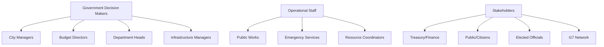
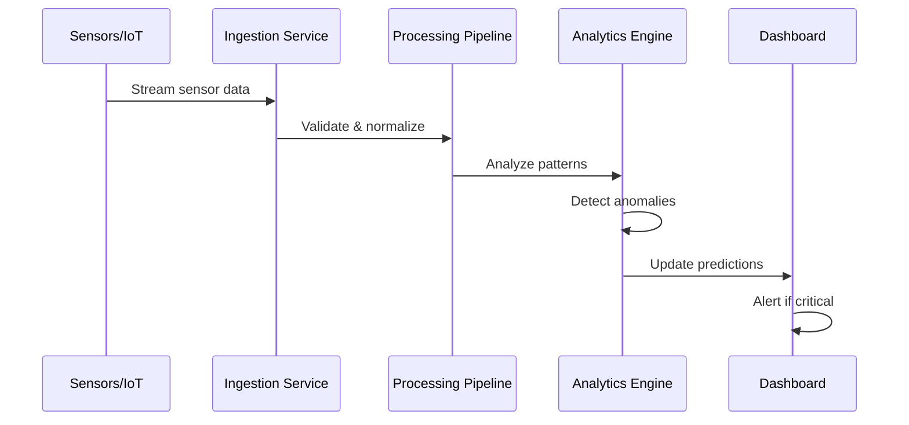
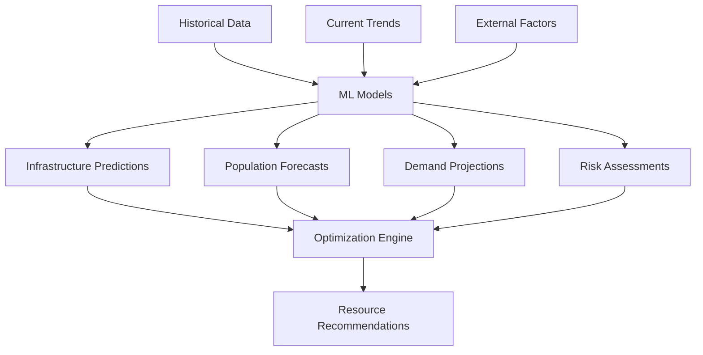
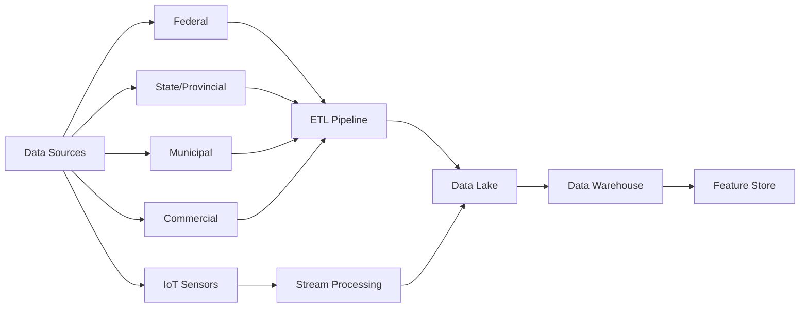
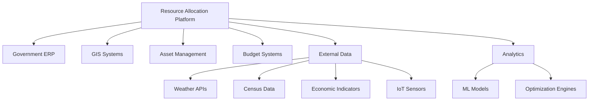
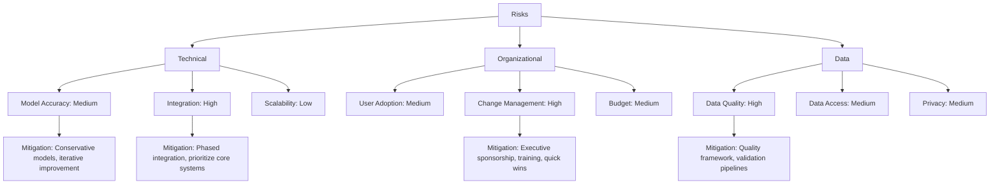

# Product Requirements Document: Predictive Government Resource Allocation Platform

## Executive Summary

**Product Name:** Predictive Government Resource Allocation Platform  
**Version:** 1.0  
**Date:** November 18, 2025  
**Project Context:** G7 GovAI Grand Challenge - Statement 3 (Future Needs and Resource Allocation)  
**Priority:** High  
**Project Impact:** High - Critical for optimizing government spending and improving public service delivery

### Vision
Transform government resource planning from reactive crisis management to proactive, data-driven allocation that anticipates needs, prevents infrastructure failures, and optimizes budget utilization across all levels of government.

### Success Criteria
- 15-25% reduction in resource waste
- 30-40% improvement in emergency response times
- 40-60% prevention of potential infrastructure failures
- >70% prediction accuracy validated against historical data
- $5-10M annual cost savings per major municipality

## Project Context

### G7 GovAI Challenge Context
- **Competition Period:** November 17 - December 1, 2025
- **Host:** Government of Canada (Treasury Board Secretariat)
- **Objective:** Design responsible AI solution to help governments accurately predict future needs and efficiently allocate resources
- **Funding:** Up to $10,000 CAD for selected solutions
- **Scope:** Two-week rapid solution design, followed by potential partnership with G7 governments

### Target Users & Stakeholders

## User Stories

### Epic 1: Data Integration & Management

#### US-1.1: Multi-Source Data Aggregation
**As a** data analyst  
**I want to** integrate data from federal, state, and municipal sources  
**So that** we have a comprehensive view of resource needs across jurisdictions

**Acceptance Criteria:**
- Connect to 5+ diverse data sources (open data portals, APIs, file uploads)
- Automated data ingestion with configurable schedules
- Data validation and quality checks on ingestion
- Standardized data format across all sources
- Real-time and historical data support
- Data lineage tracking for all sources

#### US-1.2: Real-Time Sensor Integration
**As an** infrastructure manager  
**I want** real-time sensor data from bridges, roads, and facilities  
**So that** I can monitor asset conditions continuously

**Acceptance Criteria:**
- IoT sensor integration (temperature, vibration, moisture, traffic)
- Sub-second latency for critical alerts
- Anomaly detection on sensor readings
- Sensor health monitoring and alerting
- Data aggregation and preprocessing
- Historical sensor data retention (5+ years)

### Epic 2: Predictive Analytics & Forecasting

#### US-2.1: Infrastructure Deterioration Prediction
**As a** public works director  
**I want** AI predictions of when infrastructure will need maintenance  
**So that** I can schedule repairs proactively before failures occur

**Acceptance Criteria:**
- Prediction accuracy >70% for 6-month forecasts
- Confidence intervals provided for all predictions
- Factors considered: age, usage, weather, materials, maintenance history
- Visual maps showing predicted deterioration hotspots
- Recommendations for preventive maintenance timing
- Cost estimates for proactive vs. reactive maintenance

#### US-2.2: Population Growth & Demand Forecasting
**As a** city planner  
**I want** projections of population growth and service demand  
**So that** I can plan infrastructure investments strategically

**Acceptance Criteria:**
- 1, 3, 5, and 10-year forecasts
- Demographic breakdowns (age, income, employment)
- Service demand predictions (water, power, transit, schools)
- Migration pattern analysis
- Economic indicator correlations
- Scenario modeling (optimistic, realistic, pessimistic)

### Epic 3: Resource Optimization & Allocation

#### US-3.1: Budget Allocation Recommendations
**As a** budget director  
**I want** AI-optimized budget allocation recommendations  
**So that** I can maximize impact per dollar spent

**Acceptance Criteria:**
- Multi-objective optimization (cost, urgency, impact, equity)
- Budget scenarios with constraint satisfaction
- ROI calculations for each allocation option
- Trade-off analysis visualization
- What-if scenario modeling
- Historical performance comparison

#### US-3.2: Personnel & Equipment Deployment
**As an** operations manager  
**I want** recommendations for optimal personnel and equipment deployment  
**So that** resources are positioned where they're needed most

**Acceptance Criteria:**
- Geographic heatmaps of predicted need
- Optimal positioning recommendations
- Travel time and coverage optimization
- Resource capacity vs. demand analysis
- Dynamic reallocation suggestions
- Integration with scheduling systems

### Epic 4: Decision Support & Visualization

#### US-4.1: Executive Dashboard
**As a** city manager  
**I want** a high-level dashboard showing key resource metrics  
**So that** I can make informed strategic decisions quickly

**Acceptance Criteria:**
- Key metrics displayed prominently (waste reduction, response times, cost savings)
- Visual trend analysis over time
- Alerts for critical situations
- Drill-down capability to detailed views
- Exportable reports (PDF, Excel)
- Mobile-responsive design

#### US-4.2: Scenario Planning & What-If Analysis
**As a** strategic planner  
**I want** to model different resource allocation scenarios  
**So that** I can evaluate options before committing resources

**Acceptance Criteria:**
- Create and save multiple scenarios
- Adjust parameters (budget, priorities, constraints)
- Compare scenarios side-by-side
- Risk assessment for each scenario
- Sensitivity analysis on key variables
- Recommendation of optimal scenario

## Functional Requirements

### FR-1: Data Integration Hub

**Requirements:**
- FR-1.1: System shall ingest data from 5+ diverse sources
- FR-1.2: System shall process real-time and batch data
- FR-1.3: System shall validate and clean data automatically
- FR-1.4: System shall standardize data formats across sources
- FR-1.5: System shall maintain data lineage and provenance
- FR-1.6: System shall handle millions of data points daily
- FR-1.7: System shall provide data quality monitoring dashboards

### FR-2: Predictive Analytics Engine
- FR-2.1: System shall forecast infrastructure deterioration with >70% accuracy
- FR-2.2: System shall project population growth for 1, 3, 5, 10-year horizons
- FR-2.3: System shall predict seasonal demand patterns
- FR-2.4: System shall assess environmental impact risks
- FR-2.5: System shall provide confidence intervals for all predictions
- FR-2.6: System shall update predictions as new data arrives
- FR-2.7: System shall explain prediction factors (explainable AI)

### FR-3: Optimization & Allocation
- FR-3.1: System shall generate budget allocation recommendations
- FR-3.2: System shall optimize for multiple objectives (cost, impact, equity, urgency)
- FR-3.3: System shall respect budget and resource constraints
- FR-3.4: System shall provide ROI estimates for allocations
- FR-3.5: System shall enable scenario modeling and what-if analysis
- FR-3.6: System shall support dynamic reallocation based on changing conditions
- FR-3.7: System shall generate priority scoring for resource requests

### FR-4: Decision Support Interfaces
- FR-4.1: System shall provide executive dashboard with KPIs
- FR-4.2: System shall display interactive maps with predictions
- FR-4.3: System shall enable drill-down from summary to details
- FR-4.4: System shall support scenario comparison views
- FR-4.5: System shall generate automated reports (PDF, Excel)
- FR-4.6: System shall provide mobile-responsive interfaces
- FR-4.7: System shall send alerts for critical situations

### FR-5: Emergency Response
- FR-5.1: System shall detect anomalies and potential emergencies
- FR-5.2: System shall provide real-time disaster impact predictions
- FR-5.3: System shall recommend emergency resource mobilization
- FR-5.4: System shall optimize emergency routing and logistics
- FR-5.5: System shall coordinate across agencies and jurisdictions

## Non-Functional Requirements

### NFR-1: Performance
- NFR-1.1: Data ingestion: Process 1M+ data points per day
- NFR-1.2: Prediction generation: <5 minutes for ad-hoc forecasts
- NFR-1.3: Dashboard load time: <3 seconds
- NFR-1.4: Real-time alerts: Sub-second latency for critical events
- NFR-1.5: System uptime: >99.9%
- NFR-1.6: Concurrent users: Support 1000+

### NFR-2: Accuracy & Reliability
- NFR-2.1: Prediction accuracy: >70% for 6-month forecasts
- NFR-2.2: Data quality: >95% accuracy in ingested data
- NFR-2.3: Model retraining: Monthly with latest data
- NFR-2.4: Error detection: <5% false positive rate for anomalies
- NFR-2.5: Failover: Automated recovery <15 minutes

### NFR-3: Security & Privacy
- NFR-3.1: Data encryption at rest and in transit
- NFR-3.2: Role-based access control (RBAC)
- NFR-3.3: Audit logging for all resource allocation decisions
- NFR-3.4: GDPR/PIPEDA compliance for personal data
- NFR-3.5: Multi-factor authentication for administrative access
- NFR-3.6: Regular security audits and penetration testing

### NFR-4: Scalability
- NFR-4.1: Horizontal scaling for all services
- NFR-4.2: Support 100+ municipalities simultaneously
- NFR-4.3: Auto-scaling based on load
- NFR-4.4: Multi-region deployment capability
- NFR-4.5: Handle 10+ years of historical data

### NFR-5: Usability
- NFR-5.1: User satisfaction: >4/5 rating
- NFR-5.2: First-time user completion: >80% without training
- NFR-5.3: Mobile accessibility: Full functionality on tablets/phones
- NFR-5.4: Accessibility: WCAG 2.1 AA compliance
- NFR-5.5: Internationalization: Support for multiple languages

## System Integration

### Integration Architecture

### Integration Points
1. **Government ERP Systems:** Budget tracking, procurement, HR
2. **GIS Platforms:** Mapping infrastructure and geographic analysis
3. **Asset Management:** Infrastructure condition and maintenance history
4. **Budget & Financial Systems:** Budget planning and expenditure tracking
5. **Weather Services:** NOAA, Environment Canada for environmental data
6. **Census & Demographics:** Population data and projections
7. **IoT Platforms:** Real-time sensor data from infrastructure
8. **Traffic Systems:** Transportation and congestion data
9. **Emergency Management:** Coordination with disaster response systems
10. **Public Portals:** Transparency and citizen engagement

## Dependencies

### Technology Dependencies
- **Frontend:** React/Next.js, React Native, D3.js/Chart.js
- **Backend:** Python (FastAPI), Node.js, Julia (optimization)
- **AI/ML:** TensorFlow, PyTorch, Prophet, scikit-learn, Gemini API
- **Data Processing:** Apache Kafka, Apache Airflow, Celery
- **Databases:** PostgreSQL, TimescaleDB, MongoDB, Redis
- **Cloud:** AWS/Azure/GCP, Kubernetes
- **Optimization:** OR-Tools, CPLEX, Gurobi

### External Service Dependencies
- Weather APIs (NOAA, OpenWeatherMap)
- Census and demographic data providers
- Economic data feeds (unemployment, GDP, etc.)
- GIS and mapping services
- IoT platform providers

### Government System Dependencies
- ERP and financial management systems
- Asset management platforms
- GIS and mapping infrastructure
- Emergency management systems
- Public works management systems

## Success Metrics

### Efficiency Metrics
- Resource waste reduction: -15-25%
- Emergency response time: -30-40% improvement
- Infrastructure failure prevention: -40-60%
- Budget optimization: $5-10M savings annually
- Planning cycle time: -50% reduction

### Accuracy Metrics
- Prediction accuracy: >70% for 6-month forecasts
- Data quality: >95% accuracy
- Alert precision: >85% (low false positive rate)
- ROI prediction accuracy: ±15% variance

### Adoption Metrics
- Active users: 50+ per municipality
- Daily logins: >70% of users
- Decision support usage: >60% of allocations use system
- User satisfaction: >4/5 rating
- Scenario modeling: 100+ scenarios per month

### Impact Metrics
- Cost savings identified: $500K+ in pilot
- Failed infrastructure events: -20% reduction
- Service delivery improvement: +20-30%
- Cross-jurisdiction coordination: +50% improvement
- Public satisfaction: +15% improvement

## Timeline & Milestones

### 2-Week MVP Sprint (Nov 17 - Dec 1, 2025)

**Team Composition (4 people):**
- 1 Full-Stack Developer (React + Python/FastAPI)
- 1 Data Scientist/ML Engineer (Forecasting, Optimization)
- 1 Data Engineer (Data Pipeline, Integration)
- 1 GIS/Visualization Specialist (Maps, Dashboards)

**Week 1: Foundation & Data Integration**
- Days 1-2: Architecture design, data source identification, API setup
- Days 3-4: Data ingestion pipeline (open data, CSV uploads)
- Days 5-7: Basic forecasting models (infrastructure, population)

**Week 2: Predictions & Demo**
- Days 8-10: Dashboard development, prediction visualization
- Days 11-12: Budget allocation prototype, scenario modeling
- Days 13-14: Demo preparation, documentation, video submission

**MVP Deliverables (2-Week Scope):**
- Data ingestion from 2-3 open data sources (census, infrastructure)
- Basic infrastructure deterioration prediction (1-year horizon)
- Simple population growth forecasting
- Budget allocation recommendation prototype
- Interactive dashboard with maps and visualizations
- Demo video showing predictions and resource recommendations
- Architecture documentation for scaling

**Post-Challenge Roadmap (If Selected):**
- Months 1-3: Real-time sensor integration, 5+ data sources
- Months 4-6: Deploy to 1-2 municipalities, 50+ users
- Months 7-12: Emergency response, multi-jurisdiction coordination

## Risk Assessment

### Risk Mitigation Strategies

**Technical Risks:**
- Model Accuracy: Start with conservative models, validate extensively, improve iteratively
- Integration Complexity: Prioritize core integrations, phased approach, standardized APIs
- Scalability: Cloud-native architecture, proven technologies, load testing

**Organizational Risks:**
- User Adoption: Champions network, comprehensive training, demonstrated value
- Change Management: Executive sponsorship, communication plan, gradual rollout
- Budget Constraints: Demonstrate ROI early, phased funding approach

**Data Risks:**
- Data Quality: Automated validation, quality monitoring, data stewardship program
- Data Access: Early partnerships, legal framework, data sharing agreements
- Privacy: Anonymization, access controls, compliance framework

---

**Document Version:** 1.0  
**Last Updated:** November 18, 2025  
**Status:** Draft - G7 Challenge Submission
